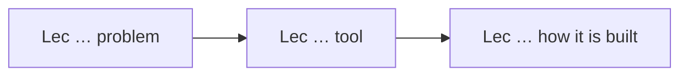
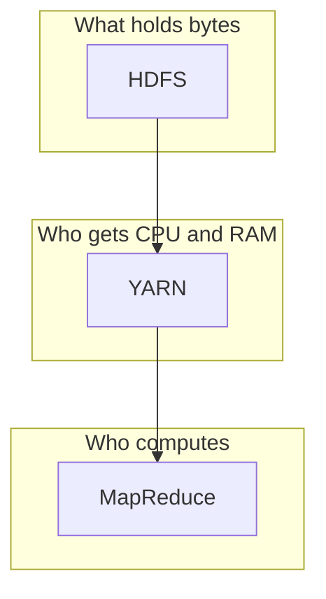

# Week {N} — {Week title}

> Goal: finish this week without the video or the raw PDF. Exam first, then a first reading that actually makes sense.
> Time budget: about 75–100 minutes for a normal week (teaching paragraphs + mermaid, not a glossary dump). Split long lectures.

## One-page cheat sheet

Fill this **after** all lectures. Keep it to what still fits on one screen: 7 bullets, a tiny table of near-twins, and up to 3–4 already-copied diagrams. No new topics. Cheat-sheet bullets may be tight; the lecture sections below must still *explain*.

**If you remember only 7 things this week**

1.
2.
3.
4.
5.
6.
7.

**Near-twins (left is not right)**

| This | Is not | Because |
| --- | --- | --- |
| | | |

**Numbers / defaults this week**

- 

**Diagrams** (reuse files from `images/`, do not copy new ones)


## This week's map

| Lec | Title | Why it is on the exam |
| --- | --- | --- |
| | | |



One mermaid for the week’s story. Node labels stay inside this week.

---

## Lecture {n}: {title}

### Hook (4–6 sentences)

Why this lecture exists in the course. One concrete picture. Name the problem in life-sized language **before** stacking tool names. No jargon dump.

### Slide picture

Copy 2–4 exam-critical crops into `notes/week-N/images/` and embed them here. Caption states the fact.

```markdown

```

If the figure is decorative or the crop failed, describe it in 3–5 lines instead. Never embed a page that still shows transcript text.

### Core ideas

**Not a factsheet.** Write a short teaching sequence that a first-timer can read top to bottom.

For each cluster of related ideas (not necessarily one bullet per noun):

1. **Story (2–5 sentences):** the problem, what the piece does, how it relates to the piece just above. Unpack every jargon phrase on first use (practical picture + definition). Example of unpacking, not of dumping: “A *centralized coordination service* is a small shared whiteboard the whole cluster trusts — who is leader, what is the latest config, wait-until-everyone-is-ready — so 100 programs do not contradict each other. Zookeeper is Hadoop’s version of that whiteboard.”
2. **Exam atom(s):** one or more tight bullets in the slide’s language, tagged `EXAM` / `PROF` / `SLIDE`.

Do **not** write: `**Term** — (Acronym Expansion, role-noun)`. That forces the student to Google the role-noun.

Forbidden leftovers: unexplained “in-memory stream processing”, “dataflow-based programming”, “resource negotiator”, “schema-on-read”, “micro-batch”, “block pool”, “hash partitioning”, “iterator over values”. Define them in the story the first time they appear.

### How it fits together

At least one mermaid (`flowchart`, `graph`, or `sequenceDiagram`) for *this lecture*: stack, who-talks-to-whom, pipeline, or near-twin fork. Caption in one sentence stating the exam fact. Keep components inside this week’s slides.



### Worked example

One example from the lecture, worked on paper-sized steps. If the lecture has none, invent a tiny one that uses the same mechanism (do not pull next week's topics). Prefer tracing a request/file/job through the mermaid.

### Near-twins / traps

Pairs the quiz will swap. Example shape: “X is not Y because…”. One line of *why*, not two undefined synonyms.

### Tiny recap card

Three lines the learner could screenshot. These may be dense; the Core ideas above must still have been readable.

### Checkpoint

Questions only. No answers here.

1. Stem (MCQ / T/F / two statements)  
   a) …  
   b) …  
   c) …  
   d) …

(5–8 items. Prefer comparison and “what happens if…” stems, still one correct option.)

#### Answer key

1. **b** — one-line reason tied to a slide/transcript idea.
2. …

#### Optional, after you check

- Explain ___ in 30 seconds (must include the *job* of the term, not only its acronym).
- What breaks if we remove ___?

---

Repeat one `## Lecture` block per lecture. If a lecture is huge, insert `### Part A / B / C` with a checkpoint after each part. Still one lecture heading.

## Week wrap

### How the lectures connect

A short story of the week, not a new topic dump. One mermaid is welcome if it does not repeat the cheat-sheet diagram verbatim.

### Assignment-shaped mixed quiz

10–12 new items mixing this week's lectures. Questions first. Then `Answer key`.

### Last 5-minute drill

A table: term → 6-word answer. The learner should fill it from memory, then check. Six words may be dense; they are a *drill*, not a substitute for Core ideas.
