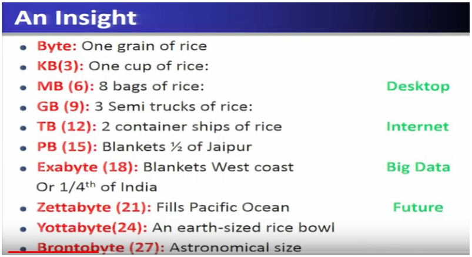
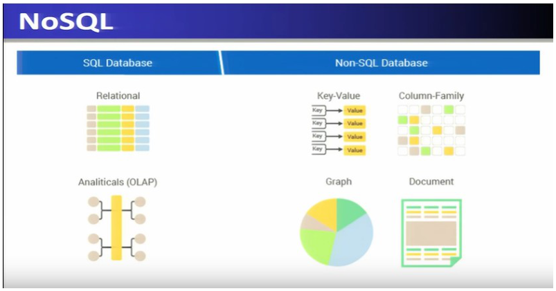
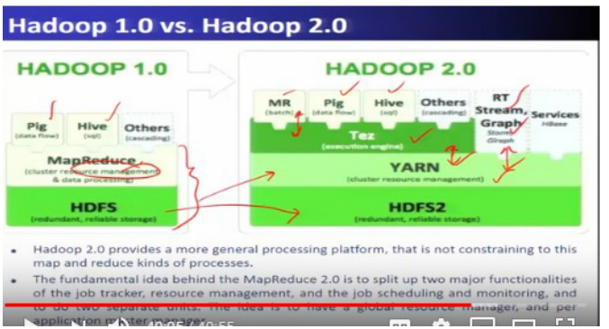

# Week 1 — Introduction to Big Data

> Goal: finish this week without the video or the raw PDF. Exam first, then intuition.
> Time budget: about 60–90 minutes for a normal week. Split long lectures.

## One-page cheat sheet

**If you remember only 7 things this week**

1. Big Data = data too large/fast/varied for traditional RDBMS; core V's are Volume (size), Velocity (speed), Variety (forms), Veracity (trust), Value (the point of it all).
2. Compute model moved OLTP (batch, 1968) → OLAP (data warehousing, 1983) → RTAP (real-time streaming, 2010).
3. Hadoop's 4 core modules: Hadoop Common, HDFS (storage), YARN (resource management), MapReduce (processing).
4. Hadoop 2.0's big change: YARN pulled resource management out of MapReduce, so Spark/Storm/Flink/Giraph can run directly on YARN+HDFS without MapReduce.
5. HDFS architecture: single NameNode (metadata) + many DataNodes (blocks, replicated); client always asks NameNode first, then talks to the nearest DataNode.
6. Ecosystem one-liners: Hive=SQL queries, Pig=scripting ETL, Sqoop=RDBMS↔Hadoop transfer, Flume=log ingestion, Oozie=workflow scheduler, Zookeeper=coordination, HBase/Cassandra=NoSQL stores, Spark(+Streaming/MLlib/GraphX)=in-memory engine ~100x faster than MapReduce.
7. Hadoop trivia: created by Doug Cutting & Mike Cafarella in 2005, named after his son's toy elephant; originally for the Nutch search engine.

**Near-twins (left is not right)**

| This | Is not | Because |
| --- | --- | --- |
| Volume | Velocity | Volume = size at rest; Velocity = speed of arrival (data in motion) |
| YARN | MapReduce | YARN = resource manager/scheduler; MapReduce = the processing model that runs over it |
| NameNode | Secondary NameNode | NameNode is the live metadata master; Secondary NameNode only keeps periodic backups, not a hot failover |
| Hive | Pig | Hive = SQL-like declarative queries; Pig = scripting/dataflow language (Pig Latin) |
| Sqoop | Flume | Sqoop moves data between Hadoop and structured RDBMS/SQL stores; Flume ingests unstructured log/event streams into HDFS |

**Numbers / defaults this week**

- Exabyte scale is the rough threshold where data is called "Big Data" (rice analogy: byte=1 grain → exabyte=blankets a coast/quarter of India).
- Data volume grew ~44x from 2009–2020 (0.8 zettabytes → 35 zettabytes).
- Spark is claimed to run ~100x faster than MapReduce for suitable in-memory workloads.
- Hadoop 2.0's four modules: Hadoop Common, HDFS, YARN, MapReduce.

**Diagrams**

## This week's map

| Lec | Title | Why it is on the exam |
| --- | --- | --- |
| 1 | Introduction to Big Data | Defines Big Data + the V's — every quiz opens here |
| 2 | Big Data Enabling Technologies | Cloud/mobile/social/IoT roots + who uses Big Data (Google, Facebook, NYSE, LHC) |
| 3 | Hadoop Stack for Big Data | Names every Hadoop-ecosystem tool and its one-line job |

---

## Lecture 1: Introduction to Big Data

### Hook (4–6 sentences)

Every company from Walmart to Facebook is drowning in more data than a normal database can chew through, and the reason isn't just "a lot of data" — it's data that is big, fast-arriving, and messy all at once. This lecture gives you the vocabulary the entire course (and every NPTEL quiz) is built on: what makes data "Big Data," and the famous V's used to describe it. Think of it as learning the units before you do the physics. Get the 3 V's (and the extra V's) rock solid here, because every later week assumes you already know them.

### Slide picture

### Core ideas

- **Big Data** — a collection of data sets so large and complex that traditional data-processing applications (classic RDBMS/tools) struggle to process them. `EXAM`
- **Why now** — sources are (1) people (social posts, GPS, photos), (2) sensors/devices (IoT, smart meters, RFID), (3) organizations (transaction records). `SLIDE`
- **3 V's (IBM/Gartner's original)** — `EXAM`
  - **Volume** — the size/scale of data, typically beyond terabytes.
  - **Velocity** — the speed at which data is generated and must be processed (real-time/streaming).
  - **Variety** — the different forms data comes in: structured (tables), unstructured (text, audio, video), semi-structured (XML, web data).
- **Traditional RDBMS is insufficient** — queries are too slow for real-time insight at Big Data scale (e.g., detecting a trending topic before it stops trending). `PROF` — he stresses this is *the* motivating problem for the whole course.
- **The "+1" V — Veracity** — the doubt/uncertainty in data: noise, inconsistency, incompleteness, latency. Framed as "data in doubt." `EXAM`
- **Many more V's** (he lists these as extra, not core-testable but quiz-plausible as "which V means ___"): `EXAM`
  - **Value** — the whole point: what useful insight/business value you extract at the end.
  - **Valence** — connectedness of data (dense vs. sparse graphs); more-connected data needs different ML algorithms.
  - **Validity** — accuracy/correctness of data *relative to its intended use*.
  - **Variability** — how the meaning of data changes over time.
  - **Viscosity** — data velocity *relative to the timescale of the event being studied*.
  - **Volatility** — rate of data loss / how long data stays usable (stable lifetime).
  - **Vocabulary** — metadata describing structure.
  - **Vagueness** — confusion over what "Big Data" even means for a given application.
- **Scale insight (rice analogy)** — byte = 1 grain of rice ... terabyte = 2 container ships ... **exabyte is where "Big Data" starts** ... zettabyte = fills the Pacific Ocean (future scale). `SLIDE` `EXAM` (the exabyte-as-threshold framing is quiz bait)
- **Computing model evolution** — `EXAM`
  - **OLTP** (1968, Online Transaction Processing) — operational DBMSs, "data at rest," historical reporting.
  - **OLAP** (1983, Online Analytical Processing) — data warehousing, pulls from multiple DBs for decision-making.
  - **RTAP** (2010, Real-Time Analytics Processing) — stream computing on "data in motion," Big Data architecture — this is the course's focus.
- **Analytics evolution** — earlier: descriptive/prescriptive business intelligence (low complexity). Now: **predictive analytics** and data mining, requiring real-time/stream computation on Big Data. `PROF`

### Worked example

Walmart handles ~1 million customer transactions/hour (volume+velocity); Facebook inserts 500 TB of new data/day and stores 30+ petabytes total (volume); a single flight generates 240 TB of flight data in 6–8 hours (volume at extreme rate). These numbers exist purely to anchor "how big is big" — if a question gives you a number and asks "is this Big Data," check: does it cross into terabytes+ scale, arrive too fast for a normal DB, or come in multiple formats?

### Near-twins / traps

| This | Is not | Because |
| --- | --- | --- |
| Volume | Velocity | Volume = size/scale ("data at rest"); Velocity = speed of arrival ("data in motion") |
| Veracity | Variety | Veracity = trustworthiness/noise in data; Variety = different data formats/types |
| Viscosity | Volatility | Viscosity = speed *relative to the event's own timescale*; Volatility = how fast data becomes stale/lost |
| OLAP | RTAP | OLAP = batch data-warehouse analysis of historical data; RTAP = real-time stream analytics |

### Tiny recap card

- Big Data = data too large/fast/varied for traditional RDBMS to handle well.
- Core exam V's: Volume (size), Velocity (speed), Variety (forms), Veracity (trust) — Value is the "+1" goal.
- Compute model moved OLTP → OLAP → RTAP as data shifted from "at rest" to "in motion."

### Checkpoint

1. Which of the following is NOT one of IBM's original 3 V's of Big Data?
   a) Volume
   b) Velocity
   c) Variety
   d) Veracity

2. A company notices its data keeps arriving in multiple formats — structured sales tables, unstructured customer-support call recordings, and semi-structured XML web logs. Which V does this describe?
   a) Volume
   b) Velocity
   c) Variety
   d) Veracity

3. True or False: OLAP refers to real-time analytics processing used for streaming Big Data.

4. "Data in motion, milliseconds to seconds to respond" is the definition of:
   a) Volume
   b) Velocity
   c) Variety
   d) Value

5. A sensor reports temperature readings, but 15% of them are noisy or missing due to hardware faults. This is primarily an issue of:
   a) Variety
   b) Veracity
   c) Valence
   d) Validity

6. Which pair is correctly matched?
   a) Viscosity — rate of data loss over time
   b) Volatility — data velocity relative to the event's timescale
   c) Valence — connectedness of the data (e.g., graph density)
   d) Vagueness — accuracy of data for a specific use case

7. Two statements —
   Statement I: OLTP historically deals with "data at rest" via operational databases.
   Statement II: RTAP was developed before OLAP to handle real-time stream computing.
   Which is correct?
   a) Both true
   b) Both false
   c) Only I true
   d) Only II true

#### Answer key

1. **d** — Volume, Velocity, Variety are IBM's original 3 V's; Veracity is the well-known "+1" added later.
2. **c** — Variety is exactly about data existing in structured, unstructured, and semi-structured forms.
3. **False** — OLAP is Online Analytical Processing (data warehousing, batch); RTAP is the real-time one.
4. **b** — This exact phrase ("data in motion... milliseconds to seconds") is the slide's Velocity definition.
5. **b** — Noise/incompleteness/uncertainty in data is the textbook definition of Veracity.
6. **c** — Valence is connectedness (graph density); the other three pairs are swapped from their real definitions.
7. **c** — OLTP (1968) does precede OLAP (1983) precedes RTAP (2010) chronologically, so Statement II is false.

#### Optional, after you check

- Explain the difference between Volume and Veracity in 30 seconds.
- What breaks if a company only tracks Volume and Velocity but ignores Veracity?

---

## Lecture 2: Big Data Enabling Technologies

### Hook (4–6 sentences)

You now know Big Data is huge, fast, and messy — so what actually stores and computes it? This lecture is the map of the whole toolbox: Hadoop and its ecosystem of open-source projects (100+ of them), each solving one piece of the storage/processing/streaming/ML puzzle. You don't need depth yet — later weeks each get their own deep dive (HDFS in week 2, Spark in week 3, HBase/Cassandra in weeks 4–5). Here you just need to recognize every name and say, in one sentence, what job it does. This is pure "tool identity" territory — the single most common NPTEL question shape.

### Slide picture

### Core ideas

- **Apache Hadoop** — open-source framework for Big Data with two original core parts: **HDFS** (Hadoop Distributed File System, storage) and **MapReduce** (programming model, processing). `EXAM`
- **Hadoop 1.0 → 2.0** — Hadoop 2.0 added **YARN** ("Yet Another Resource Negotiator") as a resource manager sitting between HDFS and applications. In 1.0, everything ran through MapReduce; in 2.0, non-MapReduce apps (Spark, Storm, Flink, Giraph) can run directly over YARN + HDFS. `EXAM` `PROF`
- **YARN internals** — Resource Manager (with a scheduler) allocates resources at the cluster level; each node has a **Node Manager** that manages resources locally in the form of **containers** — the basic unit of allocated resource. `EXAM`
- **HDFS runs on commodity hardware** — scale-out (add more ordinary machines) rather than scale-up (buy one powerful machine); this cluster of cheap, failure-prone machines is why HDFS needs built-in fault tolerance. `SLIDE`
- **Simplifying MapReduce programming** — `EXAM`
  - **Hive** (created at Facebook) — SQL-like queries (HiveSQL/HSQL) over MapReduce; used for data mining.
  - **Pig** (also Facebook) — scripting/dataflow-based programming over MapReduce.
- **Non-MapReduce apps over YARN+HDFS** — `EXAM`
  - **Giraph** (Facebook) — graph processing, used for social-network graph analysis.
  - **Storm, Spark, Flink** — real-time, in-memory stream processing ("fast data").
- **NoSQL stores** — Big Data is mostly stored as key-value pairs ("NoSQL"), not fixed-schema SQL tables; each row can have its own set of columns, and schema can change dynamically. Models include Key-Value, Column-Family, Graph, Document. `EXAM`
  - **HBase** — runs over HDFS; originally Google BigTable, later renamed HBase; started at Facebook for its messaging platform; stores terabytes to petabytes.
  - **Cassandra** — Facebook-developed, highly scalable distributed NoSQL DB; nodes organized virtually in a **ring** architecture.
  - **MongoDB** — another NoSQL/key-value style store mentioned alongside HBase and Cassandra.
- **Zookeeper** (created by Yahoo) — centralized coordination service for the ecosystem's 100+ projects: synchronization, configuration management, leader election, high availability. Small, performance-sensitive, critical, replicated across many machines. `EXAM` `PROF` (the name "Zookeeper" fits the animal-themed Hadoop project names)
- **Apache Spark** — in-memory Big Data analytics framework over HDFS, enabling "lightning fast" cluster computation. Sub-projects: `EXAM`
  - **Spark Streaming** — real-time stream processing; ingests from Kafka/Flume/HDFS/Kinesis/Twitter, splits input into **micro-batches** (micro-RDDs), processes in the Spark engine, outputs to HDFS/databases/dashboards.
  - **Spark MLlib** — distributed, scalable machine learning library (classification, regression, clustering, collaborative filtering, dimensionality reduction).
  - **Spark GraphX** — parallel large-scale graph computation; extends Spark RDDs with a graph abstraction; implements PageRank, Connected Components, K-core, Triangle Count.
- **Apache Kafka** — open-source distributed stream-processing framework; captures data streams and feeds them into Spark Streaming, forming a streaming pipeline. `EXAM`

### Worked example

Trace one streaming pipeline end to end: a live Twitter feed → captured by **Kafka** → fed into **Spark Streaming**, which chops the stream into **micro-batches** → each micro-batch is processed by the **Spark engine** → results land in **HDFS**, a database, or a live **dashboard**. This is the shape of almost every "fast data" architecture question.

### Near-twins / traps

| This | Is not | Because |
| --- | --- | --- |
| YARN | MapReduce | YARN is the resource manager/scheduler; MapReduce is the processing/programming model that runs on top of it |
| Hive | Pig | Hive = SQL-like declarative queries (HiveSQL); Pig = scripting/dataflow-based programming — both simplify MapReduce but differently |
| HBase | Cassandra | HBase runs directly over HDFS (BigTable lineage); Cassandra is a separate distributed NoSQL DB with a ring architecture, not built on HDFS |
| Giraph | GraphX | Giraph is a standalone graph-processing tool over YARN/HDFS (used by Facebook); GraphX is Spark's own graph library, built on Spark RDDs |
| Container | Node Manager | A container is the allocated resource unit; the Node Manager is the per-node process that manages/hands out containers |

### Tiny recap card

- Hadoop 2.0 core = HDFS (storage) + YARN (resource management) + MapReduce (processing).
- Hive/Pig simplify MapReduce; Giraph/Storm/Spark/Flink bypass MapReduce and run directly on YARN+HDFS.
- Spark's family (Streaming, MLlib, GraphX) plus Kafka/Zookeeper round out the ecosystem for streaming, ML, graphs, and coordination.

### Checkpoint

1. Which Hadoop 2.0 component is responsible for resource allocation and scheduling across the cluster?
   a) HDFS
   b) YARN
   c) MapReduce
   d) Hive

2. A developer wants to write Big Data queries using SQL-like syntax instead of writing raw MapReduce code. Which tool should they use?
   a) Pig
   b) Giraph
   c) Hive
   d) Zookeeper

3. True or False: In Hadoop 1.0, applications like Spark and Storm could run directly on top of MapReduce without needing YARN.

4. Which project is primarily used for centralized coordination — configuration management, synchronization, and leader election — across Hadoop ecosystem projects?
   a) Kafka
   b) Zookeeper
   c) Flume
   d) Oozie

5. In the YARN architecture, which component manages resources locally at each individual node and allocates them in the form of containers?
   a) Resource Manager
   b) Node Manager
   c) Scheduler
   d) NameNode

6. Which pair is correctly matched?
   a) Giraph — real-time in-memory stream processing
   b) HBase — originally Google BigTable, runs over HDFS
   c) Cassandra — SQL-based relational database
   d) MLlib — graph processing library

7. In a Spark Streaming pipeline, what is the data split into before being processed by the Spark engine?
   a) Transactions
   b) Micro-batches
   c) Containers
   d) Shards

8. Two statements —
   Statement I: Cassandra data centers are organized as nodes arranged virtually in a ring.
   Statement II: HDFS is designed to run best on very few, extremely powerful machines rather than many commodity machines.
   Which is correct?
   a) Both true
   b) Both false
   c) Only I true
   d) Only II true

#### Answer key

1. **b** — YARN ("Yet Another Resource Negotiator") is Hadoop 2.0's resource manager and scheduler.
2. **c** — Hive provides HiveSQL (HSQL), a SQL-like query layer over MapReduce.
3. **False** — In Hadoop 1.0 everything ran through MapReduce; YARN (introduced in 2.0) is what let non-MapReduce apps like Spark/Storm run directly over HDFS.
4. **b** — Zookeeper is the centralized coordination service (sync, config, leader election, HA) for the ecosystem's many projects.
5. **b** — The Node Manager runs on every node and hands out containers; the Resource Manager works at the cluster level.
6. **b** — HBase started as Google BigTable and runs over HDFS; the other three options swap in wrong descriptions (Giraph is graph processing not streaming, Cassandra is NoSQL not SQL, MLlib is machine learning not graphs).
7. **b** — Spark Streaming divides an incoming stream into micro-batches (micro-RDDs) for the Spark engine to process.
8. **c** — Cassandra's ring architecture is correct; HDFS is explicitly designed for scale-out commodity hardware, not a few powerful machines, so Statement II is false.

#### Optional, after you check

- Explain in 30 seconds why Hadoop 2.0 needed YARN when 1.0 already had MapReduce.
- What breaks if Zookeeper goes down in a cluster running many coordinated projects?

---

## Lecture 3: Hadoop Stack for Big Data

### Hook (4–6 sentences)

Lecture 2 gave you the map of tools; this lecture zooms into Hadoop itself — why it became the leading Big Data technology, who built it, and exactly how its pieces (NameNode, DataNode, JobTracker, TaskTracker, ResourceManager, NodeManager) talk to each other. This is the most architecture-diagram-heavy lecture of the week, and NPTEL loves turning architecture diagrams into "who talks to whom" questions. Also watch for the origin trivia (Doug Cutting, 2005, named after his son's toy elephant) — cheap, guaranteed marks.

### Slide picture

### Core ideas

- **Origin** — Hadoop was created by **Doug Cutting and Mike Cafarella in 2005**, originally to support the Nutch search engine project. Cutting (then at Yahoo, later Chief Architect at Cloudera) named it after his son's toy elephant. `EXAM` (classic trivia question)
- **Hadoop = open-source framework for reliable, scalable, distributed computing** for Big Data analytics, running on clusters of **commodity hardware**. `EXAM`
- **Four core design principles** — `EXAM` `PROF` (explicitly summarized by the professor as the "four different main design issues")
  1. **Move computation to data**, not data to computation (data is too large to move; started as a **batch processing** framework).
  2. **Scalability** — scale-out via adding more commodity machines, not scale-up to one powerful machine.
  3. **Reliability** — failure is the norm with commodity hardware, so fault tolerance is a core design goal (inherited from Google File System / Google MapReduce lineage).
  4. **Keep all the data as-is**, fit it into a schema only at read time (not at write time) — simplifies later complex analytics.
- **Apache Hadoop's four basic modules** — `EXAM`
  1. **Hadoop Common** — shared libraries/utilities used by other modules.
  2. **HDFS** — distributed file system storing data across commodity machines with high aggregate bandwidth.
  3. **YARN** — resource manager + scheduler for cluster compute resources.
  4. **MapReduce** — the programming paradigm/model for distributed computation.
- **High-level architecture** — one **Master Node** + many **Slave Nodes**. `EXAM`
  - HDFS layer: single **NameNode** (master) + many **DataNodes** (slaves, one per node).
  - MapReduce layer: single **JobTracker** (master) + many **TaskTrackers** (one per node).
  - NameNode and JobTracker typically colocate on the master; DataNode+TaskTracker pairs run on every slave.
- **HDFS read/write flow** — client contacts the **NameNode** for metadata (which DataNode holds which block), then reads/writes directly with the **closest** DataNode for high-bandwidth access; data is **replicated** across nodes/racks for fault tolerance. `EXAM` `SLIDE`
- **NameNode fault tolerance** — NameNode and DataNodes exchange continuous **heartbeats**; a dead DataNode is removed from service until it resyncs. Since a single NameNode is a **single point of failure**, a **secondary NameNode** passively keeps recent backups and can take over. `EXAM` `PROF`
- **MapReduce engine (Hadoop 1.0)** — single **JobTracker** accepts client jobs and pushes tasks out to **TaskTrackers** across the cluster, trying to keep computation close to the data. `EXAM`
- **YARN (Hadoop 2.0)** — client-server architecture: **ResourceManager** (core, receives client requests) + per-node **NodeManager** (allocates resources locally). Each application gets an **Application Master**, and allocated resource units are **containers**. `EXAM`
- **Hadoop 1.0 vs 2.0** — `EXAM`
  - 1.0: only HDFS + MapReduce; MapReduce itself handled both resource management/scheduling *and* data processing.
  - 2.0: MapReduce's resource-management job is split out into **YARN**; **Tez** becomes the execution engine; MapReduce, Pig, Hive, real-time streaming, and graph processing all now run *on top of* YARN, not only through MapReduce. HDFS becomes **HDFS2** (still redundant, reliable storage).
- **Distributions/"stacks"** — Google stack (GFS + MapReduce + BigTable + MySQL), Yahoo/Hadoop stack (Hadoop + HBase + Zookeeper etc.), Cloudera's distribution — all packaging the same core ideas differently. `SLIDE`
- **Ecosystem applications, one-liners** — `EXAM`
  - **Sqoop** — "SQL-on-Hadoop": bulk-transfers data between Hadoop and SQL/RDBMS data stores.
  - **HBase** — column-oriented, distributed, key-value NoSQL DB, based on Google BigTable; fast random access to large datasets; not relational.
  - **Pig** — scripting language (**Pig Latin**), dataflow model, built at Yahoo (2006), simplifies MapReduce, used for ETL (Extract-Transform-Load).
  - **Hive** — SQL-like queries over MapReduce for storage + analysis.
  - **Oozie** — workflow scheduler that coordinates Hadoop jobs (MapReduce, Pig, Hive, Sqoop).
  - **Zookeeper** — centralized coordination service: configuration, naming, distributed synchronization, group services.
  - **Flume** — distributed, reliable service for collecting/aggregating/moving large amounts of log data into HDFS ("data ingestion").
  - **Impala** — SQL-based analytics query engine on top of Hadoop, offers low-latency queries.
  - **Spark** — fast, general-purpose, in-memory large-scale data processing engine; claimed **~100x faster** than MapReduce for suitable applications. `EXAM` (the "100x faster" number is a favorite quiz number)

### Worked example

Trace an HDFS write: a client wants to write a file → contacts the **NameNode**, which returns metadata (which blocks go where) → client writes the first copy to the **closest** DataNode → HDFS **replicates** that block to other DataNodes (potentially across racks, per the diagram) → NameNode's metadata table now tracks the block's locations. A **read** works the same way in reverse: NameNode tells the client the nearest replica to fetch from.

### Near-twins / traps

| This | Is not | Because |
| --- | --- | --- |
| JobTracker | TaskTracker | JobTracker is the single master that assigns work; TaskTrackers are the per-node slaves that actually execute map/reduce tasks |
| NameNode | Secondary NameNode | NameNode is the live single point of metadata truth; the Secondary NameNode only keeps periodic backups/checkpoints, it is not a hot standby that automatically takes over instantly |
| Pig | Sqoop | Pig is a scripting/dataflow language over MapReduce for ETL/analysis; Sqoop is specifically for bulk transfer between Hadoop and SQL/RDBMS stores |
| Hadoop 1.0 | Hadoop 2.0 | In 1.0, MapReduce itself does resource management + processing; in 2.0, YARN takes over resource management so non-MapReduce apps can also run |
| Oozie | Zookeeper | Oozie schedules/coordinates *workflows of jobs* (Pig, Hive, Sqoop, MR); Zookeeper coordinates *distributed system state* (config, sync, naming, leader election) |

### Tiny recap card

- Hadoop's 4 design pillars: move computation to data, scale out, be fault-tolerant, keep raw data and schema-on-read.
- Architecture: Master (NameNode + JobTracker) + Slaves (DataNode + TaskTracker per node); Hadoop 2.0 replaces JobTracker's resource-management role with YARN (ResourceManager + NodeManager).
- Ecosystem one-liners: Sqoop=RDBMS↔Hadoop transfer, Pig=scripting ETL, Hive=SQL queries, Oozie=workflow scheduler, Zookeeper=coordination, Flume=log ingestion, Spark=in-memory ~100x faster engine.

### Checkpoint

1. Who created Hadoop, and in what year?
   a) Larry Page and Sergey Brin, 2003
   b) Doug Cutting and Mike Cafarella, 2005
   c) Matei Zaharia, 2009
   d) Doug Cutting alone, 1998

2. In the Hadoop 1.0 high-level architecture, which component runs on the Master Node's MapReduce layer and assigns tasks to worker nodes?
   a) TaskTracker
   b) NameNode
   c) JobTracker
   d) NodeManager

3. True or False: The Secondary NameNode automatically and instantly takes over all client requests the moment the primary NameNode fails, with zero configuration.

4. Which Hadoop ecosystem tool is specifically designed to bulk-transfer data between Hadoop and a SQL/RDBMS data store?
   a) Flume
   b) Sqoop
   c) Oozie
   d) Pig

5. What is the key architectural change from Hadoop 1.0 to Hadoop 2.0?
   a) HDFS was removed entirely
   b) Resource management was split out of MapReduce into a new component, YARN
   c) MapReduce was replaced by Spark as the only processing engine
   d) NameNode was made redundant by removing DataNodes

6. A client wants to read a file stored in HDFS. What is the first thing it must do?
   a) Directly contact the nearest DataNode
   b) Contact the NameNode to get block location metadata
   c) Contact the JobTracker
   d) Contact the Secondary NameNode

7. Which of Hadoop's four core design principles is described by "instead of moving data to the computation, move the computation to where the data is stored"?
   a) Scalability
   b) Reliability
   c) Moving computation to data
   d) Keeping all the data

8. Two statements —
   Statement I: Pig uses a SQL-like query language called Pig Latin.
   Statement II: Hive provides SQL-like queries over MapReduce.
   Which is correct?
   a) Both true
   b) Only I true
   c) Only II true
   d) Both false

#### Answer key

1. **b** — Doug Cutting and Mike Cafarella created Hadoop in 2005 for the Nutch search engine project; Cutting named it after his son's toy elephant.
2. **c** — The JobTracker is the single master-node component in the MapReduce layer that distributes tasks to TaskTrackers.
3. **False** — The Secondary NameNode only keeps periodic backups/checkpoints; it is not a fully automatic hot-standby failover.
4. **b** — Sqoop ("SQL-on-Hadoop") is built specifically for bulk transfer between Hadoop and RDBMS/SQL stores.
5. **b** — Hadoop 2.0's defining change is pulling resource management out of MapReduce and into YARN, enabling non-MapReduce apps to run on the cluster too.
6. **b** — HDFS reads always start by asking the NameNode where the relevant blocks/replicas live.
7. **c** — This is the exact "moving computation to data" principle emphasized as one of Hadoop's four foundational design issues.
8. **c** — Pig Latin is a scripting/dataflow language, not SQL-like, so Statement I is false; Hive is indeed the SQL-like layer, so Statement II is true.

#### Optional, after you check

- Explain in 30 seconds why a single NameNode is both essential and a design risk.
- What breaks if the Secondary NameNode is mistaken for a live failover replacement?

---

## Week wrap

### How the lectures connect

Lecture 1 gave you the *problem*: data has gotten so big, fast, and varied that RDBMS can't keep up, framed through the V's (Volume, Velocity, Variety, Veracity, Value). Lecture 2 gave you the *toolbox*: Hadoop's ecosystem of open-source projects — HDFS/YARN/MapReduce at the core, with Hive/Pig simplifying programming, HBase/Cassandra handling NoSQL storage, and Spark/Kafka/Zookeeper handling streaming, ML, graphs, and coordination. Lecture 3 zoomed into Hadoop itself — its four design principles (move computation to data, scale out, be reliable, schema-on-read), its four modules, and the exact master/slave architecture (NameNode/DataNode, JobTracker/TaskTracker, and YARN's ResourceManager/NodeManager split in 2.0). Together: why Big Data is a problem → what tools exist → how the flagship tool (Hadoop) is actually built.

### Assignment-shaped mixed quiz

1. Which characteristic of Big Data refers to data whose meaning changes over time?
   a) Veracity
   b) Variability
   c) Validity
   d) Valence

2. Facebook's use of Cassandra is an example of which type of data store?
   a) Relational SQL database
   b) NoSQL key-value / column-family store
   c) Graph database only
   d) In-memory cache only

3. Which Hadoop 2.0 component replaced the resource-management responsibility that used to sit inside MapReduce?
   a) Tez
   b) YARN
   c) HDFS2
   d) Oozie

4. True or False: In the Hadoop high-level architecture, TaskTrackers run only on the Master Node, never on Slave Nodes.

5. Which tool would you use to move bulk data between a traditional RDBMS and Hadoop?
   a) Flume
   b) Sqoop
   c) Zookeeper
   d) Oozie

6. A company needs to process a live Twitter stream in near real-time and store results in a dashboard. Which combination of tools fits best?
   a) Hive + Sqoop
   b) Kafka + Spark Streaming
   c) Pig + Oozie
   d) HBase + Zookeeper

7. What does the "scale out" approach to Hadoop's design mean?
   a) Buying fewer, more powerful machines
   b) Adding more commodity machines as data grows
   c) Increasing RAM only on the NameNode
   d) Replacing HDFS with a relational database

8. Which pair correctly matches a project to its creator/origin?
   a) Hive — created at Facebook
   b) Pig — created at Google
   c) Cassandra — created at Yahoo
   d) Zookeeper — created at Facebook

9. What is stored by the NameNode?
   a) The actual data blocks
   b) Filenames and block location metadata
   c) MapReduce job code
   d) Streaming data buffers

10. Two statements —
    Statement I: HBase is a row-oriented relational database.
    Statement II: HBase is based on the original design of Google BigTable.
    Which is correct?
    a) Both true
    b) Only I true
    c) Only II true
    d) Both false

11. In Hadoop 2.0, which applications can now run directly over YARN and HDFS without going through MapReduce?
    a) Hive and Pig only
    b) Spark, Storm, Flink, Giraph
    c) Sqoop and Flume only
    d) Only batch MapReduce jobs

12. What is the primary purpose of Apache Oozie?
    a) Distributed coordination and configuration
    b) Workflow scheduling of Hadoop jobs (MapReduce, Pig, Hive, Sqoop)
    c) Real-time stream ingestion
    d) In-memory analytics computation

#### Answer key

1. **b** — Variability specifically means the meaning of data changes over time; Veracity is about trust/noise, not meaning drift.
2. **b** — Cassandra is a distributed NoSQL database, organized as a ring, not a relational SQL store.
3. **b** — YARN took over cluster resource management and scheduling, which MapReduce handled alone in Hadoop 1.0.
4. **False** — TaskTrackers run on every node (master and slaves); JobTracker is the single master-only component.
5. **b** — Sqoop is purpose-built for bulk transfer between Hadoop and SQL/RDBMS stores.
6. **b** — Kafka captures the live stream and feeds it to Spark Streaming, which processes it as micro-batches for dashboard output — the exact pipeline from lecture 2's diagram.
7. **b** — Scale-out means adding more (cheap, commodity) machines rather than buying fewer powerful ones (scale-up).
8. **a** — Hive was created at Facebook; Pig was created at Yahoo, Cassandra at Facebook, Zookeeper at Yahoo (options b–d swap these).
9. **b** — The NameNode stores metadata only (filenames + block locations), not the actual data blocks.
10. **c** — HBase is column-oriented (not row-oriented relational) and is indeed based on Google BigTable's design, so only Statement II is true.
11. **b** — Spark, Storm, Flink, and Giraph are the named non-MapReduce applications that run over YARN+HDFS directly.
12. **b** — Oozie is the workflow scheduler coordinating MapReduce, Pig, Hive, and Sqoop jobs.

### Last 5-minute drill

| Term | 6-word answer |
| --- | --- |
| Volume | Size of data, at rest |
| Velocity | Speed of data arrival, in motion |
| Variety | Data in structured/unstructured/semi-structured forms |
| Veracity | Trustworthiness, noise, uncertainty in data |
| Value | Useful insight extracted from big data |
| HDFS | Distributed file system for Big Data storage |
| YARN | Resource manager and scheduler for Hadoop |
| MapReduce | Programming model: map then reduce data |
| NameNode | Master node holding filenames + block locations |
| DataNode | Slave node storing actual data blocks |
| JobTracker | Master node assigning MapReduce tasks (Hadoop 1.0) |
| Hive | SQL-like queries over MapReduce (HiveSQL) |
| Pig | Scripting/dataflow language (Pig Latin) for ETL |
| Sqoop | Bulk transfer tool: Hadoop ↔ SQL/RDBMS |
| Flume | Collects and ingests log data into HDFS |
| Oozie | Workflow scheduler coordinating Hadoop jobs |
| Zookeeper | Centralized coordination: config, sync, naming service |
| HBase | Column-oriented NoSQL store, based on BigTable |
| Cassandra | Distributed NoSQL DB, ring architecture (Facebook) |
| Spark | In-memory engine, ~100x faster than MapReduce |

