# Week 1 — Introduction to Big Data

> Goal: finish this week without the video or the raw PDF. Exam first, then intuition.
> Time budget: about 60–90 minutes for a normal week. Split long lectures.

## One-page cheat sheet

**If you remember only 7 things this week**

1. Big Data = data too large/fast/varied for traditional RDBMS; core V's are Volume (size), Velocity (speed), Variety (forms), Veracity (trust), Value (the point of it all).
2. Compute model moved OLTP (batch, 1968) → OLAP (data warehousing, 1983) → RTAP (real-time streaming, 2010).
3. Hadoop's 4 core modules: Hadoop Common, HDFS (storage), YARN (resource management), MapReduce (processing).
4. Hadoop 2.0's big change: YARN pulled resource management out of MapReduce, so Spark/Storm/Flink/Giraph can run directly on YARN+HDFS without MapReduce.
5. HDFS architecture: single NameNode (metadata) + many DataNodes (blocks, replicated); client always asks NameNode first, then talks to the nearest DataNode.
6. Hive = SQL on Hadoop; Pig = step-by-step dataflow scripts; Sqoop = copy tables from a normal SQL database into Hadoop (and back); Flume = collect logs as they happen; Oozie = “run job A then B”; Zookeeper = the cluster’s shared whiteboard (leader/config/sync); HBase/Cassandra = NoSQL stores; Spark family ≈ keep data in RAM, claimed ~100x vs MapReduce.
7. Hadoop trivia: created by Doug Cutting & Mike Cafarella in 2005, named after his son's toy elephant; originally for the Nutch search engine.

**Near-twins (left is not right)**

| This | Is not | Because |
| --- | --- | --- |
| Volume | Velocity | Volume = size at rest; Velocity = speed of arrival (data in motion) |
| YARN | MapReduce | YARN = resource manager/scheduler; MapReduce = the processing model that runs over it |
| NameNode | Secondary NameNode | NameNode is the live metadata master; Secondary NameNode only keeps periodic backups, not a hot failover |
| Hive | Pig | Hive: you write *what* you want (SQL). Pig: you write *the steps* data should flow through (Pig Latin scripts) |
| Sqoop | Flume | Sqoop moves data between Hadoop and structured RDBMS/SQL stores; Flume ingests unstructured log/event streams into HDFS |

**Numbers / defaults this week**

- Exabyte scale is the rough threshold where data is called "Big Data" (rice analogy: byte=1 grain → exabyte=blankets a coast/quarter of India).
- Data volume grew ~44x from 2009–2020 (0.8 zettabytes → 35 zettabytes).
- Spark is claimed to run ~100x faster than MapReduce for suitable in-memory workloads.
- Hadoop 2.0's four modules: Hadoop Common, HDFS, YARN, MapReduce.

**Diagrams**

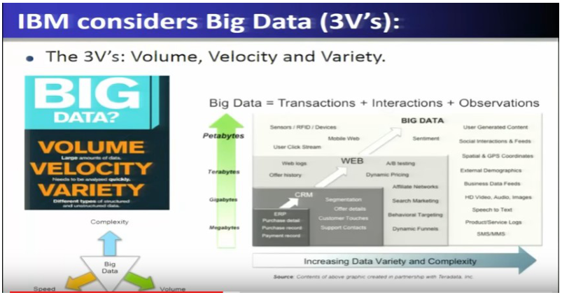
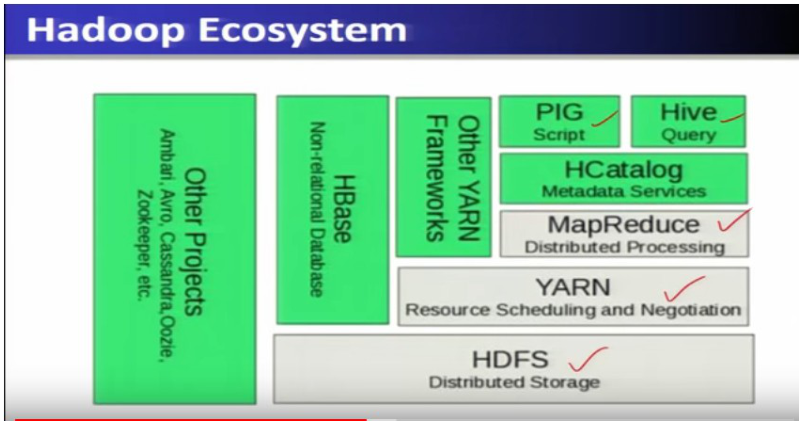
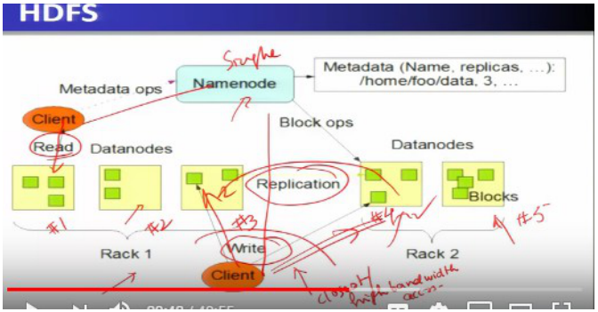

## This week's map

| Lec | Title | Why it is on the exam |
| --- | --- | --- |
| 1 | Introduction to Big Data | Defines Big Data + the V's — every quiz opens here |
| 2 | Big Data Enabling Technologies | Cloud/mobile/social/IoT roots + who uses Big Data (Google, Facebook, NYSE, LHC) |
| 3 | Hadoop Stack for Big Data | Names every Hadoop-ecosystem tool and its one-line job |

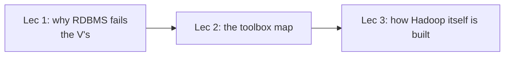

Week 1 is one story: name the problem → name the tools → see Hadoop’s architecture.

---

## Lecture 1: Introduction to Big Data

### Hook (4–6 sentences)

Every company from Walmart to Facebook is drowning in more data than a normal database can chew through, and the reason isn't just "a lot of data" — it's data that is big, fast-arriving, and messy all at once. This lecture gives you the vocabulary the entire course (and every NPTEL quiz) is built on: what makes data "Big Data," and the famous V's used to describe it. Think of it as learning the units before you do the physics. Get the 3 V's (and the extra V's) rock solid here, because every later week assumes you already know them.

### Slide picture

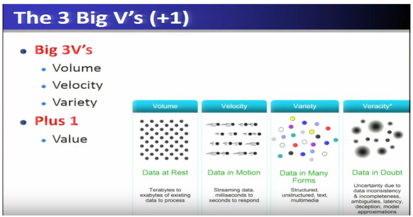

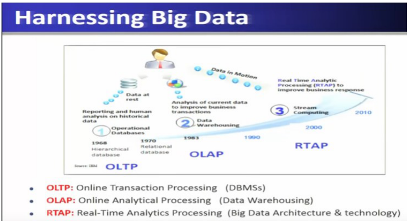

### Core ideas

A normal company database (an **RDBMS** — rows and columns, SQL, one or a few powerful servers) is great at “update this bank balance” and “report last month’s sales.” **Big Data** is the name for collections that break that comfort: too large, arriving too fast, or too messy in shape for those traditional tools to finish in time. `EXAM`

Where it comes from, on the slides: (1) people (posts, GPS, photos), (2) sensors/devices (meters, RFID), (3) organizations (transaction logs). `SLIDE`

The original **3 V's** (IBM/Gartner) are three *different* ways data can be “too much”: `EXAM`

- **Volume** — how *much* is sitting there (size at rest; think terabytes and up). A warehouse of receipts.
- **Velocity** — how *fast* new data shows up and must be reacted to (data in motion; streaming). A firehose, not a filing cabinet.
- **Variety** — how many *shapes* it takes: structured tables, unstructured audio/video/text, semi-structured XML/web logs.

**Traditional RDBMS is insufficient** because a query that finishes tomorrow is useless for “is this topic trending *now*.” `PROF`

**Veracity** is the well-known extra V: the data may be noisy, incomplete, delayed, or inconsistent — “data in doubt.” Trust is a separate problem from size. `EXAM`

He lists more V's as “which V means ___” bait (not the IBM original three): `EXAM`

- **Value** — why you bother: the insight or money you extract at the end.
- **Valence** — how *connected* the data is (a dense social graph vs sparse). Connected data wants graph-style algorithms.
- **Validity** — is it *correct for this use* (a temperature sensor used as a fraud signal may be “valid” for weather and useless for fraud).
- **Variability** — the *meaning* drifts over time (the same word in 2016 vs 2026).
- **Viscosity** — speed *relative to the event* (a 1-second delay is fine for a monthly report, fatal for a 50 ms trade).
- **Volatility** — how fast data *goes stale or is lost* (yesterday’s hot dataset is irrelevant).
- **Vocabulary** — metadata: the labels that describe structure.
- **Vagueness** — people do not even agree what “Big Data” means for this app.

**Scale insight (rice analogy)** — byte = 1 grain … terabyte = 2 container ships … **exabyte is where the slides call it Big Data** … zettabyte ≈ Pacific Ocean. `SLIDE` `EXAM`

How *compute* evolved is a timeline of “where the data sits when you analyze it”: `EXAM`

- **OLTP** (1968, Online Transaction Processing) — the operational database that records *each sale as it happens*, then mostly sits “at rest” for later reports. Think checkout counter.
- **OLAP** (1983, Online Analytical Processing) — copy many operational DBs into a **data warehouse** and slice them for decisions (“sales by region last quarter”). Still batch / historical, not the live firehose.
- **RTAP** (2010, Real-Time Analytics Processing) — analyze **data in motion** as streams arrive. This is the Big Data architecture the course is aiming at.

Analytics itself moved from descriptive/prescriptive BI toward **predictive** mining that wants that real-time/stream compute. `PROF`

### How it fits together

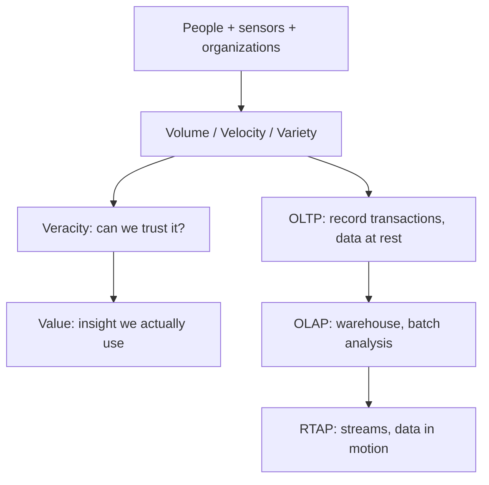

The V's name the *pain*; OLTP → OLAP → RTAP is how industry compute caught up with that pain.

### Worked example

Walmart handles ~1 million customer transactions/hour (volume+velocity); Facebook inserts 500 TB of new data/day and stores 30+ petabytes total (volume); a single flight generates 240 TB of flight data in 6–8 hours (volume at extreme rate). These numbers exist purely to anchor "how big is big" — if a question gives you a number and asks "is this Big Data," check: does it cross into terabytes+ scale, arrive too fast for a normal DB, or come in multiple formats?

### Near-twins / traps

| This | Is not | Because |
| --- | --- | --- |
| Volume | Velocity | Volume = size/scale ("data at rest"); Velocity = speed of arrival ("data in motion") |
| Veracity | Variety | Veracity = trustworthiness/noise in data; Variety = different data formats/types |
| Viscosity | Volatility | Viscosity = speed *relative to the event's own timescale*; Volatility = how fast data becomes stale/lost |
| OLAP | RTAP | OLAP = batch data-warehouse analysis of historical data; RTAP = real-time stream analytics |

### Tiny recap card

- Big Data = data too large/fast/varied for traditional RDBMS to handle well.
- Core exam V's: Volume (size), Velocity (speed), Variety (forms), Veracity (trust) — Value is the "+1" goal.
- Compute model moved OLTP → OLAP → RTAP as data shifted from "at rest" to "in motion."

### Checkpoint

1. Which of the following is NOT one of IBM's original 3 V's of Big Data?
   a) Volume
   b) Velocity
   c) Variety
   d) Veracity

2. A company notices its data keeps arriving in multiple formats — structured sales tables, unstructured customer-support call recordings, and semi-structured XML web logs. Which V does this describe?
   a) Volume
   b) Velocity
   c) Variety
   d) Veracity

3. True or False: OLAP refers to real-time analytics processing used for streaming Big Data.

4. "Data in motion, milliseconds to seconds to respond" is the definition of:
   a) Volume
   b) Velocity
   c) Variety
   d) Value

5. A sensor reports temperature readings, but 15% of them are noisy or missing due to hardware faults. This is primarily an issue of:
   a) Variety
   b) Veracity
   c) Valence
   d) Validity

6. Which pair is correctly matched?
   a) Viscosity — rate of data loss over time
   b) Volatility — data velocity relative to the event's timescale
   c) Valence — connectedness of the data (e.g., graph density)
   d) Vagueness — accuracy of data for a specific use case

7. Two statements —
   Statement I: OLTP historically deals with "data at rest" via operational databases.
   Statement II: RTAP was developed before OLAP to handle real-time stream computing.
   Which is correct?
   a) Both true
   b) Both false
   c) Only I true
   d) Only II true

#### Answer key

1. **d** — Volume, Velocity, Variety are IBM's original 3 V's; Veracity is the well-known "+1" added later.
2. **c** — Variety is exactly about data existing in structured, unstructured, and semi-structured forms.
3. **False** — OLAP is Online Analytical Processing (data warehousing, batch); RTAP is the real-time one.
4. **b** — This exact phrase ("data in motion... milliseconds to seconds") is the slide's Velocity definition.
5. **b** — Noise/incompleteness/uncertainty in data is the textbook definition of Veracity.
6. **c** — Valence is connectedness (graph density); the other three pairs are swapped from their real definitions.
7. **c** — OLTP (1968) does precede OLAP (1983) precedes RTAP (2010) chronologically, so Statement II is false.

#### Optional, after you check

- Explain the difference between Volume and Veracity in 30 seconds.
- What breaks if a company only tracks Volume and Velocity but ignores Veracity?

---

## Lecture 2: Big Data Enabling Technologies

### Hook (4–6 sentences)

You now know Big Data is huge, fast, and messy — so what actually stores and computes it? This lecture is the map of the whole toolbox: Hadoop and its ecosystem of open-source projects (100+ of them), each solving one piece of the storage/processing/streaming/ML puzzle. You don't need depth yet — later weeks each get their own deep dive (HDFS in week 2, Spark in week 3, HBase/Cassandra in weeks 4–5). Here you just need to recognize every name and say, in one sentence, what job it does. This is pure "tool identity" territory — the single most common NPTEL question shape.

### Slide picture

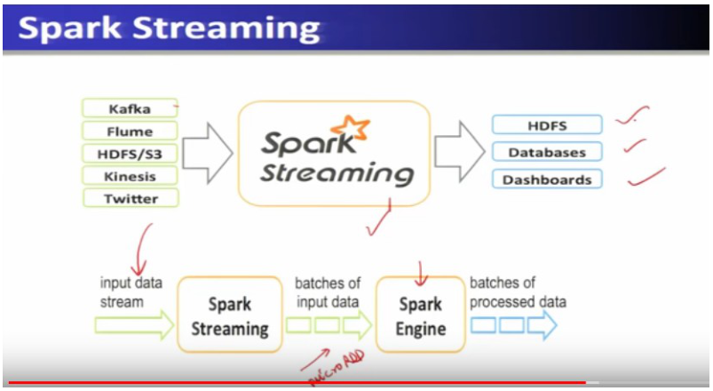

### Core ideas

Picture a warehouse of cheap PCs, not one giant server. **Apache Hadoop** is the open-source “OS” for that warehouse. Originally it had two jobs that quizzes treat as a pair: `EXAM`

- **HDFS** (Hadoop Distributed File System) is the *storage* layer — the warehouse’s filing system. A file is chopped into large chunks (**blocks**), copies live on many machines, and a client asks “where are my pieces?” instead of opening one disk. If one PC dies, another copy still has the block.
- **MapReduce** is the *processing* layer — a **programming model**, meaning you do not write “talk to 500 machines.” You write two functions: **map** (do something to *each* record where it already sits) and **reduce** (combine the partial answers). Hadoop ships those functions to the machines that hold the data.

HDFS is built for **commodity hardware**: many ordinary, failure-prone machines (**scale-out**) rather than one expensive box (**scale-up**). Fault tolerance is not a luxury; disks *will* die. `SLIDE`

**Hadoop 1.0 vs 2.0.** In 1.0, MapReduce was also the *landlord*: it decided who gets CPU time. So Spark, Storm, etc. could not easily share the cluster. Hadoop 2.0 inserted **YARN** (“Yet Another Resource Negotiator”) between HDFS and the apps. YARN is a **resource manager**: it rents CPU and RAM to jobs the way a hotel front desk rents rooms. After that, MapReduce is *one* guest; Spark/Storm/Flink/Giraph can be guests too, still reading the same HDFS. `EXAM` `PROF`

YARN’s pieces, if you zoom in: `EXAM`

- **Resource Manager** — cluster-wide desk + **scheduler** (“who gets the next rooms”).
- **Node Manager** — one per machine; the floor supervisor.
- **Container** — one rented slice of CPU+RAM. A task runs *inside* a container; the container is not a Docker trivia item here, just “the unit of allocation.”

Writing raw MapReduce is painful, so two **simplification layers** sit on top of it: `EXAM`

- **Hive** (Facebook) — you write **SQL-like** queries (HiveSQL/HSQL). *Declarative*: you say *what* you want (“count sales by region”), Hive compiles that into MapReduce jobs. Used for data mining over the warehouse.
- **Pig** (Facebook in this lecture’s telling) — you write a **script of steps** in **Pig Latin**. That is **scripting / dataflow programming**: you say how data should *flow* (load → filter → group → store), not a single SQL sentence. Same MapReduce underneath, different human interface.

Some apps **skip MapReduce** and run on YARN+HDFS directly: `EXAM`

- **Giraph** (Facebook) — **graph processing**: treat people as nodes and friendships as edges (PageRank-style social analysis), not “rows in a table.”
- **Storm, Spark, Flink** — **fast data**. MapReduce waits for a whole batch file. **Stream processing** means handle records *as they arrive* (tweets, click logs). **In-memory** means keep working data in RAM instead of writing every intermediate result to disk — that is why these engines feel “real-time” compared with classic MapReduce.

**NoSQL** here means: not a fixed-column SQL table. Big Data is often **key → value** (or related models). Each row can have *different* columns; the schema can change as you go. Slide families: Key-Value, Column-Family, Graph, Document — vs SQL’s Relational and OLAP analytical models. `EXAM`

- **HBase** — a BigTable-style store **on top of HDFS**; Facebook messaging-scale; terabytes to petabytes.
- **Cassandra** — Facebook’s separate distributed NoSQL DB; nodes sit in a **ring** (each node is a peer on a circle, not a single master like HDFS’s NameNode).
- **MongoDB** — mentioned with them as another NoSQL/document-ish store.

**Zookeeper** (Yahoo) is not a database and not a job scheduler. With 100+ Hadoop projects, someone must hold the *shared truth*: who is the current **leader**, what is the latest **config**, “wait until all nodes are ready” (**synchronization**), stay up if one copy dies (**high availability**). A **centralized coordination service** is that small, heavily replicated whiteboard. Zookeeper *is* that whiteboard — small, latency-sensitive, critical. The zoo pun is intentional. `EXAM` `PROF`

**Apache Spark** sits on HDFS and tries to keep data **in memory** across a cluster (“lightning fast”). Sub-projects quizzes name: `EXAM`

- **Spark Streaming** — live input (Kafka, Flume, HDFS, Kinesis, Twitter) is chopped into **micro-batches**: tiny bundles of records (also called micro-RDDs) processed one after another so “streaming” is implemented as a fast sequence of mini-jobs, then written to HDFS / DBs / dashboards.
- **Spark MLlib** — machine learning *distributed* (classification, regression, clustering, collaborative filtering, dimensionality reduction) so the model trains on the cluster, not one laptop.
- **Spark GraphX** — graphs on Spark RDDs (PageRank, connected components, k-core, triangle count). Different from Giraph: GraphX lives *inside* Spark.

**Apache Kafka**, in this lecture: an open-source **distributed stream-processing framework** that **captures** streams and **submits** them to Spark — a pipeline. He explicitly defers the internals (“we will discuss later on”). `EXAM`

The week-1 assignment option `Kafka – Distributed Commit Log` is **not** a Lecture 2 sentence. Do not treat commit-log as a week-1 atom; the phrase shows up when Kafka is taught for real (later). For this week, the identity is: Kafka = intake into Spark Streaming, not Hive/Sqoop/GraphX.

### How it fits together

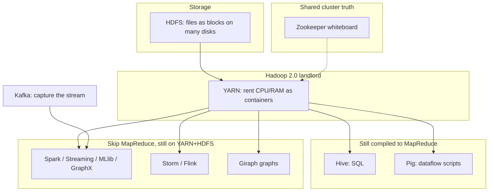

Bottom layer holds bytes; YARN hands out machines; Hive/Pig still ride MapReduce; Spark-family and friends rent YARN directly; Zookeeper keeps the zoo from arguing.

### Worked example

Trace one streaming pipeline end to end: a live Twitter feed → captured by **Kafka** → fed into **Spark Streaming**, which chops the stream into **micro-batches** → each micro-batch is processed by the **Spark engine** → results land in **HDFS**, a database, or a live **dashboard**. This is the shape of almost every "fast data" architecture question.

### Near-twins / traps

| This | Is not | Because |
| --- | --- | --- |
| YARN | MapReduce | YARN is the resource manager/scheduler; MapReduce is the processing/programming model that runs on top of it |
| Hive | Pig | Hive = SQL-like declarative queries (HiveSQL); Pig = scripting/dataflow-based programming — both simplify MapReduce but differently |
| HBase | Cassandra | HBase runs directly over HDFS (BigTable lineage); Cassandra is a separate distributed NoSQL DB with a ring architecture, not built on HDFS |
| Giraph | GraphX | Giraph is a standalone graph-processing tool over YARN/HDFS (used by Facebook); GraphX is Spark's own graph library, built on Spark RDDs |
| Container | Node Manager | A container is the allocated resource unit; the Node Manager is the per-node process that manages/hands out containers |

### Tiny recap card

- Hadoop 2.0 core = HDFS (the filing system) + YARN (who gets machines) + MapReduce (map then combine).
- Hive = SQL; Pig = dataflow scripts; Giraph/Storm/Spark/Flink can skip MapReduce and still sit on YARN+HDFS.
- Spark’s family (Streaming micro-batches, MLlib, GraphX) plus Kafka (capture streams into Spark) and Zookeeper (the whiteboard) round out streaming, ML, graphs, and coordination.

### Checkpoint

1. Which Hadoop 2.0 component is responsible for resource allocation and scheduling across the cluster?
   a) HDFS
   b) YARN
   c) MapReduce
   d) Hive

2. A developer wants to write Big Data queries using SQL-like syntax instead of writing raw MapReduce code. Which tool should they use?
   a) Pig
   b) Giraph
   c) Hive
   d) Zookeeper

3. True or False: In Hadoop 1.0, applications like Spark and Storm could run directly on top of MapReduce without needing YARN.

4. Which project is primarily used for centralized coordination — configuration management, synchronization, and leader election — across Hadoop ecosystem projects?
   a) Kafka
   b) Zookeeper
   c) Flume
   d) Oozie

5. In the YARN architecture, which component manages resources locally at each individual node and allocates them in the form of containers?
   a) Resource Manager
   b) Node Manager
   c) Scheduler
   d) NameNode

6. Which pair is correctly matched?
   a) Giraph — real-time in-memory stream processing
   b) HBase — originally Google BigTable, runs over HDFS
   c) Cassandra — SQL-based relational database
   d) MLlib — graph processing library

7. In a Spark Streaming pipeline, what is the data split into before being processed by the Spark engine?
   a) Transactions
   b) Micro-batches
   c) Containers
   d) Shards

8. Two statements —
   Statement I: Cassandra data centers are organized as nodes arranged virtually in a ring.
   Statement II: HDFS is designed to run best on very few, extremely powerful machines rather than many commodity machines.
   Which is correct?
   a) Both true
   b) Both false
   c) Only I true
   d) Only II true

#### Answer key

1. **b** — YARN ("Yet Another Resource Negotiator") is Hadoop 2.0's resource manager and scheduler.
2. **c** — Hive provides HiveSQL (HSQL), a SQL-like query layer over MapReduce.
3. **False** — In Hadoop 1.0 everything ran through MapReduce; YARN (introduced in 2.0) is what let non-MapReduce apps like Spark/Storm run directly over HDFS.
4. **b** — Zookeeper is the centralized coordination service (sync, config, leader election, HA) for the ecosystem's many projects.
5. **b** — The Node Manager runs on every node and hands out containers; the Resource Manager works at the cluster level.
6. **b** — HBase started as Google BigTable and runs over HDFS; the other three options swap in wrong descriptions (Giraph is graph processing not streaming, Cassandra is NoSQL not SQL, MLlib is machine learning not graphs).
7. **b** — Spark Streaming divides an incoming stream into micro-batches (micro-RDDs) for the Spark engine to process.
8. **c** — Cassandra's ring architecture is correct; HDFS is explicitly designed for scale-out commodity hardware, not a few powerful machines, so Statement II is false.

#### Optional, after you check

- Explain in 30 seconds why Hadoop 2.0 needed YARN when 1.0 already had MapReduce.
- What breaks if Zookeeper goes down in a cluster running many coordinated projects?

---

## Lecture 3: Hadoop Stack for Big Data

### Hook (4–6 sentences)

Lecture 2 gave you the map of tools; this lecture zooms into Hadoop itself — why it became the leading Big Data technology, who built it, and exactly how its pieces (NameNode, DataNode, JobTracker, TaskTracker, ResourceManager, NodeManager) talk to each other. This is the most architecture-diagram-heavy lecture of the week, and NPTEL loves turning architecture diagrams into "who talks to whom" questions. Also watch for the origin trivia (Doug Cutting, 2005, named after his son's toy elephant) — cheap, guaranteed marks.

### Slide picture

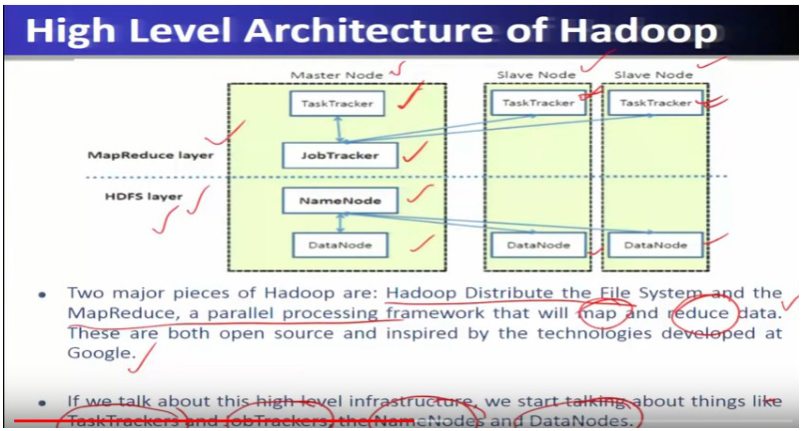

### Core ideas

**Origin trivia** (cheap marks): **Doug Cutting and Mike Cafarella, 2005**, for the **Nutch** search engine; named after Cutting’s son’s toy elephant; Cutting later at Yahoo / Cloudera. `EXAM`

Hadoop is an open-source framework for **reliable, scalable, distributed** analytics on **commodity** clusters. `EXAM`

Four design issues the professor flags: `EXAM` `PROF`

1. **Move computation to data** — a 10 TB file is expensive to ship across the network; send a small program to the machine that already holds the block. Classic Hadoop is **batch**: wait until a job’s input is ready, then crunch.
2. **Scalability** — **scale-out** (add PCs), not **scale-up** (buy one supercomputer).
3. **Reliability** — cheap hardware fails; copies and retries are the design, inherited from Google File System / Google MapReduce.
4. **Keep data as-is; schema at read time** — dump the raw dump now; decide columns when you query. That is **schema-on-read** (opposite of a bank DB that rejects a write if a column is missing). It makes later weird analytics easier.

Four **modules** of Apache Hadoop: `EXAM`

1. **Hadoop Common** — shared Java libraries the others import (the toolbox, not a daemon you quiz as “storage”).
2. **HDFS** — the distributed filesystem (high aggregate bandwidth across many disks).
3. **YARN** — rents CPU/RAM and decides *when* jobs run.
4. **MapReduce** — the map-then-reduce programming model.

**High-level architecture** — one **Master** + many **Slaves**: `EXAM`

- Storage: **NameNode** (master) + **DataNodes** (one per machine). NameNode is the *catalog*: filenames and “block 7 lives on machines A,B,C.” DataNodes hold the actual bytes.
- Compute (Hadoop 1.0 names): **JobTracker** (master) + **TaskTrackers** (workers). JobTracker assigns map/reduce tasks; TaskTrackers run them.

**HDFS read/write:** client always asks the **NameNode** first (metadata), then reads/writes the **nearest DataNode** for the actual bytes. Replicas sit on other nodes/racks so a disk or rack death is survivable. `EXAM` `SLIDE`

NameNode and DataNodes keep **heartbeats** (I’m alive pings). A silent DataNode is dropped until it returns. One NameNode is a **single point of failure**. The **Secondary NameNode** is *not* a hot spare that instantly takes traffic; it periodically **checkpoints/backups** metadata so recovery is possible. `EXAM` `PROF`

**MapReduce engine (1.0):** JobTracker takes a job, prefers tasks *next to* the data. `EXAM`

**YARN (2.0):** **ResourceManager** (cluster desk) + **NodeManager** (per machine) + per-app **Application Master** (that job’s own foreman) + **containers** (the rented slice). `EXAM`

**1.0 vs 2.0:** 1.0 = HDFS + MapReduce, and MapReduce *also* scheduled the cluster. 2.0 = **YARN** takes scheduling; **Tez** is named as an execution engine; MapReduce, Pig, Hive, streaming, graphs run *on* YARN; storage is **HDFS2**. `EXAM`

Google vs Yahoo packaging (GFS+MR+BigTable vs Hadoop+HBase+Zookeeper) is slide color, not a new architecture. `SLIDE`

Ecosystem — same map as Lecture 2, now with the jobs quizzes use: `EXAM`

- **Sqoop** — **SQL-on-Hadoop** in the *transfer* sense: bulk-copy *tables* between a normal **RDBMS** (MySQL, Oracle) and Hadoop. Not a query engine.
- **HBase** — column-oriented, key-value, BigTable lineage; fast *random* get/put on huge data; not SQL joins.
- **Pig** — **Pig Latin** scripts, dataflow, Yahoo 2006, **ETL** (extract from sources, transform, load into the lake).
- **Hive** — SQL-like analysis over MapReduce.
- **Oozie** — **workflow**: “run this MapReduce, then this Hive, then Sqoop.” A to-do list of jobs, not cluster membership.
- **Zookeeper** — config, naming, sync, group services (the whiteboard). Different from Oozie.
- **Flume** — **ingest** log/event streams *into* HDFS (agents on web servers pouring logs), not table dumps (that’s Sqoop).
- **Impala** — SQL analytics on Hadoop with **low latency** (interactive-ish queries vs Hive’s batch feel).
- **Spark** — general in-memory engine; slide claim **~100x** vs MapReduce when the working set fits RAM. `EXAM`

### How it fits together

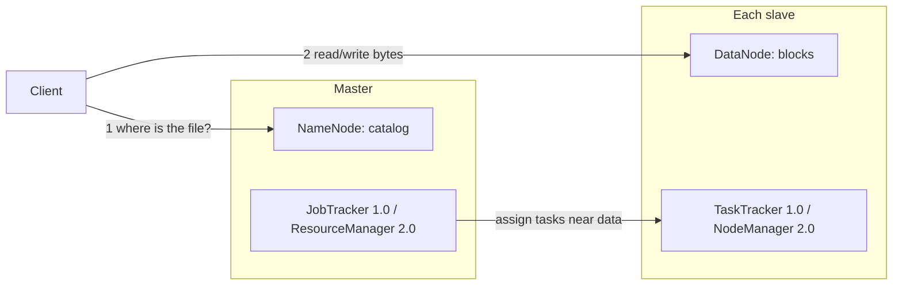

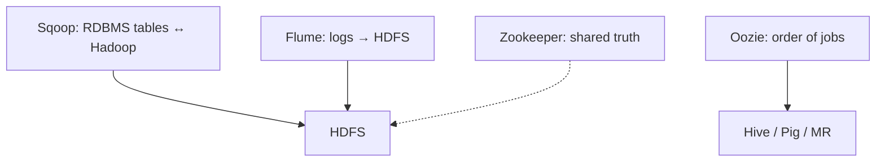

Catalog vs bytes is the HDFS split; Sqoop vs Flume is structured dump vs log firehose; Oozie vs Zookeeper is job order vs cluster membership.

### Worked example

Trace an HDFS write: a client wants to write a file → contacts the **NameNode**, which returns metadata (which blocks go where) → client writes the first copy to the **closest** DataNode → HDFS **replicates** that block to other DataNodes (potentially across racks, per the diagram) → NameNode's metadata table now tracks the block's locations. A **read** works the same way in reverse: NameNode tells the client the nearest replica to fetch from.

### Near-twins / traps

| This | Is not | Because |
| --- | --- | --- |
| JobTracker | TaskTracker | JobTracker is the single master that assigns work; TaskTrackers are the per-node slaves that actually execute map/reduce tasks |
| NameNode | Secondary NameNode | NameNode is the live single point of metadata truth; the Secondary NameNode only keeps periodic backups/checkpoints, it is not a hot standby that automatically takes over instantly |
| Pig | Sqoop | Pig is a scripting/dataflow language over MapReduce for ETL/analysis; Sqoop is specifically for bulk transfer between Hadoop and SQL/RDBMS stores |
| Hadoop 1.0 | Hadoop 2.0 | In 1.0, MapReduce itself does resource management + processing; in 2.0, YARN takes over resource management so non-MapReduce apps can also run |
| Oozie | Zookeeper | Oozie schedules/coordinates *workflows of jobs* (Pig, Hive, Sqoop, MR); Zookeeper coordinates *distributed system state* (config, sync, naming, leader election) |

### Tiny recap card

- Hadoop's 4 design pillars: move computation to data, scale out, survive disk death, dump raw data and apply schema when you read.
- Architecture: Master (NameNode + JobTracker) + Slaves (DataNode + TaskTracker); Hadoop 2.0’s landlord is YARN (ResourceManager + NodeManager), not JobTracker-as-scheduler.
- Sqoop copies SQL tables; Flume pours logs; Pig is step-by-step ETL; Hive is SQL; Oozie orders jobs; Zookeeper is the shared whiteboard; Spark keeps work in RAM (~100x claim).

### Checkpoint

1. Who created Hadoop, and in what year?
   a) Larry Page and Sergey Brin, 2003
   b) Doug Cutting and Mike Cafarella, 2005
   c) Matei Zaharia, 2009
   d) Doug Cutting alone, 1998

2. In the Hadoop 1.0 high-level architecture, which component runs on the Master Node's MapReduce layer and assigns tasks to worker nodes?
   a) TaskTracker
   b) NameNode
   c) JobTracker
   d) NodeManager

3. True or False: The Secondary NameNode automatically and instantly takes over all client requests the moment the primary NameNode fails, with zero configuration.

4. Which Hadoop ecosystem tool is specifically designed to bulk-transfer data between Hadoop and a SQL/RDBMS data store?
   a) Flume
   b) Sqoop
   c) Oozie
   d) Pig

5. What is the key architectural change from Hadoop 1.0 to Hadoop 2.0?
   a) HDFS was removed entirely
   b) Resource management was split out of MapReduce into a new component, YARN
   c) MapReduce was replaced by Spark as the only processing engine
   d) NameNode was made redundant by removing DataNodes

6. A client wants to read a file stored in HDFS. What is the first thing it must do?
   a) Directly contact the nearest DataNode
   b) Contact the NameNode to get block location metadata
   c) Contact the JobTracker
   d) Contact the Secondary NameNode

7. Which of Hadoop's four core design principles is described by "instead of moving data to the computation, move the computation to where the data is stored"?
   a) Scalability
   b) Reliability
   c) Moving computation to data
   d) Keeping all the data

8. Two statements —
   Statement I: Pig uses a SQL-like query language called Pig Latin.
   Statement II: Hive provides SQL-like queries over MapReduce.
   Which is correct?
   a) Both true
   b) Only I true
   c) Only II true
   d) Both false

#### Answer key

1. **b** — Doug Cutting and Mike Cafarella created Hadoop in 2005 for the Nutch search engine project; Cutting named it after his son's toy elephant.
2. **c** — The JobTracker is the single master-node component in the MapReduce layer that distributes tasks to TaskTrackers.
3. **False** — The Secondary NameNode only keeps periodic backups/checkpoints; it is not a fully automatic hot-standby failover.
4. **b** — Sqoop ("SQL-on-Hadoop") is built specifically for bulk transfer between Hadoop and RDBMS/SQL stores.
5. **b** — Hadoop 2.0's defining change is pulling resource management out of MapReduce and into YARN, enabling non-MapReduce apps to run on the cluster too.
6. **b** — HDFS reads always start by asking the NameNode where the relevant blocks/replicas live.
7. **c** — This is the exact "moving computation to data" principle emphasized as one of Hadoop's four foundational design issues.
8. **c** — Pig Latin is a scripting/dataflow language, not SQL-like, so Statement I is false; Hive is indeed the SQL-like layer, so Statement II is true.

#### Optional, after you check

- Explain in 30 seconds why a single NameNode is both essential and a design risk.
- What breaks if the Secondary NameNode is mistaken for a live failover replacement?

---

## Week wrap

### How the lectures connect

Lecture 1 gave you the *problem*: data has gotten so big, fast, and varied that RDBMS can't keep up, framed through the V's (Volume, Velocity, Variety, Veracity, Value). Lecture 2 gave you the *toolbox*: Hadoop's ecosystem of open-source projects — HDFS/YARN/MapReduce at the core, with Hive/Pig simplifying programming, HBase/Cassandra handling NoSQL storage, and Spark/Kafka/Zookeeper handling streaming, ML, graphs, and coordination. Lecture 3 zoomed into Hadoop itself — its four design principles (move computation to data, scale out, be reliable, schema-on-read), its four modules, and the exact master/slave architecture (NameNode/DataNode, JobTracker/TaskTracker, and YARN's ResourceManager/NodeManager split in 2.0). Together: why Big Data is a problem → what tools exist → how the flagship tool (Hadoop) is actually built.

### Assignment-shaped mixed quiz

1. Which characteristic of Big Data refers to data whose meaning changes over time?
   a) Veracity
   b) Variability
   c) Validity
   d) Valence

2. Facebook's use of Cassandra is an example of which type of data store?
   a) Relational SQL database
   b) NoSQL key-value / column-family store
   c) Graph database only
   d) In-memory cache only

3. Which Hadoop 2.0 component replaced the resource-management responsibility that used to sit inside MapReduce?
   a) Tez
   b) YARN
   c) HDFS2
   d) Oozie

4. True or False: In the Hadoop high-level architecture, TaskTrackers run only on the Master Node, never on Slave Nodes.

5. Which tool would you use to move bulk data between a traditional RDBMS and Hadoop?
   a) Flume
   b) Sqoop
   c) Zookeeper
   d) Oozie

6. A company needs to process a live Twitter stream in near real-time and store results in a dashboard. Which combination of tools fits best?
   a) Hive + Sqoop
   b) Kafka + Spark Streaming
   c) Pig + Oozie
   d) HBase + Zookeeper

7. What does the "scale out" approach to Hadoop's design mean?
   a) Buying fewer, more powerful machines
   b) Adding more commodity machines as data grows
   c) Increasing RAM only on the NameNode
   d) Replacing HDFS with a relational database

8. Which pair correctly matches a project to its creator/origin?
   a) Hive — created at Facebook
   b) Pig — created at Google
   c) Cassandra — created at Yahoo
   d) Zookeeper — created at Facebook

9. What is stored by the NameNode?
   a) The actual data blocks
   b) Filenames and block location metadata
   c) MapReduce job code
   d) Streaming data buffers

10. Two statements —
    Statement I: HBase is a row-oriented relational database.
    Statement II: HBase is based on the original design of Google BigTable.
    Which is correct?
    a) Both true
    b) Only I true
    c) Only II true
    d) Both false

11. In Hadoop 2.0, which applications can now run directly over YARN and HDFS without going through MapReduce?
    a) Hive and Pig only
    b) Spark, Storm, Flink, Giraph
    c) Sqoop and Flume only
    d) Only batch MapReduce jobs

12. What is the primary purpose of Apache Oozie?
    a) Distributed coordination and configuration
    b) Workflow scheduling of Hadoop jobs (MapReduce, Pig, Hive, Sqoop)
    c) Real-time stream ingestion
    d) In-memory analytics computation

#### Answer key

1. **b** — Variability specifically means the meaning of data changes over time; Veracity is about trust/noise, not meaning drift.
2. **b** — Cassandra is a distributed NoSQL database, organized as a ring, not a relational SQL store.
3. **b** — YARN took over cluster resource management and scheduling, which MapReduce handled alone in Hadoop 1.0.
4. **False** — TaskTrackers run on every node (master and slaves); JobTracker is the single master-only component.
5. **b** — Sqoop is purpose-built for bulk transfer between Hadoop and SQL/RDBMS stores.
6. **b** — Kafka captures the live stream and feeds it to Spark Streaming, which processes it as micro-batches for dashboard output — the exact pipeline from lecture 2's diagram.
7. **b** — Scale-out means adding more (cheap, commodity) machines rather than buying fewer powerful ones (scale-up).
8. **a** — Hive was created at Facebook; Pig was created at Yahoo, Cassandra at Facebook, Zookeeper at Yahoo (options b–d swap these).
9. **b** — The NameNode stores metadata only (filenames + block locations), not the actual data blocks.
10. **c** — HBase is column-oriented (not row-oriented relational) and is indeed based on Google BigTable's design, so only Statement II is true.
11. **b** — Spark, Storm, Flink, and Giraph are the named non-MapReduce applications that run over YARN+HDFS directly.
12. **b** — Oozie is the workflow scheduler coordinating MapReduce, Pig, Hive, and Sqoop jobs.

### Last 5-minute drill

| Term | 6-word answer |
| --- | --- |
| Volume | Size of data, at rest |
| Velocity | Speed of data arrival, in motion |
| Variety | Data in structured/unstructured/semi-structured forms |
| Veracity | Trustworthiness, noise, uncertainty in data |
| Value | Useful insight extracted from big data |
| HDFS | Distributed file system for Big Data storage |
| YARN | Resource manager and scheduler for Hadoop |
| MapReduce | Programming model: map then reduce data |
| NameNode | Master node holding filenames + block locations |
| DataNode | Slave node storing actual data blocks |
| JobTracker | Master node assigning MapReduce tasks (Hadoop 1.0) |
| Hive | SQL-like queries over MapReduce (HiveSQL) |
| Pig | Scripting/dataflow language (Pig Latin) for ETL |
| Sqoop | Bulk transfer tool: Hadoop ↔ SQL/RDBMS |
| Flume | Collects and ingests log data into HDFS |
| Kafka | Captures streams into Spark Streaming |
| Oozie | Workflow scheduler coordinating Hadoop jobs |
| Zookeeper | Centralized coordination: config, sync, naming service |
| HBase | Column-oriented NoSQL store, based on BigTable |
| Cassandra | Distributed NoSQL DB, ring architecture (Facebook) |
| Spark | In-memory engine, ~100x faster than MapReduce |

