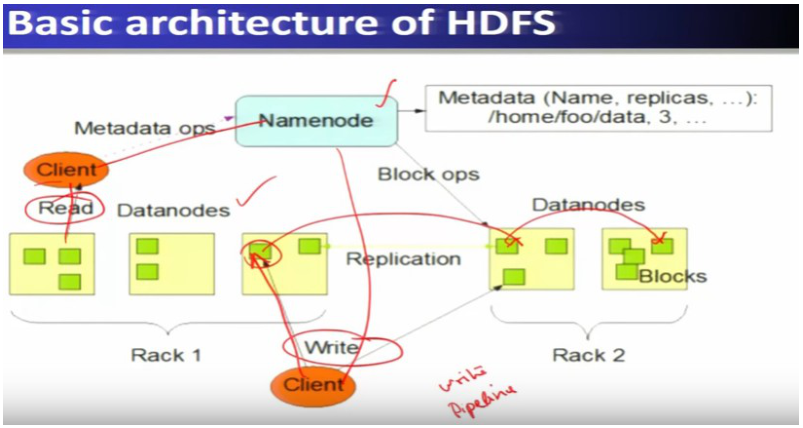
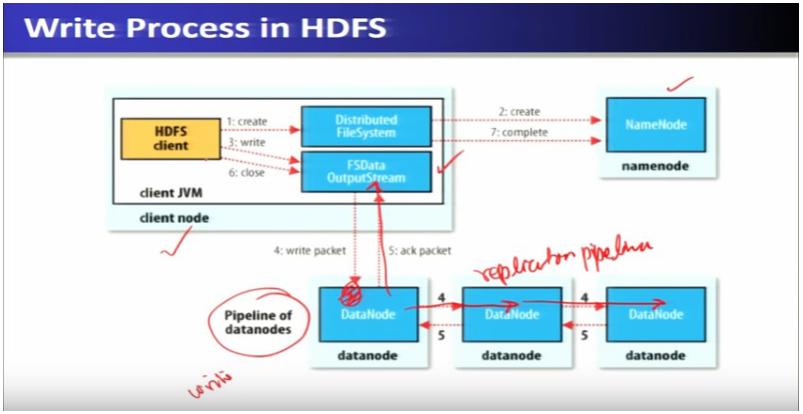

# Week 2 — Hadoop, HDFS and MapReduce

> Goal: finish this week without the video or the raw PDF. Exam first, then intuition.
> Time budget: about 60–90 minutes for a normal week. Split long lectures.

## One-page cheat sheet

*(stub — filled after all lectures)*

## This week's map

| Lec | Title | Why it is on the exam |
| --- | --- | --- |
| 4 | HDFS | Architecture, Federation, read/write path, tuning params — heavily quizzed |
| 5 | MapReduce 1.0 | JobTracker/TaskTracker roles, classic MR flow |
| 6 | MapReduce 2.0 (Part-I) | YARN motivation, ResourceManager/NodeManager |
| 7 | MapReduce 2.0 (Part-II) | YARN app lifecycle detail, MR1 vs YARN distinctions |
| 8 | MapReduce Examples | WordCount mechanics, map()-only-change questions |

---

## Lecture 4: Hadoop Distributed File System (HDFS)

### Hook

Imagine a file too big to fit on one computer — say 10 GB, and your disk plus a thousand others are all cheap, failure-prone commodity machines. HDFS's whole job is to chop that file into blocks, scatter the blocks across hundreds/thousands of nodes, keep multiple copies so a dead disk doesn't lose data, and let compute run *next to* the data instead of dragging data across the network. Everything in this lecture — block size, replication factor, Federation — is just tuning that one idea.

### Slide picture






### Core ideas

- **HDFS** — Hadoop Distributed File System: a scalable, fault-tolerant filesystem that stores huge files as blocks spread across a cluster of commodity machines. `EXAM`
- **Design goals** — scalable distributed storage, tolerate node failure, portability across heterogeneous hardware, handle very large datasets (TB–PB), high throughput. `EXAM`
- **Techniques used to meet those goals** `EXAM`:
  - *Simplified coherency model* — write-once, read-many (simplifies consistency, no need to handle concurrent writers).
  - *Data replication* — same block stored on multiple nodes so one node's failure doesn't lose data.
  - *Move computation to data* — run the map task on/near the node holding the block, not the reverse.
  - *Relaxed POSIX* — e.g., client-side caching on write, trading strict POSIX semantics for throughput.
- **NameNode** — single master; stores **metadata only**: filesystem namespace, and which blocks live on which DataNodes. Manages block creation/deletion/replication instructions. `EXAM`
- **DataNode** — one per cluster node; stores the actual block data; serves client read/write requests; does not decide placement, just follows NameNode instructions. `EXAM`
- **Read path**: client → NameNode ("where are the blocks of this file?") → NameNode returns DataNode locations → client reads directly from the **closest** DataNode (NameNode is not in the data path). `EXAM`
- **Write path**: client → NameNode ("give me DataNodes to write to") → client writes to first (closest) DataNode → that DataNode forwards to the next replica DataNode, and so on — this chain is the **replication pipeline**, so all replicas are written in parallel with the first write, not sequentially after. `EXAM` `SLIDE`
- **HDFS Federation (HDFS 2.0)** — instead of one NameNode, there are multiple independent NameNodes, each owning its own namespace and **block pool**; block pools of all namespaces are physically spread across the *same* shared set of DataNodes. `EXAM`
  - Benefits: namespace **scalability** (no single NameNode memory ceiling), better **performance** (nearest namespace serves a client), **isolation** (one app's heavy load on one namespace doesn't starve another namespace). `EXAM`
  - Removes the single point of failure that a lone NameNode was in HDFS 1.0. `PROF`
- **Block size** — default **64 MB**, tunable up to **128 MB**, set via `dfs.block.size` in `hdfs-site.xml`. `EXAM`
  - Bigger blocks → fewer blocks per file → less NameNode metadata memory, fewer map tasks, but less parallelism.
  - Smaller blocks → more parallelism, but more NameNode memory pressure and more map task startup overhead.
- **Replication factor** — default **3**, set via `dfs.replication`. `EXAM`
  - Lower replication → less storage cost, but less robust (fewer surviving copies) and less locality (fewer nearby replicas to read from).
  - Higher replication → more robust + more locality choices, but more storage cost.
- **Small-files problem** — HDFS is optimized for large files; a huge number of tiny files (e.g., 10 GB as many 32 KB files) bloats NameNode memory (one metadata entry per block/file) and creates excessive short-lived map tasks (JVM spin-up/spin-down latency, poor disk I/O). `EXAM` `PROF`
  - Fixes: **Sequence Files** (merge/concatenate many small files into one), or use HBase/Hive, or a **combined input format**.
- **Fault tolerance / robustness** — DataNodes send periodic **heartbeats** to the NameNode; a DataNode with no recent heartbeat is marked down, stops receiving new I/O, and the NameNode re-replicates any blocks that fell below the replication factor onto other nodes. `EXAM`
  - **Checksums** detect corrupted blocks; on a checksum failure, an alternate replica is read instead.
  - NameNode failure is mitigated by Federation (multiple NameNodes) and by (manual, by default) failover to a standby NameNode.
- **Worked numeric example** — 10 GB file, 64 MB blocks → 10×(1024/64) = **160 blocks**. `EXAM`

### Worked example

10 GB file, default 64 MB block size:

```
number of blocks = file size / block size = (10 × 1024 MB) / 64 MB = 160 blocks
```

With replication factor 3, that's 160 × 3 = 480 physical block copies stored across the cluster, and at least 160 map tasks needed to process the whole file (one map task per block, minimum).

### Near-twins / traps

- **NameNode stores data** is NOT true — NameNode stores only **metadata** (filenames, block locations); actual data lives on DataNodes. `EXAM`
- **Reading a block you already know the location of still needs the NameNode** is NOT true — the NameNode is contacted once to get block locations; the actual read/write happens directly between client and DataNode.
- **Higher replication factor always improves performance** is misleading — it improves robustness *and* locality options, but costs more storage; it's a trade-off, not a free win.
- **HDFS Federation means multiple copies of the same namespace** is NOT true — Federation means multiple *independent* namespaces (NN-1, NN-2, …), each with its own block pool, not multiple copies of one namespace (that would just be replication).
- **Smaller block size is always better for parallelism** — true for parallelism, but NOT true for overall performance: small blocks blow up NameNode memory and map-task overhead, especially with many small files.

### Tiny recap card

1. NameNode = metadata only; DataNode = actual blocks; client talks to NameNode first, then reads/writes DataNodes directly.
2. Default block size 64 MB (tunable to 128 MB); default replication factor 3 — both are storage-vs-performance trade-offs.
3. HDFS Federation = multiple NameNodes, each with its own namespace + block pool, spread over shared DataNodes — fixes the single-NameNode bottleneck and single point of failure.

### Checkpoint

1. What does the HDFS NameNode actually store?
   a) The full contents of every file
   b) Metadata — filesystem namespace and block-to-DataNode mapping
   c) A backup copy of every block
   d) Only the replication factor

2. In the HDFS write path, replication to additional DataNodes happens:
   a) After the client finishes writing to the first DataNode, as a separate step
   b) In a pipeline, concurrently as the first DataNode forwards the block onward
   c) Only when the NameNode explicitly polls for under-replicated blocks
   d) Never — replicas are created only during periodic heartbeats

3. Two statements: (I) The default HDFS block size is 64 MB. (II) The default HDFS replication factor is 5. Which is true?
   a) Both I and II
   b) Only I
   c) Only II
   d) Neither

4. A cluster has a 10 GB file with the default 64 MB block size. How many blocks does it split into?
   a) 16
   b) 80
   c) 160
   d) 640

5. What is the main problem with storing a very large number of small files in HDFS?
   a) DataNodes cannot store small files at all
   b) It bloats NameNode memory and creates excessive short-lived map tasks
   c) It reduces the replication factor automatically
   d) It disables the read/write pipeline

6. What is the main benefit of HDFS Federation over a single-NameNode design?
   a) It removes the need for replication
   b) It increases namespace scalability and removes the single point of failure
   c) It merges all block pools into one node
   d) It eliminates the need for DataNodes

7. If the replication factor is lowered from 3 to 1, what is the trade-off?
   a) Better robustness, less storage used
   b) Less storage used, but reduced robustness and fewer locality options
   c) No effect on robustness, only affects block size
   d) Improves both storage and robustness

8. How does the NameNode detect that a DataNode has failed?
   a) The DataNode sends an explicit failure message
   b) Absence of periodic heartbeats from that DataNode
   c) A checksum mismatch on the NameNode itself
   d) The client reports a failed read

#### Answer key

1. **b** — NameNode never stores actual file data, only namespace + block location metadata.
2. **b** — the "replication pipeline": the client writes to the first DataNode, which forwards to the next while still receiving, so all replicas are written concurrently, not sequentially after.
3. **b** — block size default is 64 MB (true); replication default is 3, not 5, so statement II is false.
4. **c** — 10×1024/64 = 160.
5. **b** — every block/file adds NameNode metadata, and each tiny file still spins up its own map task, wasting JVM startup time and disk I/O.
6. **b** — Federation's whole point is scaling the namespace and removing the single-NameNode bottleneck/SPOF, not touching replication or DataNodes directly.
7. **b** — fewer replicas save space but leave less room for locality reads and less tolerance for node failure.
8. **b** — the NameNode relies on periodic heartbeats; a DataNode that misses them is marked down.

#### Optional, after you check

- Explain the HDFS replication pipeline in 30 seconds.
- What breaks if HDFS Federation is removed and we go back to one NameNode?

---
