# Week 2 — Hadoop, HDFS and MapReduce

> Goal: finish this week without the video or the raw PDF. Exam first, then intuition.
> Time budget: about 60–90 minutes for a normal week. Split long lectures.

## One-page cheat sheet

**If you remember only 7 things this week**

1. HDFS = NameNode (metadata only) + DataNodes (actual blocks); client asks NameNode for locations, then talks to DataNodes directly for read/write.
2. Default HDFS block size 64 MB (tunable to 128 MB), default replication factor 3 — both are storage-vs-performance trade-offs; small files hurt performance (NameNode memory + task overhead).
3. HDFS Federation = multiple NameNodes, each with its own namespace + block pool spread over shared DataNodes — fixes single-NameNode bottleneck/SPOF.
4. MapReduce 1.0: JobTracker (master, schedules/tracks) + TaskTracker (slave, executes) does both resource management AND computation.
5. MapReduce 2.0 splits that apart: YARN (Resource Manager + Node Manager + Application Master) now owns resource management/scheduling; MapReduce is purely the programming model (map + reduce functions).
6. Map runs in parallel per record, emits intermediate (key,value) pairs; shuffle groups/sorts by key; reduce iterates over each key's values to aggregate — the same template solves WordCount, histograms, inverted index, joins, and common-friends.
7. Distributed Sort is the odd one out: uses range partitioning (never hash) so shuffle-driven merge sort preserves global order.

**Near-twins (left is not right)**

| This | Is not | Because |
| --- | --- | --- |
| NameNode | A place where file data is stored | It stores only metadata (namespace + block locations); DataNodes hold actual blocks |
| HDFS Federation | Multiple replicas of one namespace | It's multiple *independent* namespaces, each with its own block pool |
| MapReduce 1.0's JobTracker | A pure scheduler | It does both scheduling AND is the entry point that breaks jobs into map/reduce tasks |
| MapReduce 2.0 | Still doing its own resource management | YARN now owns resource management/scheduling; MR2 is a pure programming model |
| YARN's Application Master | The cluster-wide scheduler | Only the Resource Manager schedules cluster-wide; AM only negotiates containers for its own job |
| Distributed Sort's reduce | Where the sorting logic lives | Sorting happens via map-side quicksort + shuffle merge sort; reduce just emits pairs unchanged |

**Numbers / defaults this week**

- HDFS default block size: **64 MB** (tunable up to 128 MB), config key `dfs.block.size`
- HDFS default replication factor: **3**, config key `dfs.replication`
- 10 GB file at 64 MB blocks → **160 blocks**
- YARN container = fixed CPU + fixed memory slice of a server (e.g., 8-core/16 MB server → 8 containers of 1 core + 2 MB)

**Diagrams** (reused from lecture sections above)


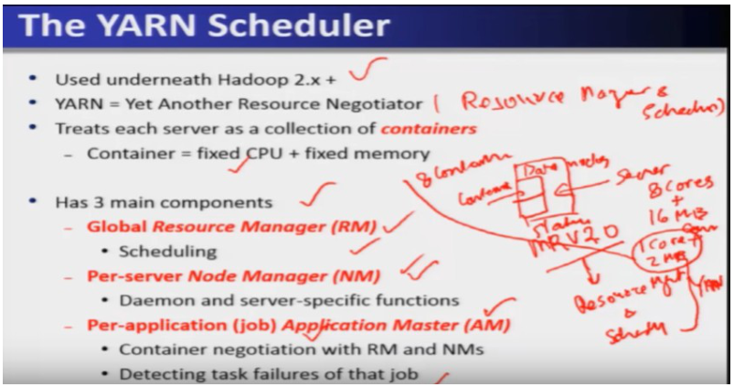
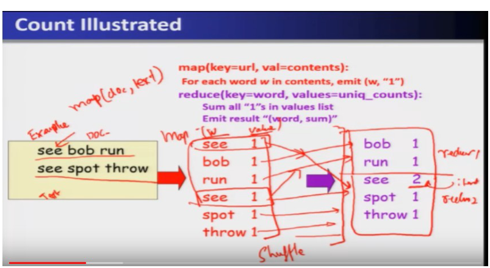

## This week's map

| Lec | Title | Why it is on the exam |
| --- | --- | --- |
| 4 | HDFS | Architecture, Federation, read/write path, tuning params — heavily quizzed |
| 5 | MapReduce 1.0 | JobTracker/TaskTracker roles, classic MR flow |
| 6 | MapReduce 2.0 (Part-I) | YARN motivation, ResourceManager/NodeManager |
| 7 | MapReduce 2.0 (Part-II) | YARN app lifecycle detail, MR1 vs YARN distinctions |
| 8 | MapReduce Examples | WordCount mechanics, map()-only-change questions |


Storage first, then the 1.0 engine that also scheduled, then the 2.0 split (YARN + map/reduce math), then the exam's favorite examples.

---

## Lecture 4: Hadoop Distributed File System (HDFS)

### Hook

Imagine a file too big to fit on one computer — say 10 GB, and your disk plus a thousand others are all cheap, failure-prone commodity machines. HDFS's whole job is to chop that file into blocks, scatter the blocks across hundreds/thousands of nodes, keep multiple copies so a dead disk doesn't lose data, and let compute run *next to* the data instead of dragging data across the network. Everything in this lecture — block size, replication factor, Federation — is just tuning that one idea.

### Slide picture


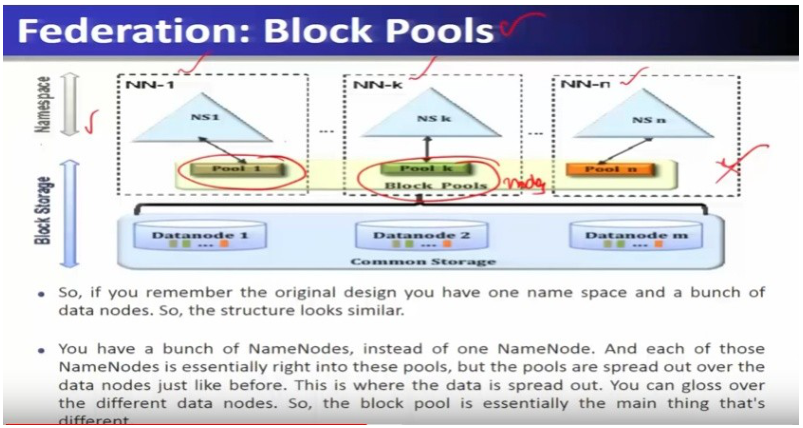

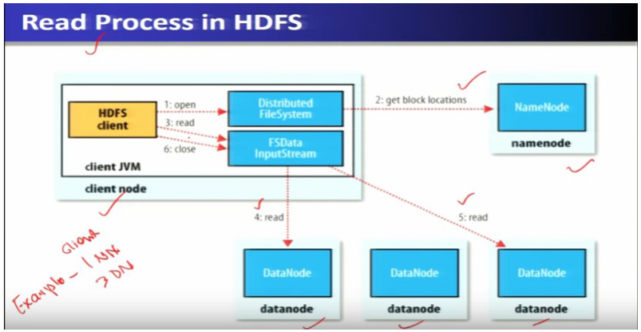


### Core ideas

HDFS is the warehouse filing system from week 1, now with the knobs quizzes love. A file too big for one disk is split into **blocks**, copies of each block live on several machines, and compute is sent *to* those machines.

**Write-once, read-many (simplified coherency):** after you finish writing a file, you do not have 50 processes editing the middle of it at once. That boring rule is why HDFS can skip the hard “everyone’s edit is consistent” logic of a normal filesystem. `EXAM`

**Relaxed POSIX:** a “real” Unix filesystem has strict rules (when is a write visible to others, locking, etc.). HDFS cheats for **throughput** — e.g. client-side buffering on write — so it is *like* a filesystem for big files, not a drop-in `/home` for your laptop. `EXAM`

**NameNode vs DataNode:** the NameNode is only the **catalog** (namespace = directory tree + filenames; plus “block 12 is on nodes A,B,C”). DataNodes store the **bytes** and obey placement orders; they do not invent the namespace. `EXAM`

**Read path:** ask NameNode where the blocks are → read the **closest** DataNode. NameNode is *not* in the data path after that. `EXAM`

**Write path / replication pipeline:** ask NameNode where to write → stream bytes to the first DataNode → that node **forwards** to the next replica while you are still writing (a bucket brigade), not “finish the whole file then copy.” `EXAM` `SLIDE`

**HDFS Federation:** one NameNode’s catalog can grow until RAM dies, and that one process is a single point of failure. Federation = **several NameNodes**, each with its own catalog (**namespace**). Each namespace owns a **block pool** — think of a labeled set of block IDs that belong to *that* catalog. All pools still live as bytes on the **same shared DataNodes** (the warehouse floor is shared; the reception desks are separate). Benefits: namespace **scalability**, **performance** (talk to the nearest catalog), **isolation** (one heavy tenant does not freeze another catalog). `EXAM` `PROF`

**Block size** default **64 MB**, often tuned to **128 MB**, `dfs.block.size`. Bigger → fewer catalog entries and fewer map tasks, less parallelism. Smaller → more parallel maps, more NameNode RAM and startup overhead. `EXAM`

**Replication factor** default **3**, `dfs.replication`. Fewer copies = cheaper disk, more risk, fewer nearby copies to read. More copies = safer + more locality, more disk. `EXAM`

**Small-files problem:** HDFS wants *few huge files*. Ten million 32 KB files means ten million catalog entries and tiny map tasks that spend their life starting a JVM. Fixes: **Sequence Files** (glue small files into one), HBase/Hive, combined input format. `EXAM` `PROF`

**Heartbeats + checksums:** DataNodes ping the NameNode; silence ⇒ mark dead and **re-replicate** under-copied blocks. Checksums catch rot; read another replica. Federation / standby NameNode mitigate NameNode death (failover is not magic by default). `EXAM`

**Numeric:** 10 GB / 64 MB = **160 blocks**. `EXAM`

### How it fits together

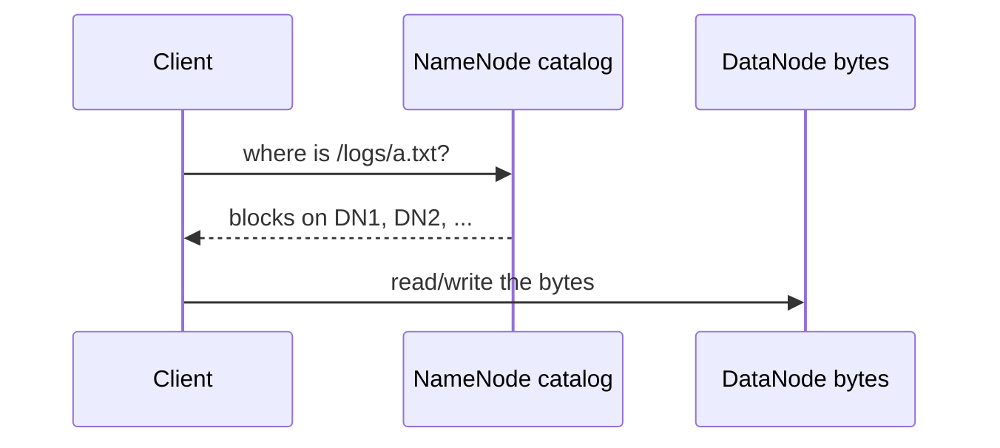

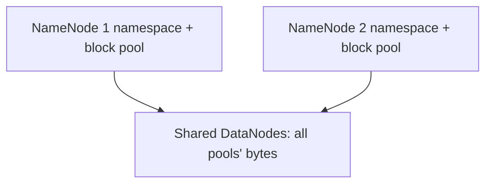

Client never treats the NameNode as a disk. Federation is extra reception desks, not extra copies of the *same* catalog.

### Worked example

10 GB file, default 64 MB block size:

```
number of blocks = file size / block size = (10 × 1024 MB) / 64 MB = 160 blocks
```

With replication factor 3, that's 160 × 3 = 480 physical block copies stored across the cluster, and at least 160 map tasks needed to process the whole file (one map task per block, minimum).

### Near-twins / traps

- **NameNode stores data** is NOT true — NameNode stores only **metadata** (filenames, block locations); actual data lives on DataNodes. `EXAM`
- **Reading a block you already know the location of still needs the NameNode** is NOT true — the NameNode is contacted once to get block locations; the actual read/write happens directly between client and DataNode.
- **Higher replication factor always improves performance** is misleading — it improves robustness *and* locality options, but costs more storage; it's a trade-off, not a free win.
- **HDFS Federation means multiple copies of the same namespace** is NOT true — Federation means multiple *independent* namespaces (NN-1, NN-2, …), each with its own block pool, not multiple copies of one namespace (that would just be replication).
- **Smaller block size is always better for parallelism** — true for parallelism, but NOT true for overall performance: small blocks blow up NameNode memory and map-task overhead, especially with many small files.

### Tiny recap card

1. NameNode = metadata only; DataNode = actual blocks; client talks to NameNode first, then reads/writes DataNodes directly.
2. Default block size 64 MB (tunable to 128 MB); default replication factor 3 — both are storage-vs-performance trade-offs.
3. HDFS Federation = multiple NameNodes, each with its own namespace + block pool, spread over shared DataNodes — fixes the single-NameNode bottleneck and single point of failure.

### Checkpoint

1. What does the HDFS NameNode actually store?
   a) The full contents of every file
   b) Metadata — filesystem namespace and block-to-DataNode mapping
   c) A backup copy of every block
   d) Only the replication factor

2. In the HDFS write path, replication to additional DataNodes happens:
   a) After the client finishes writing to the first DataNode, as a separate step
   b) In a pipeline, concurrently as the first DataNode forwards the block onward
   c) Only when the NameNode explicitly polls for under-replicated blocks
   d) Never — replicas are created only during periodic heartbeats

3. Two statements: (I) The default HDFS block size is 64 MB. (II) The default HDFS replication factor is 5. Which is true?
   a) Both I and II
   b) Only I
   c) Only II
   d) Neither

4. A cluster has a 10 GB file with the default 64 MB block size. How many blocks does it split into?
   a) 16
   b) 80
   c) 160
   d) 640

5. What is the main problem with storing a very large number of small files in HDFS?
   a) DataNodes cannot store small files at all
   b) It bloats NameNode memory and creates excessive short-lived map tasks
   c) It reduces the replication factor automatically
   d) It disables the read/write pipeline

6. What is the main benefit of HDFS Federation over a single-NameNode design?
   a) It removes the need for replication
   b) It increases namespace scalability and removes the single point of failure
   c) It merges all block pools into one node
   d) It eliminates the need for DataNodes

7. If the replication factor is lowered from 3 to 1, what is the trade-off?
   a) Better robustness, less storage used
   b) Less storage used, but reduced robustness and fewer locality options
   c) No effect on robustness, only affects block size
   d) Improves both storage and robustness

8. How does the NameNode detect that a DataNode has failed?
   a) The DataNode sends an explicit failure message
   b) Absence of periodic heartbeats from that DataNode
   c) A checksum mismatch on the NameNode itself
   d) The client reports a failed read

#### Answer key

1. **b** — NameNode never stores actual file data, only namespace + block location metadata.
2. **b** — the "replication pipeline": the client writes to the first DataNode, which forwards to the next while still receiving, so all replicas are written concurrently, not sequentially after.
3. **b** — block size default is 64 MB (true); replication default is 3, not 5, so statement II is false.
4. **c** — 10×1024/64 = 160.
5. **b** — every block/file adds NameNode metadata, and each tiny file still spins up its own map task, wasting JVM startup time and disk I/O.
6. **b** — Federation's whole point is scaling the namespace and removing the single-NameNode bottleneck/SPOF, not touching replication or DataNodes directly.
7. **b** — fewer replicas save space but leave less room for locality reads and less tolerance for node failure.
8. **b** — the NameNode relies on periodic heartbeats; a DataNode that misses them is marked down.

#### Optional, after you check

- Explain the HDFS replication pipeline in 30 seconds.
- What breaks if HDFS Federation is removed and we go back to one NameNode?

---

## Lecture 5: Hadoop MapReduce 1.0

### Hook

Say you have 20,000 customer records scattered across 5 machines and you want every customer from Mumbai. Someone has to (a) figure out where the data chunks live, (b) send the "find Mumbai customers" computation to each chunk in parallel, and (c) collect and report back when it's done. In MapReduce 1.0, that someone is a **JobTracker/TaskTracker** pair — a master who plans and delegates, and workers who actually crunch the data where it sits.

### Slide picture

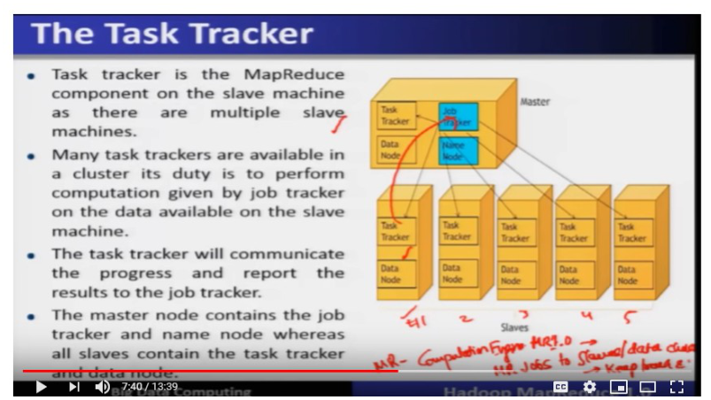

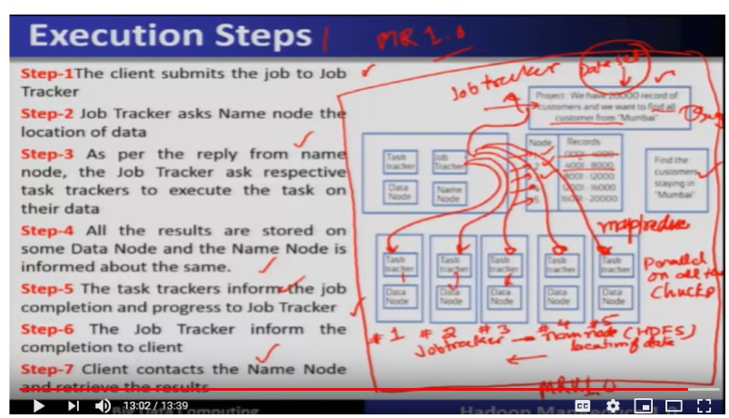

### Core ideas

- **MapReduce (1.0)** — the execution engine / programming paradigm of Hadoop 1.0; runs on top of HDFS 1.0 and, in this version, handles **both** resource management *and* data processing (these two responsibilities are later split apart in YARN — see Lecture 6). `EXAM`
- **JobTracker** — runs on the **Master** node (typically co-located with the HDFS NameNode); receives job execution requests from the client, breaks a submitted MapReduce job into smaller chunks/tasks, and assigns map/reduce tasks to TaskTrackers. Acts as the **server** in a client-server model. `EXAM`
- **TaskTracker** — runs on each **slave** node (alongside a DataNode); performs the actual map/reduce computation assigned by the JobTracker on the local data chunk, and reports progress/results back to the JobTracker. Acts as the **client** in the client-server model. `EXAM`
- **Master vs Slave composition** `EXAM`:
  - Master node = JobTracker + NameNode
  - Slave node = TaskTracker + DataNode
- **7-step execution cycle** (classic exam sequence — memorize the order) `EXAM`:
  1. Client submits the job to the JobTracker.
  2. JobTracker asks the NameNode for the data's location.
  3. JobTracker instructs the respective TaskTrackers to execute tasks on their local data chunks.
  4. All TaskTrackers execute **in parallel**; results are stored on the same DataNode where the computation ran.
  5. TaskTrackers report progress/completion back to the JobTracker.
  6. JobTracker informs the client of completion.
  7. Client contacts the NameNode and retrieves the result.
- **Data locality principle** — the JobTracker sends the computation *to* the node holding the data chunk, rather than moving data to a central compute node; this is the same "move computation, not data" idea from HDFS (Lecture 4). `PROF`
- **Chunks/splits** — the input dataset (e.g., 20,000 records) is divided and physically stored across multiple DataNodes (e.g., 4,000 records each on 5 nodes); MapReduce operates on these chunks in parallel. `SLIDE`

**Resource management vs processing, in 1.0:** the JobTracker is both the hotel desk (*who gets a machine*) and the recipe (*map/reduce*). YARN later splits those jobs. `EXAM`

### How it fits together

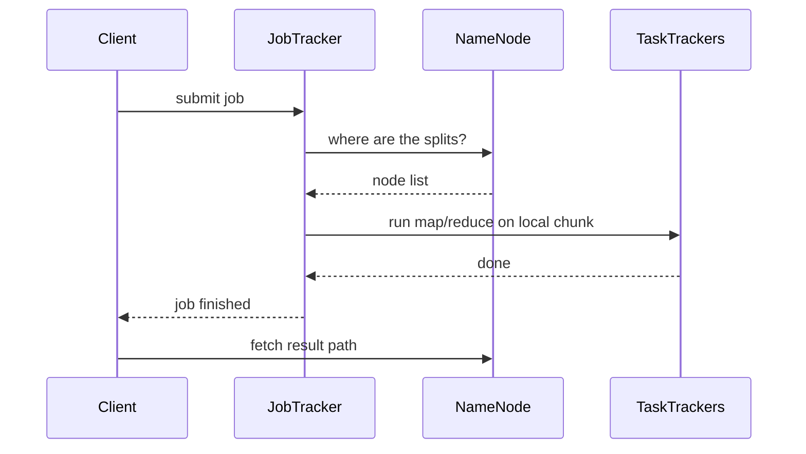

JobTracker never holds the 20,000 rows; it only plans. Bytes stay on DataNodes.

### Worked example

20,000 customer records split into 5 chunks of 4,000 each, stored on Node 1–5. Task: find all customers from Mumbai.

1. Client submits the "find Mumbai customers" MapReduce job to JobTracker.
2. JobTracker asks NameNode: where do the 5 chunks live? NameNode replies with node locations.
3. JobTracker tells TaskTracker on each of the 5 nodes to run the map function on its local 4,000-record chunk.
4. All 5 TaskTrackers filter their local chunk for Mumbai customers **in parallel**, writing results locally.
5. Each TaskTracker reports completion to JobTracker.
6. JobTracker tells the client the job is done.
7. Client goes to NameNode to fetch and assemble the final result.

### Near-twins / traps

- **JobTracker processes the data itself** is NOT true — JobTracker only **schedules and tracks**; the actual map/reduce computation happens on TaskTrackers at the slave nodes.
- **TaskTracker decides where jobs run** is NOT true — placement decisions are made by the JobTracker (based on data location from the NameNode); the TaskTracker only executes what it's told.
- **MapReduce 1.0 separates resource management from job scheduling** is NOT true — that separation is the defining feature of **YARN (MapReduce 2.0)**, not 1.0. In 1.0 the JobTracker does both.
- **The client retrieves results from the JobTracker directly** is NOT quite the full picture — the JobTracker informs the client of completion, but the client fetches the actual result via the **NameNode** (HDFS), not from the JobTracker itself.

### Tiny recap card

1. JobTracker (master, plans/tracks) + TaskTracker (slave, executes) = MapReduce 1.0's client-server engine.
2. JobTracker asks NameNode for data location, then sends tasks to the TaskTrackers holding that data — computation moves to data.
3. 7-step cycle: submit → locate → assign → parallel execute → report → notify client → client fetches via NameNode.

### Checkpoint

1. In MapReduce 1.0, which component actually performs the map/reduce computation?
   a) JobTracker
   b) NameNode
   c) TaskTracker
   d) Client

2. What two responsibilities does MapReduce 1.0's JobTracker combine, that later get split apart in YARN?
   a) Storage and replication
   b) Resource management and data processing
   c) Read and write paths
   d) Namespace and block pool management

3. Two statements: (I) The JobTracker typically runs on the Master node alongside the NameNode. (II) The TaskTracker typically runs on the Master node alongside the NameNode. Which is correct?
   a) Both I and II
   b) Only I
   c) Only II
   d) Neither

4. In the 7-step execution cycle, what does the JobTracker consult to find out where a file's data chunks are stored?
   a) The TaskTracker directly
   b) The client's local disk
   c) The NameNode
   d) The DataNode's heartbeat log

5. After task computation finishes, where are the results initially stored?
   a) On the JobTracker's local disk
   b) On the same DataNode where the computation ran
   c) On the client's machine
   d) On the NameNode

6. What happens if the JobTracker assigned tasks to nodes that did NOT hold the relevant data chunk?
   a) Nothing changes, MapReduce always works this way
   b) It would violate the data-locality principle and require moving data across the network, hurting performance
   c) The NameNode would automatically move the JobTracker
   d) TaskTrackers would refuse to run

#### Answer key

1. **c** — TaskTrackers do the actual work on slave nodes; JobTracker only schedules and tracks.
2. **b** — MapReduce 1.0 bundles resource management and data processing in one JobTracker; YARN later splits these into ResourceManager and per-application components.
3. **b** — Master = JobTracker + NameNode; Slave = TaskTracker + DataNode, so only statement I is true.
4. **c** — the NameNode holds block location metadata, which is exactly what the JobTracker needs to plan task placement.
5. **b** — results are written back to the same DataNode where the task executed, keeping computation and storage co-located.
6. **b** — the entire design point of "move computation to data" is defeated if tasks run away from their data, causing unnecessary network transfer.

#### Optional, after you check

- Explain the JobTracker/TaskTracker relationship in 30 seconds, the way you'd explain client-server to a friend.
- What would break in the 7-step cycle if the JobTracker crashed mid-job? (Hint: MapReduce 1.0 has no JobTracker failover — this is exactly the kind of single-point-of-failure problem YARN fixes.)

---

## Lecture 6: Hadoop MapReduce 2.0 (Part-I)

### Hook

MapReduce 1.0's JobTracker did two very different jobs at once: scheduling resources across the cluster *and* running the programming model. Version 2.0 splits those apart — resource management moves to **YARN**, leaving MapReduce as a pure **programming model**: you just write a `map()` and a `reduce()` function, and the framework automatically parallelizes, partitions, shuffles, and fault-tolerates everything underneath. This lecture is about that programming model itself, using the classic functional-programming idea and the WordCount example.

### Slide picture

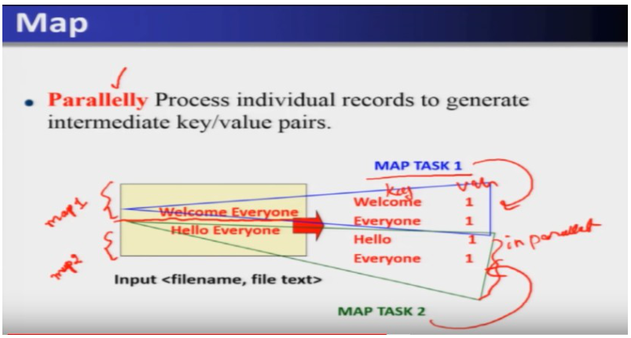

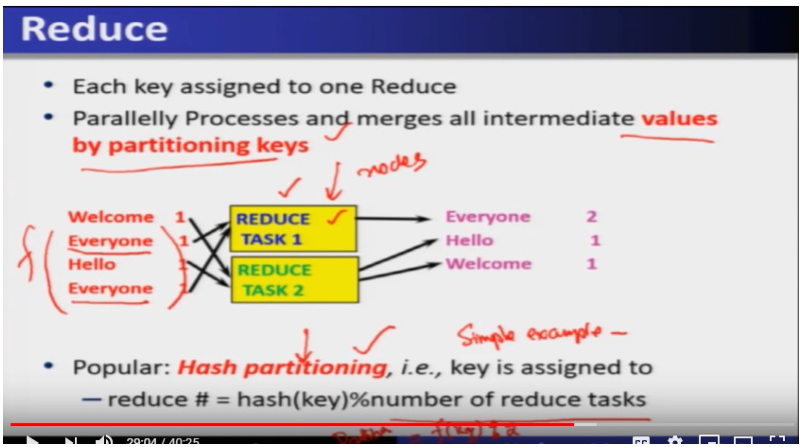

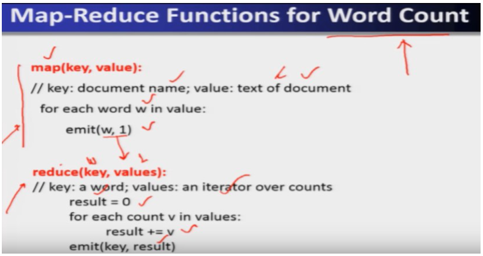

### Core ideas

- **Hadoop 2.0 stack** — three layers: **HDFS 2.0** (storage) → **YARN** (resource management + scheduling) → **MapReduce 2.0** (pure programming model). Other applications can also run directly on HDFS + YARN, bypassing MapReduce entirely. `EXAM`
- **Key simplification in MR 2.0** — resource management/scheduling responsibilities move out of MapReduce and into YARN; MapReduce now *only* handles the programming paradigm (map/reduce functions). `EXAM` — contrast with Lecture 5's MR 1.0 JobTracker, which did both.
- **MapReduce programming model** — input is a set of key/value pairs; output is a set of key/value pairs. The programmer supplies exactly two functions: `EXAM`
  - **Map** — takes one input (key, value) pair, produces a set of **intermediate** (key, value) pairs. Runs independently and in parallel over each record — no sequential dependency between records.
  - **Reduce** — takes an intermediate key and an **iterator** over all values for that key, merges them (typically into 0 or 1 output values per invocation), emits final output.
- **Functional-programming origin** — the map/reduce naming borrows from functional languages like Lisp: `(map square '(1 2 3 4))` → `(1 4 9 16)` applies a function independently/parallel to every list element; `(reduce + '(1 4 9 16))` → `30` folds the list with a binary operator. `PROF`
- **WordCount walkthrough** `EXAM`:
  - Input: `<filename, file text>` as the initial key/value.
  - Map emits `(word, 1)` for every word occurrence — e.g., "Welcome Everyone" / "Hello Everyone" split into 2 chunks run as Map Task 1 and Map Task 2 in parallel, each independently emitting its own (word,1) pairs.
  - **Shuffle** — sorts/groups all intermediate pairs by key so same-key values land together (this is the "group by key" step) before reduce sees them.
  - **Combiner** — an optional step (sometimes folded into map or reduce) that pre-aggregates values for the same key to cut network traffic before/at shuffle.
  - Reduce receives, per key, an **iterator** over all its values (e.g., "Everyone": [1,1]) and sums them → final count.
- **Reduce task partitioning** — each key is assigned to exactly **one** reduce task; a common scheme is **hash partitioning**: `reduce_task_number = hash(key) % number_of_reduce_tasks`. `EXAM`
  - All occurrences of the same key always land on the same reduce task (needed for correct aggregation).
- **Runtime guarantees automatically provided by the MapReduce framework** (programmer does not manage these manually) `EXAM`:
  - Automatic parallelization and distribution of data/computation across machines.
  - Fault tolerance — node failures handled via replicated chunks and rescheduling, without affecting overall job correctness.
  - I/O scheduling optimizations to reduce I/O operations and improve performance.
  - Monitoring — task progress/status tracked via client-server interaction (JobTracker/TaskTracker in MR1, YARN components in MR2).
- **Underlying distributed-file-system components (reused from HDFS ideas)** `SLIDE`:
  - **Chunk servers** — file split into chunks (~64 MB), replicated (replication factor, e.g., 3), sometimes across racks for rack-failure tolerance.
  - **Master node** (a.k.a. NameNode) — stores metadata: which chunks live on which chunk servers.
  - **Client library** — talks to the master to locate chunk servers, then connects directly to chunk servers for data access (same "ask master, then go direct" pattern seen in HDFS read/write).
- **Motivation for MapReduce** — want to use thousands of CPUs on large-scale data without programmers managing parallelization/distribution/fault-tolerance details themselves; MapReduce abstracts all of that away. `PROF` (Google runs 1,000+ MapReduce jobs/day historically, per the lecture.)

**Unpack the middle of the pipeline.** After map, you have a mess of `(key, value)` pairs on many machines. **Shuffle** is the network+sort step that *groups the same key together* (all `Everyone` 1's in one pile). An **iterator** is just “walk this pile one 1 at a time without loading the whole list into RAM if it is huge.” **Hash partitioning** is a consistent coin-flip: `hash(key) % R` so every `Everyone` always goes to the *same* reducer (otherwise two machines would each think the count is 1). A **combiner** is a local mini-reduce that sums 1's *before* the network, so you ship `(Everyone, 5)` instead of five `(Everyone, 1)`s.

### How it fits together


HDFS still holds files; YARN still rents machines; this lecture is only the *math* of map → shuffle → reduce.

### Worked example

WordCount, continuing the "Welcome Everyone / Hello Everyone" example:

1. **Map phase (parallel)**: Map Task 1 processes "Welcome Everyone" → emits `(Welcome,1)`, `(Everyone,1)`. Map Task 2 processes "Hello Everyone" → emits `(Hello,1)`, `(Everyone,1)`.
2. **Shuffle**: group by key → `Welcome:[1]`, `Everyone:[1,1]`, `Hello:[1]`.
3. **Partition** (hash partitioning, 2 reduce tasks): e.g., `Everyone` → Reduce Task 1; `Welcome`, `Hello` → Reduce Task 2 (assignment depends on `hash(key) % 2`).
4. **Reduce phase**: Reduce Task 1 sums Everyone's values via iterator → `Everyone: 2`. Reduce Task 2 sums → `Hello: 1`, `Welcome: 1`.

Pseudocode (from the slide):

```
map(key, value):
  // key: document name; value: text of document
  for each word w in value:
    emit(w, 1)

reduce(key, values):
  // key: a word; values: an iterator over counts
  result = 0
  for each count v in values:
    result += v
  emit(key, result)
```

### Near-twins / traps

- **MapReduce 2.0 still does its own resource scheduling** is NOT true — that job moved to **YARN**; MR 2.0 is a pure programming model. `EXAM`
- **Map processes records sequentially, one at a time** is NOT true — map is explicitly designed to process records **independently and in parallel**.
- **Reduce receives raw unsorted intermediate values** is NOT true — reduce receives values only **after shuffle** has grouped/sorted them by key, delivered via an iterator.
- **A key can be split across multiple reduce tasks** is NOT true — each key is assigned to exactly **one** reduce task (that's the whole point of hash partitioning — consistent routing per key).
- **Combiner and Reduce are the same thing** — NOT quite: the combiner is an optional local pre-aggregation step (can run as part of the map side) to cut network traffic; the reduce function is the final, required aggregation step after shuffle.

### Tiny recap card

1. MR 2.0 = pure programming model (map + reduce functions only); YARN now owns resource management/scheduling.
2. Map emits intermediate (key,value) pairs in parallel per record; shuffle groups by key; reduce iterates over each key's values to produce final output.
3. Each key routes to exactly one reduce task (commonly via hash partitioning: `hash(key) % num_reduce_tasks`).

### Checkpoint

1. In MapReduce 2.0, which component now handles resource management and scheduling, a responsibility MapReduce 1.0 handled itself?
   a) The Map function
   b) YARN
   c) The Reduce function
   d) The Combiner

2. What is the correct order of phases when processing a MapReduce job's intermediate data?
   a) Reduce → Shuffle → Map
   b) Map → Shuffle → Reduce
   c) Shuffle → Map → Reduce
   d) Map → Reduce → Shuffle

3. Two statements: (I) Map function processes records independently and can run in parallel. (II) Reduce function can begin processing a key's values before shuffle groups them. Which is correct?
   a) Both I and II
   b) Only I
   c) Only II
   d) Neither

4. Using hash partitioning with 2 reduce tasks, what determines which reduce task a given key goes to?
   a) The order the key was emitted in
   b) hash(key) % number_of_reduce_tasks
   c) A random assignment each time
   d) Alphabetical order of the key

5. In the WordCount example, what does the Map function emit for each word occurrence?
   a) (word, total_count_so_far)
   b) (word, 1)
   c) (document_name, word)
   d) (word, document_name)

6. What does the Reduce function's iterator provide?
   a) A single combined value per key, pre-summed
   b) A scan over all intermediate values associated with one key
   c) The raw, unsorted list of all key-value pairs in the job
   d) The physical location of each chunk server

7. Why can a very large list of intermediate values still be processed correctly by Reduce even if it can't fit in memory at once?
   a) Because MapReduce truncates the list
   b) Because the iterator supplies values one at a time / as a stream rather than loading them all at once
   c) Because reduce tasks are skipped for large lists
   d) Because YARN caches everything in RAM automatically

8. Which of these is NOT something the MapReduce runtime handles automatically for the programmer?
   a) Fault tolerance for node failures
   b) Automatic parallelization and distribution
   c) I/O scheduling optimization
   d) Writing the application-specific map() logic

#### Answer key

1. **b** — YARN takes over resource management/scheduling in Hadoop 2.0, leaving MapReduce as a pure programming model.
2. **b** — records are processed by Map, intermediate results are grouped by Shuffle, then Reduce aggregates per key.
3. **b** — Map is independent/parallel by design (I true); Reduce needs shuffle's grouping to see all values per key before it can process them (II false).
4. **b** — hash partitioning routes each key deterministically using hash(key) mod the number of reduce tasks.
5. **b** — WordCount's map emits a (word, 1) pair for every occurrence of a word.
6. **b** — the iterator scans through all values sharing that key, supplied by the shuffle step.
7. **b** — values are streamed to reduce via the iterator instead of being materialized fully in memory, which is exactly why huge lists are still processable.
8. **d** — writing the map() function's application logic is the one thing the *programmer* must do; everything else (parallelization, fault tolerance, I/O scheduling) is automatic.

#### Optional, after you check

- Explain, in your own words, why shuffle has to happen before reduce can start.
- What would go wrong with WordCount if hash partitioning sent different occurrences of the same word to different reduce tasks?

---

## Lecture 7: Hadoop MapReduce 2.0 (Part-II)

### Hook

Once you accept "just write map() and reduce()", a whole zoo of real-world problems fall out of the same template: grepping huge log files, counting URL hits, finding who links to a webpage, building a search engine's inverted index, even distributed sorting. This lecture runs through those applications, then answers the follow-up question: if MapReduce itself no longer manages resources, who hands out the CPUs and memory? That's **YARN**, and its Resource Manager / Node Manager / Application Master triad.

### Slide picture

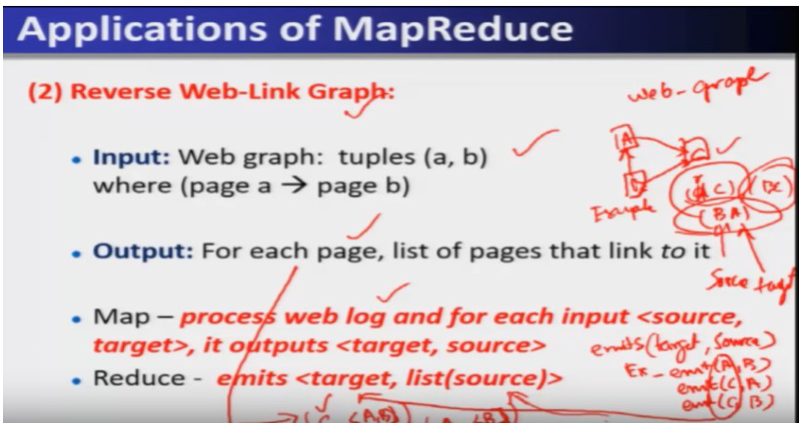


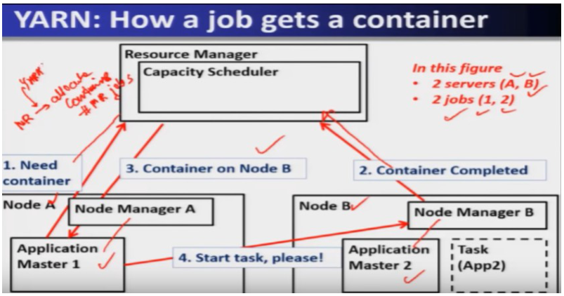

### Core ideas

- **Distributed Grep** — map emits a line if it matches a supplied pattern; reduce is the **identity function** (just copies intermediate values to output). Works because the huge document is distributed across nodes so no single machine needs the whole thing in memory. `EXAM`
- **Count of URL Access Frequency** — map processes a web-log, emits `(URL, 1)` per access; reduce sums per URL — essentially WordCount applied to URLs instead of words. `EXAM`
- **Reverse Web-Link Graph** — input is web-graph tuples `(a, b)` meaning page a → page b; map emits `<target, source>` for each edge; reduce concatenates all sources into `<target, list(source)>`, giving, for each page, the list of pages linking to it. Useful for computing **PageRank**-style popularity. `EXAM`
  - Worked mini-example: edges A→C, B→C, B→A. Map emits (C,A), (C,B), (A,B). Reduce groups by target: C → [A,B], A → [B]. So page C is linked from A and B; page A is linked from B only.
- **Term-Vector per Host** — map emits `(hostname, term_vector)` per document (hostname pulled from the doc's URL); reduce merges all term vectors for a host, drops infrequent terms, emits `(hostname, term_vector)`. Summarizes a host's most important words. `SLIDE`
- **Inverted Index** — the core mechanism behind search engines. Map parses each document, emits `(word, document_ID)` pairs; reduce collects all doc IDs per word, sorts them, emits `(word, list(document_ID))`. This is exactly what lets a search engine answer "which documents contain this keyword" instantly. `EXAM` `PROF`
- **Distributed Sort** — map extracts the key from each record and emits `(key, record)`; reduce emits pairs **unchanged**. Sorting itself happens implicitly: map-side uses **quicksort**, and the shuffle-then-reduce merge step uses **merge sort**. Partitioning across reducers must use **range partitioning**, not hash partitioning — hashing would destroy the sorted order. `EXAM` `PROF` (a genuine trap: default MapReduce partitioning intuition is hash-based, but sort breaks that assumption)
- **Chained MapReduce** — some problems (e.g., URL access **percentage**, not just count) need more than one MapReduce job in sequence: job 1 computes `(URL, count)`; job 2 reshapes to `(1, (URL,count))`; job 3 sums all counts and computes each URL's `count / total` as a percentage. Complex applications can be solved by chaining multiple MapReduce jobs together. `EXAM`
- **YARN** — "Yet Another Resource Negotiator"; used underneath Hadoop 2.x+ to do MapReduce's resource management and scheduling (the job MR 1.0's JobTracker used to do). `EXAM`
  - Treats each server as a collection of **containers**; a container = a fixed slice of CPU + memory (e.g., an 8-core/16 MB server might be divided into 8 containers of 1 core + 2 MB each).
  - **Three main components** `EXAM`:
    1. **Global Resource Manager (RM)** — overall scheduling across the whole cluster.
    2. **Per-server Node Manager (NM)** — a daemon on each server handling server-specific functions (starting/monitoring containers on that node).
    3. **Per-application Application Master (AM)** — one per job; negotiates with the RM and NMs to get containers, and detects/handles task failures for that specific job.
- **YARN container allocation flow** (2 servers A,B; 2 jobs 1,2 example) `EXAM`:
  1. Application Master needs a container → requests the Resource Manager.
  2. Resource Manager tracks container completions/availability across nodes.
  3. Resource Manager allocates an available container (e.g., on Node B) to the requesting Application Master.
  4. Application Master contacts the Node Manager on that node and says "start task, please" — execution begins; when done, the container is returned to the pool.

**Hash vs range partitioning, in one picture.** WordCount uses **hash**: sprinkle keys across reducers so load is even; order of keys across reducers does not matter. **Distributed sort** needs **range partitioning**: reducer 0 gets keys `A–G`, reducer 1 `H–N`, … so concatenating reducer outputs is globally sorted. Hash would scatter `Apple` and `Banana` to random reducers and destroy that order. `EXAM` `PROF`

**YARN vs JobTracker.** The **Resource Manager** is the cluster-wide hotel desk. Each **Node Manager** is the floor staff on one server. Each running job gets its own **Application Master** — a foreman who *asks* the desk for rooms (**containers**) and notices if *that job’s* workers die. The AM does **not** schedule the whole hotel. `EXAM`

### How it fits together

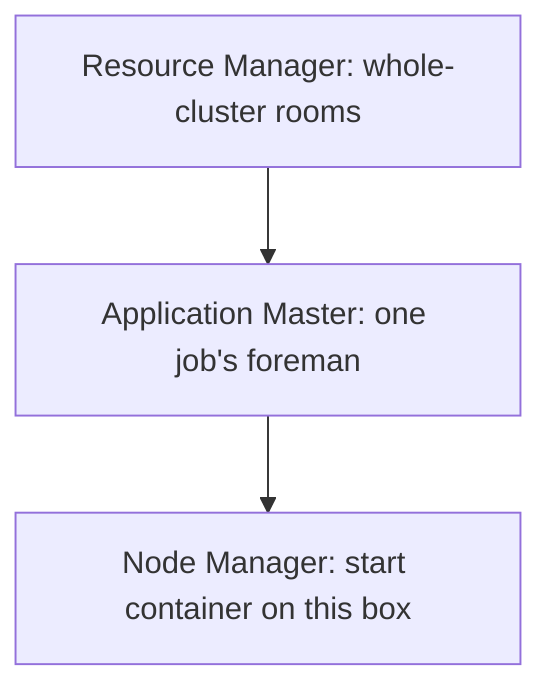

Grep/sort/inverted-index are the *same* map-shuffle-reduce template with different keys; YARN is *who pays for the machines* while that template runs.

### Worked example

Reverse Web-Link Graph with edges A→C, B→C, B→A (same as slide):

```
Input tuples: (A,C), (B,C), (B,A)
Map: for each (source, target) emit (target, source)
  (A,C) -> emit (C, A)
  (B,C) -> emit (C, B)
  (B,A) -> emit (A, B)
Shuffle groups by key (target):
  C -> [A, B]
  A -> [B]
Reduce: emit (target, list(source))
  (C, [A, B])   -- pages A and B point to C
  (A, [B])      -- page B points to A
```

### Near-twins / traps

- **Distributed Grep needs a reduce that does real work** is NOT true — its reduce is the **identity function**, just passing map's output through unchanged.
- **Distributed Sort's reducer sorts the data** is NOT quite the full picture — the sort happens via **map-side quicksort** and **shuffle-driven merge sort**; the reduce function itself just emits pairs unchanged.
- **Distributed Sort can safely use hash partitioning like WordCount** is NOT true — hash partitioning would scramble global order; sort requires **range partitioning**.
- **YARN's Application Master schedules the whole cluster** is NOT true — that's the **Resource Manager's** job; the Application Master only manages containers/failures for *its own* job.
- **A container is a fixed unit across all servers** is NOT true — container size (CPU+memory) is derived from that particular server's total resources; different servers can yield different container counts.

### Tiny recap card

1. Many real applications (grep, URL counting, reverse web-link, inverted index, distributed sort) map cleanly onto map()+reduce(), sometimes with reduce as pure identity (grep, sort).
2. Distributed Sort is the odd one out: quicksort on map side + merge sort via shuffle, and partitioning must be by range, never by hash.
3. YARN = Resource Manager (global scheduler) + Node Manager (per-server daemon) + Application Master (per-job container negotiator/failure handler), operating over fixed CPU+memory "containers."

### Checkpoint

1. In the Distributed Grep application, what does the reduce function do?
   a) Counts pattern matches per line
   b) Nothing meaningful — it is the identity function
   c) Sorts all matching lines
   d) Removes duplicate lines

2. In the Reverse Web-Link Graph application, what does the map function emit for an edge (source, target)?
   a) (source, target)
   b) (target, source)
   c) (target, count)
   d) (source, count)

3. Why can't Distributed Sort use hash partitioning across reducers the way WordCount does?
   a) Hash partitioning is too slow for sorting
   b) Hashing would destroy the required global sorted order; range partitioning is needed instead
   c) Reduce functions cannot accept hashed keys
   d) There is no difference; both work equally well

4. What are YARN's three main components?
   a) NameNode, DataNode, Client
   b) JobTracker, TaskTracker, Client
   c) Resource Manager, Node Manager, Application Master
   d) Master, Slave, Combiner

5. In YARN, which component is responsible for detecting task failures within one specific job?
   a) Resource Manager
   b) Node Manager
   c) Application Master
   d) NameNode

6. What is a YARN "container"?
   a) A virtual machine running a full OS
   b) A fixed allocation of CPU and memory on a server
   c) A replica of a data block
   d) A queue of pending MapReduce jobs

7. Why might a problem like "percentage of total URL accesses" require chaining multiple MapReduce jobs?
   a) MapReduce cannot process URLs at all
   b) A single map/reduce pass cannot both compute per-URL counts and the overall total needed for percentage in one step
   c) YARN forbids more than one job per cluster
   d) Reduce functions cannot perform division

8. Two statements: (I) The Resource Manager allocates containers across the whole cluster. (II) The Application Master allocates containers across the whole cluster. Which is correct?
   a) Both I and II
   b) Only I
   c) Only II
   d) Neither

#### Answer key

1. **b** — grep's reduce just passes through whatever lines the map function already filtered; no aggregation needed.
2. **b** — reversing the direction is the whole point: map flips (source,target) into (target,source) so reduce can group all sources per target.
3. **b** — hashing scatters keys without regard to order, which breaks a globally sorted result; range partitioning keeps contiguous key ranges together.
4. **c** — Resource Manager, Node Manager, and Application Master are YARN's three components (not to be confused with MR1's JobTracker/TaskTracker).
5. **c** — the Application Master is scoped to one job and is responsible for detecting and responding to that job's task failures.
6. **b** — a container is a bundle of a fixed amount of CPU and memory carved out of a server's total resources.
7. **b** — computing a percentage needs both an individual URL's count and the sum of all counts, which typically requires a first job to get counts and a second/third job to compute the total and divide — hence chaining.
8. **b** — only the Resource Manager has cluster-wide scheduling authority; the Application Master only negotiates containers for its own job.

#### Optional, after you check

- Explain in 30 seconds why Distributed Sort's reducer barely "does" anything, yet the output is still globally sorted.
- What would go wrong if two different Application Masters could directly allocate containers without going through the Resource Manager?

---

## Lecture 8: MapReduce Examples

### Hook

This lecture is a worked-example tour: the same map()/reduce() template solves word counting, categorizing words by length, building a search index, joining two relational tables, and even finding common friends on a social network. If you can trace WordCount by hand, you can trace all six — the trick is always deciding what the **key** and **value** should be at each stage.

### Slide picture


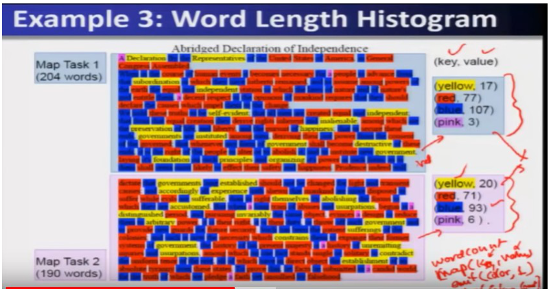

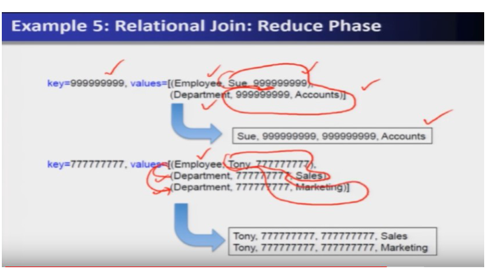

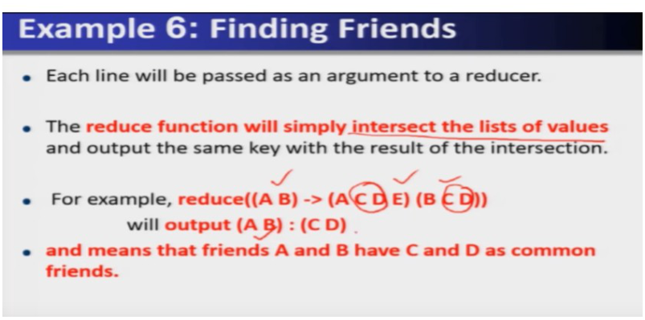

### Core ideas

- **Example 1 — WordCount** — canonical map/reduce structure, reused as the base pattern for every other example in this lecture: `EXAM`
  ```
  map(key, value): // key=doc name, value=text
    for each word w in value: emit(w, 1)
  reduce(key, values): // key=word, values=iterator of counts
    result = sum(values); emit(key, result)
  ```
  Traced example: "see bob run / see spot throw" → map emits (see,1) twice, (bob,1), (run,1), (spot,1), (throw,1) → shuffle groups "see" together → reduce sums → see:2, bob:1, run:1, spot:1, throw:1.
- **Example 2 — Counting words of different lengths** — map's **key becomes the word's length**, value is the word itself; reduce groups by length and collects the matching words into a list. `EXAM` Shows the key/value choice is a design decision, not fixed to "the word" — you pick whatever you're grouping by.
- **Example 3 — Word Length Histogram** — an extension of Example 2: instead of listing words, bucket them into **categories** (Big/yellow=10+ letters, Medium/red=5–9, Small/blue=2–4, Tiny/pink=1 letter) and count occurrences per category. `EXAM`
  - Map emits `(color_category, 1)` per word; each map task produces its own partial counts (e.g., Map Task 1: yellow 17, red 77, blue 107, pink 3; Map Task 2: yellow 20, red 71, blue 93, pink 6).
  - Reduce sums the partial counts from all map tasks via the iterator → final totals (yellow 37, red 148, blue 200, pink 9). `SLIDE`
  - This demonstrates that **reduce aggregates partial per-map-task results**, not just per-record values — MapReduce naturally supports multi-stage aggregation.
- **Example 4 — Inverted Index** — map emits `(word, document_ID)` for every word occurrence; reduce groups by word and collects/sorts the list of document IDs containing that word. `EXAM`
  - Worked mini-example: tweet1="I love pancakes for breakfast", tweet2="I dislike pancakes", tweet3="What should I eat for breakfast?", tweet4="I love to eat" → output includes `"pancakes": (tweet1, tweet2)`, `"breakfast": (tweet1, tweet3)`, `"eat": (tweet3, tweet4)`, `"love": (tweet1, tweet4)`.
  - This is the literal mechanism behind search engines answering "which documents contain keyword X". `PROF`
- **Example 5 — Relational Join** — MapReduce is inherently a **unary** operation (one input stream), but joins are **binary** (two tables); the trick is to tag every tuple from both tables with the join key as the map key, then let reduce combine matches. `EXAM` `PROF` (a genuine trap: students may assume MapReduce can't do joins because it's unary — the tagging trick resolves this.)
  - Map: for each tuple in either table, emit `(join_key, (table_name, rest_of_tuple))` — e.g., for Employee(name, SSN) and Department(SSN, dept), emit keyed on SSN.
  - Reduce: group by join key; when multiple tuples with **different table origins** share a key, combine them into joined output rows (one output row per matching pair, e.g., Tony joined with both Sales and Marketing produces two output tuples).
- **Example 6 — Finding Common Friends** — a social-network operation (e.g., Facebook's "mutual friends"). `EXAM`
  - Map: for a person X with friend list L, emit a key for **every pair** (X, other-person-in-L) — keyed with the smaller/earlier name first — paired with the *entire* friend list L as the value. E.g., for `A -> (B,C,D)`: emit (A,B)->(B,C,D), (A,C)->(B,C,D), (A,D)->(B,C,D).
  - Reduce: for each pair-key, take the **intersection** of the (usually two) friend-lists collected for that pair, and that intersection is their common-friends list. E.g., `reduce((A,B) -> (A,C,D,E),(B,C,D)) = (A,B): (C,D)`.
  - Computed **in parallel** for every pair of people simultaneously.

**Unary vs binary, in English.** MapReduce’s map function sees *one* input record at a time (unary). A SQL join needs *two* tables. The exam trick: pretend there is still one stream, but **tag** each record with which table it came from and use the join column as the map key. Reduce then sees, for one SSN, both the employee row and the department rows, and can stitch them. You did not magically get two inputs; you encoded both tables into one keyed pile. `EXAM` `PROF`

### How it fits together

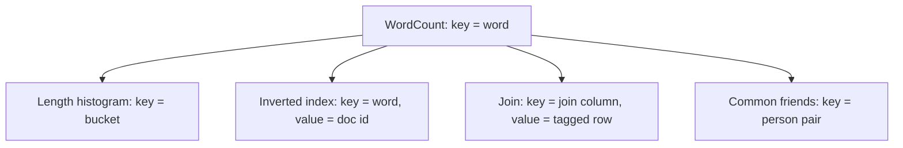

Change what you *group by* (the key) and what you *emit*; reduce still just combines the pile for that key.

### Worked example

Common Friends, full trace for pair (A,B):

```
Input: A -> (B,C,D);  B -> (A,C,D,E)
Map(A -> B,C,D):  (A,B)->(B,C,D)   (A,C)->(B,C,D)   (A,D)->(B,C,D)
Map(B -> A,C,D,E): (A,B)->(A,C,D,E) (B,C)->(A,C,D,E) (B,D)->(A,C,D,E) (B,E)->(A,C,D,E)

Shuffle groups by key:
(A,B) -> [(A,C,D,E), (B,C,D)]

Reduce: intersect the two lists
(A,B) : intersection of {A,C,D,E} and {B,C,D} = {C,D}
Output: (A,B) : (C,D)   -- A and B's common friends are C and D
```

### Near-twins / traps

- **The map key must always be the record's natural identifier (like a word)** is NOT true — Example 2/3 use the word's **length/category** as the key, and Example 5/6 use a **join key** or **person-pair** as the key. The key is whatever you're grouping/aggregating by.
- **MapReduce cannot do relational joins because it's a unary operation** is NOT true — you resolve this by **tagging every tuple with its table name** and using the join column as the map key, turning a binary join into a keyed grouping problem reduce can handle.
- **Word Length Histogram's reduce recomputes counts from scratch** is NOT true — reduce **sums partial counts already computed by different map tasks** (17+20=37 for yellow), it doesn't rescan raw words.
- **Finding Common Friends' reduce needs to compare every person against every other person globally** is NOT true — reduce only ever looks at the (usually two) friend-lists that happen to share the **same pair-key**, an inherently parallel/local operation.

### Tiny recap card

1. The map/reduce key is a design choice — word, length-category, join-column, or person-pair — chosen based on what you want reduce to group together.
2. Reduce can aggregate either raw values (WordCount) or already-partially-aggregated values from different map tasks (Word Length Histogram) — both use the same iterator-and-sum pattern.
3. Binary/relational operations (joins, common-friends intersection) become unary-friendly by tagging tuples with an origin label and picking the shared attribute as the map key.

### Checkpoint

1. In "Counting words of different lengths," what does the map function use as the key?
   a) The word itself
   b) The document name
   c) The length of the word
   d) A random hash

2. In the Word Length Histogram example, what operation does reduce perform on the values coming from two different map tasks?
   a) Concatenates all words alphabetically
   b) Sums the partial per-category counts from each map task into final totals
   c) Picks only the larger of the two counts
   d) Recomputes the word lengths from scratch

3. In the Inverted Index example, what does the reduce function output for a given word?
   a) The word's total character count
   b) A sorted list of document IDs containing that word
   c) The single document where the word appears most
   d) The word's length category

4. Why is a relational join tricky to express directly in MapReduce?
   a) MapReduce cannot use SSN or similar keys
   b) MapReduce is inherently unary, but a join is a binary operation over two tables
   c) Reduce functions cannot process more than one value
   d) Map functions can only run on one table at a time

5. In the relational join example, what trick allows two different tables to be joined using MapReduce?
   a) Running two completely separate MapReduce jobs and merging manually afterward
   b) Tagging each tuple with its table name and using the join column as the map key
   c) Concatenating both tables into a single file before any processing
   d) Only joining tables of identical schema

6. In Finding Common Friends, what operation does the reduce function perform on the two friend-lists sharing a pair-key like (A,B)?
   a) Union of the two lists
   b) Intersection of the two lists
   c) Concatenation of the two lists
   d) Sorting the two lists alphabetically

7. Two statements: (I) In Finding Common Friends, each map task emits a key for every pair of the form (person, one-friend-from-their-list). (II) The value emitted alongside each such key is the entire friend list of the person, not just the single other person's name. Which is correct?
   a) Both I and II
   b) Only I
   c) Only II
   d) Neither

8. What does "reduce((A,B) -> (A,C,D,E),(B,C,D))" output, following the lecture's worked example?
   a) (A,B): (A,B,C,D,E)
   b) (A,B): (C,D)
   c) (A,B): (A,E)
   d) (A,B): ()

#### Answer key

1. **c** — the length becomes the grouping key so reduce can collect all words sharing that length.
2. **b** — reduce sums the already-partially-tallied counts from each map task's local pass, giving the final histogram totals.
3. **b** — inverted index output is exactly (word, sorted list of document IDs containing it) — the mechanism search engines rely on.
4. **b** — MapReduce processes one input stream (unary), while a join fundamentally combines two separate tables (binary), requiring a workaround.
5. **b** — tagging tuples with their originating table and keying on the join column lets reduce see and combine matching tuples from both tables.
6. **b** — the whole point of finding *common* friends is intersection, not union or concatenation.
7. **a** — both statements match the lecture's worked example: a key is emitted per pair, and the emitted value is the full friend list (not a single name), so reduce can later intersect two full lists.
8. **b** — intersecting {A,C,D,E} and {B,C,D} gives {C,D}, matching the lecture's stated output.

#### Optional, after you check

- Explain in 30 seconds why Example 2's map key can be "word length" instead of "the word itself."
- What would break in the relational join example if the map function forgot to tag each tuple with its table name?

---

## Week wrap

### How the lectures connect

Week 2 builds Hadoop's two pillars in order: storage, then compute. Lecture 4 gives you HDFS — a NameNode holding metadata and DataNodes holding replicated blocks, tuned by block size and replication factor, made more scalable/robust by Federation. Lectures 5–7 then build the compute layer on top of that storage: Lecture 5 shows the original MapReduce 1.0 engine (JobTracker/TaskTracker) doing both scheduling and computation in one component; Lecture 6 shows how MapReduce 2.0 strips scheduling out, leaving a clean map/reduce programming model (with shuffle and partitioning as the connective tissue between them); Lecture 7 shows both the wider zoo of problems that model solves and the YARN architecture (Resource Manager/Node Manager/Application Master) that took over the scheduling job. Lecture 8 is the payoff: watch the same map()/reduce() template — pick a key, emit intermediate pairs, group, aggregate — solve six genuinely different problems, from word counting to social-network friend intersection. The throughline for the whole week: **move computation to data, and let the framework handle parallelism, faults, and scheduling so the programmer only writes two functions.**

### Assignment-shaped mixed quiz

1. What does the HDFS NameNode store?
   a) File contents
   b) Metadata: namespace and block locations
   c) A full backup of every DataNode
   d) Only the replication factor

2. What is the default HDFS replication factor?
   a) 1
   b) 2
   c) 3
   d) 5

3. In HDFS Federation, what does each NameNode own?
   a) A full copy of every other NameNode's data
   b) Its own independent namespace and block pool
   c) Only the read path, never the write path
   d) A single shared block pool with no isolation

4. In MapReduce 1.0, which component both schedules jobs AND assigns map/reduce tasks?
   a) TaskTracker
   b) NameNode
   c) JobTracker
   d) DataNode

5. What changed between MapReduce 1.0 and MapReduce 2.0?
   a) MapReduce 2.0 removed the reduce function entirely
   b) Resource management/scheduling moved from MapReduce itself into YARN
   c) MapReduce 2.0 no longer uses key-value pairs
   d) MapReduce 2.0 eliminated the need for HDFS

6. What are YARN's three main components?
   a) NameNode, DataNode, Client
   b) Resource Manager, Node Manager, Application Master
   c) JobTracker, TaskTracker, Combiner
   d) Mapper, Reducer, Shuffler

7. Which MapReduce application uses the identity function as its reduce step?
   a) WordCount
   b) Distributed Grep
   c) Inverted Index
   d) Relational Join

8. Why must Distributed Sort use range partitioning instead of hash partitioning?
   a) Range partitioning is faster to compute
   b) Hash partitioning would destroy the required global sorted order
   c) Reduce cannot accept hashed keys
   d) There is no real difference between them

9. In the Reverse Web-Link Graph application, what does the map function emit for edge (source, target)?
   a) (source, target)
   b) (target, source)
   c) (source, 1)
   d) (target, 1)

10. In the Relational Join example, what value is used as the map key to bring matching tuples from two different tables together?
    a) The table name
    b) A random identifier
    c) The join column (e.g., SSN)
    d) The row number

11. In Finding Common Friends, what does reduce do with the two friend-lists sharing a pair-key?
    a) Union
    b) Intersection
    c) Concatenation
    d) Subtraction

12. A 10 GB file is stored with the default HDFS block size. How many blocks does it produce?
    a) 40
    b) 80
    c) 160
    d) 320

#### Answer key

1. **b** — NameNode is purely metadata; DataNodes hold the actual data.
2. **c** — 3 is the default replication factor (`dfs.replication`).
3. **b** — Federation's core idea: independent namespaces + block pools per NameNode, spread over shared DataNodes.
4. **c** — JobTracker in MR1.0 handles both scheduling and delegating map/reduce tasks; TaskTracker just executes.
5. **b** — YARN takes over resource management/scheduling in Hadoop 2.0, leaving MapReduce as a pure programming model.
6. **b** — Resource Manager (global), Node Manager (per-server), Application Master (per-job).
7. **b** — Distributed Grep's reduce is a pure identity function; it just passes matching lines through.
8. **b** — hashing scrambles order; range partitioning keeps the sort intact across reducers.
9. **b** — reversing direction is the whole point: map flips (source,target) to (target,source) so reduce can group all sources per target.
10. **c** — the join column (e.g., SSN or order ID) becomes the map key so reduce can group matching tuples from both tables together.
11. **b** — "common" friends means intersection of the two lists, not union or concatenation.
12. **c** — 10×1024/64 = 160 blocks at the default 64 MB block size.

### Last 5-minute drill

| Term | 6-word answer |
| --- | --- |
| NameNode | Stores metadata: filenames and block locations |
| DataNode | Stores actual data blocks on disk |
| HDFS block size default | 64 MB, tunable up to 128 MB |
| HDFS replication factor default | 3 copies of every data block |
| HDFS Federation | Multiple NameNodes, each own namespace/pool |
| JobTracker (MR1) | Master; schedules and tracks MapReduce jobs |
| TaskTracker (MR1) | Slave; executes assigned map/reduce tasks |
| YARN | Resource management/scheduling, replacing JobTracker's role |
| Resource Manager (YARN) | Global scheduler across the entire cluster |
| Node Manager (YARN) | Per-server daemon managing that server's containers |
| Application Master (YARN) | Per-job container negotiator and failure handler |
| Container (YARN) | Fixed CPU + memory slice on a server |
| Map function | Emits intermediate key-value pairs, runs parallel |
| Reduce function | Aggregates values per key via iterator |
| Shuffle | Groups and sorts intermediate pairs by key |
| Distributed Sort partitioning | Range partitioning, never hash — preserves order |
| Inverted Index | Word to sorted list of document IDs |
| Relational Join in MapReduce | Tag tuples by table, key on join column |
