# Week 3 — Spark and the Design of Key-Value Stores

> Goal: finish this week without the video or the raw PDF. Exam first, then a first reading that actually makes sense.
> Time budget: about 90–110 minutes for this week (four lectures, two of them meaty).

## One-page cheat sheet

**If you remember only 7 things this week**

1. MapReduce forces every intermediate result through HDFS (for fault tolerance) — safe but slow, and useless for interactive/iterative work. Spark's fix is the **RDD**: an immutable, partitioned collection kept **in memory**, rebuilt on failure by replaying its **lineage** (a log of the transformations that built it) instead of reading a saved copy off disk.
2. RDDs support two operation types: **transformations** (map, filter, join, groupByKey, reduceByKey — lazy, build a new RDD, nothing runs yet) and **actions** (count, collect, take, saveAsTextFile — actually trigger the computation). Nothing executes until an action is called.
3. Job execution: **Driver program** creates a **SparkContext**, which talks to a **Cluster Manager** (or YARN/Mesos), which hands work to **Worker Nodes**; each worker runs **Executors**, and each executor runs **Tasks** and holds a **Cache**. The whole computation is compiled into a **DAG** (directed acyclic graph) of stages, split by the DAG scheduler at shuffle boundaries.
4. Cache is why Spark is fast for repeat queries: an in-cache lookup on a filtered log answers in under a second; the same lookup from disk takes ~20 seconds, and the gap only grows at terabyte scale (~5–7 s cached vs ~170 s from disk).
5. Spark Core is the engine; four libraries sit on top of it: **Spark SQL** (query structured data, Hive/JSON links), **Spark Streaming** (micro-batch real-time), **MLlib** (classification, regression, clustering, collaborative filtering, decomposition, optimization), **GraphX** (graph algorithms — PageRank, shortest path, community detection — built from RDDs of vertices and edges).
6. Today's write-heavy, unstructured, foreign-key-free workloads don't fit RDBMS. **NoSQL / key-value stores** answer with `get(key)` / `put(key, value)`, no fixed schema, no joins, and **column-oriented storage** (so a query like "all rows updated last month" scans one column, not every row).
7. **Cassandra** stores its key-value data on a **ring-based distributed hash table** (borrowed from P2P DHTs) but *without* finger tables or multi-hop routing. A **partitioner** maps each key to its position on the ring; the key's data (and its replica copies at the next positions round the ring) live on the servers found there.

**Near-twins (left is not right)**

| This | Is not | Because |
| --- | --- | --- |
| RDD lineage | A backup copy of the data | It is a *log of transformations*; failure recovery means replaying the log on the surviving input, not restoring a saved replica |
| Spark transformations (map, filter, join) | Executed immediately | They are lazy — they only build up the DAG; nothing runs until an action (count, collect, save) is called |
| MapReduce's disk write after every map | A performance feature | It exists purely for fault tolerance; it is the exact reason MapReduce is slow for iterative/interactive jobs, which is why Spark avoids it |
| Cassandra's ring | A distributed hash table with finger tables | Cassandra reuses only the *ring* idea from P2P DHTs — no finger table, no multi-hop routing to find a key |
| NoSQL "unstructured" | Broken/missing data by accident | Rows may legitimately have missing columns because there is no schema forcing every row to have every column |
| Scale out | Buying one bigger machine | Scale out = keep adding more commodity machines; scale up = replace with a costlier, more powerful one |

**Numbers / defaults this week**

- PageRank per-iteration update: `new_rank = 0.15 + 0.85 × contribs`, every page starts at rank 1.
- Cache vs disk example: full-text search on Wikipedia-scale data — **<1 s** cached vs **~20 s** from disk; scaled to 1 TB — **~5–7 s** cached vs **~170 s** from disk.
- Example ring size `m = 7` → `2^7 = 128` positions on the Cassandra ring.
- MLlib's six algorithm families: classification, regression, collaborative filtering, clustering, decomposition, optimization.

**Diagrams** (reused from lecture sections below)

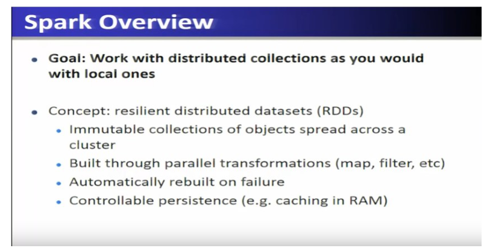
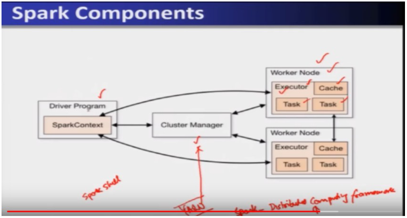
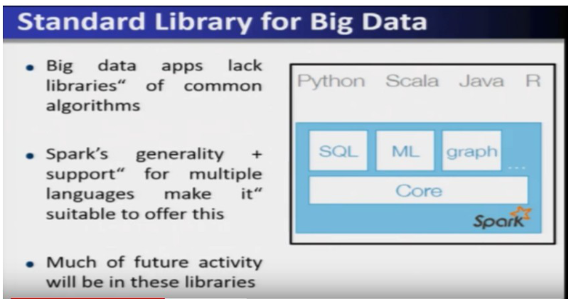
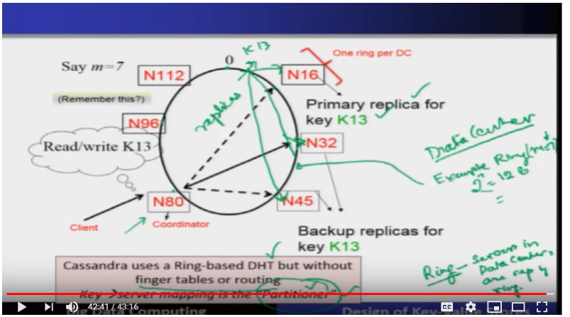

## This week's map

| Lec | Title | Why it is on the exam |
| --- | --- | --- |
| 9 | Parallel Programming with Spark | Scala basics, RDD definition, transformations vs actions, worked log-mining + word count + PageRank examples |
| 10 | Introduction to Spark | *Why* Spark exists (MapReduce's disk bottleneck), lineage mechanics, Spark execution components (Driver/Executor/Cluster Manager/DAG) |
| 11 | Spark Built-in Libraries | The four libraries on Spark Core: SQL, Streaming, MLlib (algorithm list!), GraphX |
| 12 | Design of Key-Value Stores | RDBMS vs NoSQL mismatch, column-oriented storage, Cassandra's ring + partitioner |

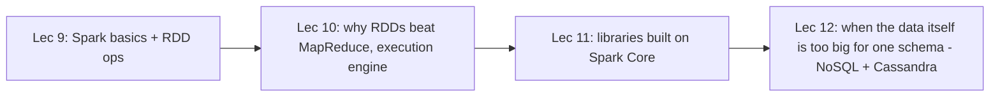

Two lectures build the Spark engine and its vocabulary (9 and 10 overlap on purpose — 10 explains *why* the RDD idea from 9 exists), lecture 11 tours what is built on top, and lecture 12 pivots into this week's second big theme: storing huge, unstructured, write-heavy data with a key-value store instead of a relational database.

---

## Lecture 9: Parallel Programming with Spark

### Part A — Scala basics, RDD concept, and the log-mining example

### Hook

Picture searching a terabyte of Wikipedia edit logs for an error pattern, then a minute later searching again for a *different* pattern in the *same* logs. With classic MapReduce, both searches re-read from disk — every run pays the same tax. Spark's whole pitch is: keep the working data set in RAM across operations, so the second search is nearly free. This lecture introduces the language Spark is written in (Scala), the abstraction that makes the RAM trick safe (the RDD), and the vocabulary (transformations, actions) you will reuse for the rest of the course.

### Slide picture

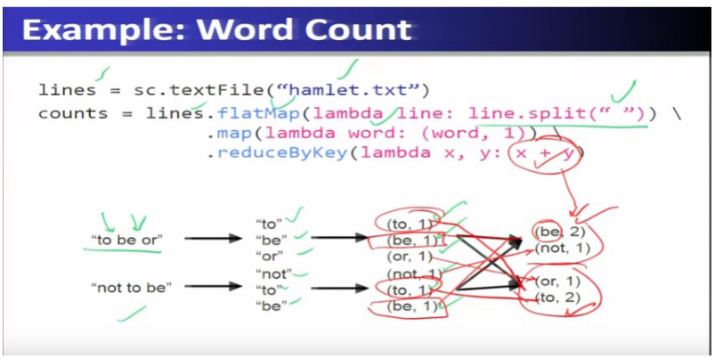

### Core ideas

**What Spark actually is.** Spark is a fast, general-purpose cluster computing engine that plugs into any Hadoop-supported storage (HDFS, S3, plain files) — it does not replace your storage, it replaces how you *compute* over it. The speed comes from **in-memory computational primitives**: instead of writing intermediate results to disk between steps (as MapReduce does), Spark keeps them in RAM whenever possible. The slides claim roughly **100x faster** than MapReduce for suitable workloads, plus **2–10x less code** thanks to a rich API (Scala/Java/Python) and an interactive shell. It runs locally on a multicore machine, or on a cluster via Mesos, YARN, or Spark's own standalone mode. `EXAM`

**Why Scala first.** Spark was originally written in Scala, a statically-typed language that compiles to JVM bytecode and interoperates with Java — which is why Spark's native API reads like functional Scala even when you call it from Python. A first-timer only needs enough Scala to read the slides' code: `var x: Int = 7` declares a typed mutable variable, `var x = 7` lets the type be inferred, `val y = "hi"` is **read-only** (cannot be reassigned). Functions are declared with `def`, e.g. `def square(x: Int): Int = x*x`. `SLIDE`

**Functional collection methods.** Scala treats a list as something you transform with small functions rather than loop over by hand: `list.foreach(f)` runs `f` on every element for its side effect (e.g. printing); `list.map(f)` builds a *new* list by applying `f` to every element (`List(1,2,3).map(_+2) → List(3,4,5)`); `list.filter(f)` keeps only elements where `f` is true (`filter(_ % 2 == 1) → List(1,3)`); `list.reduce(f)` combines all elements pairwise into one value (`reduce(_+_) → 6`). The underscore `_` is Scala's "whatever argument goes here" shorthand — `_ + 2` means "take one argument and add 2 to it." These four verbs (map, filter, reduce, plus flatMap for one-to-many) are exactly the vocabulary RDDs reuse, so learning them here pays off immediately. `EXAM`

**The RDD, defined properly.** Spark's core abstraction is the **Resilient Distributed Dataset (RDD)**: an *immutable* (cannot be edited in place) collection of objects, *partitioned* (split into chunks) and *spread across the cluster's machines*. You never build an RDD from scratch by hand — you get one by reading a file, or by transforming another RDD with a **coarse-grained** operation (one operation applied uniformly to every element — map, filter, join — as opposed to editing one record at a time). Two more properties matter: RDDs are **automatically rebuilt on failure** (explained below via lineage), and they support **controllable persistence** — you decide whether to cache an RDD in RAM for reuse. `EXAM`

**Transformations vs actions — the split that explains "lazy."** RDD operations fall into two buckets. **Transformations** (map, filter, groupBy, join, …) build a *new* RDD from an old one, but Spark does not actually compute anything yet — it just remembers the recipe. **Actions** (count, collect, save, …) are what actually trigger execution and either return a value to the driver or write output to storage. This "do nothing until asked" behavior is called **laziness**: it lets Spark look at the *whole* chain of transformations before running anything, so it can optimize (e.g. pipeline steps together) rather than executing each line eagerly. `EXAM` `PROF`

**Worked example — mining console logs.** The slide walks a concrete Spark session: `sc.textFile()` reads a log file from HDFS, producing the base RDD of lines (a transformation — nothing has run yet). `.filter()` keeps only lines containing "error," producing an `errors` RDD. `.map()` splits each error line on tabs to pull out the message, and this result is **cached** in memory. Now `.filter()` for the string "foo" and `.count()` — count is an **action**, so *this* is the point where Spark actually walks back through the chain and executes everything. Because the intermediate `errors` RDD was cached, a *second* query (say, filtering for "bar" instead of "foo") reuses that cached RDD instead of re-reading the file from HDFS — this is the mechanism behind the "under a second from cache vs ~20 seconds from disk" numbers on the slide (and "~5–7 s vs ~170 s" at 1 TB scale). `EXAM` `PROF`

**Fault tolerance via lineage (first pass — Lecture 10 goes deeper).** If Spark keeps data in RAM instead of HDFS, what happens when a machine dies mid-job? Spark does *not* keep a redundant copy of every RDD the way HDFS keeps replicated blocks. Instead, each RDD **tracks the sequence of transformations used to build it** — that sequence is called its **lineage**. On failure, Spark recomputes only the lost partition by replaying its lineage against the still-available input, rather than restoring a saved copy. `EXAM` `SLIDE`

### How it fits together

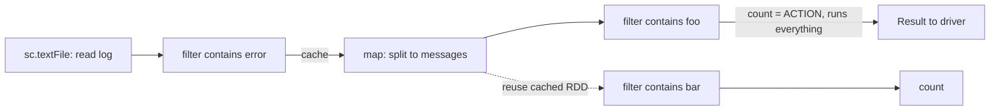

Everything up to `count()` is a lazy transformation chain; `count()` is the action that finally executes it, and the cached `errors`/`messages` RDD is what makes the second query (bar) fast.

### Worked example

Trace `errors.filter(_.contains("foo")).count()`: (1) `sc.textFile` builds the base lines RDD — lazy, no work done. (2) `.filter("ERROR")` builds `errors` — still lazy. (3) `.cache()` marks `errors` for in-memory reuse — still lazy, nothing cached yet. (4) A second `.filter("foo")` builds one more RDD — still lazy. (5) `.count()` is an action: Spark now executes the whole chain, materializes `errors` in cache as it computes it, and returns the count to the driver. A later `.filter("bar").count()` on the same `errors` RDD skips straight to step 4/5 because `errors` is already sitting in cache.

### Near-twins / traps

- **RDD lineage vs a data backup.** Lineage is a *recipe* (the transformations applied), not a stored copy. Recovering from failure means recomputation, not restoring a duplicate — the opposite of how HDFS achieves fault tolerance (block replication).
- **Transformation vs action.** `map()`, `filter()`, `reduceByKey()` never trigger a Spark job by themselves. Only `count()`, `collect()`, `take()`, `saveAsTextFile()`, etc. do. A quiz that lists five operations and asks "which one runs first" is testing this.

### Tiny recap card

- RDD = immutable, partitioned, in-memory collection; rebuilt via lineage, not backups.
- Transformations are lazy (map, filter, join); actions trigger execution (count, collect, save).
- Caching an RDD turns a repeat disk-bound query into a near-instant memory lookup.

### Checkpoint

1. A Spark program calls `rdd2 = rdd1.map(f)` and then nothing else. What has actually executed on the cluster at this point?  
   a) The map function has run on every partition  
   b) Nothing — map is a lazy transformation, so only the recipe is recorded  
   c) Only the first partition has been mapped  
   d) Spark throws an error because no action was called

2. An RDD's partition is lost when a worker node crashes. How does Spark recover it?  
   a) It restores a replicated copy from another node, like HDFS  
   b) It asks the driver to resend the entire original dataset  
   c) It replays that partition's lineage (its recorded transformations) against the still-available input  
   d) The job simply fails and must be restarted from scratch

3. Which of the following is an action, not a transformation?  
   a) `filter()`  
   b) `map()`  
   c) `count()`  
   d) `groupBy()`

4. In the log-mining example, why is the second query (filtering for "bar") much faster than the first (filtering for "foo")?  
   a) "bar" is a shorter string to search for  
   b) The `errors`/`messages` RDD was cached in memory after the first query, so the second query skips re-reading from disk  
   c) Spark automatically indexes all strings after the first query  
   d) The second query runs on fewer worker nodes

5. `val y = "hi"` in Scala means:  
   a) `y` is a mutable variable that can be reassigned  
   b) `y` is read-only and cannot be reassigned  
   c) `y` is a distributed collection  
   d) `y` is inferred to be an RDD

6. True or False: RDDs can be built directly by hand, element by element, the way you'd populate a Java `ArrayList`.  
   a) True  
   b) False

#### Answer key

1. **b** — transformations are lazy; only an action (count, collect, save, …) triggers execution.
2. **c** — lineage is a log of transformations, replayed to recompute lost data, not a stored replica.
3. **c** — `count()` returns a value and triggers execution; the others just build new RDDs.
4. **b** — `.cache()` on the `errors`/`messages` RDD means the second filter reuses it from RAM instead of re-reading and re-filtering from disk.
5. **b** — `val` declarations in Scala are always read-only; `var` is the mutable one.
6. **b** (False) — RDDs are only created by reading external data or applying coarse-grained transformations to an existing RDD, never built element-by-element by the programmer.

#### Optional, after you check

- Explain "lazy transformation" in 30 seconds without using the word "lazy."
- What would happen to correctness (not just speed) if Spark forgot an RDD's lineage before a node crashed?

---

### Part B — Spark operations, the full word-count program, job execution, and PageRank

### Hook

Part A gave you the vocabulary (RDD, transformation, action, lineage). Part B is where that vocabulary becomes a working toolbox: the actual functions you call to create RDDs, the key-value operations that make WordCount and PageRank one-liners, and the driver/executor machinery that runs it all on a real cluster.

### Slide picture

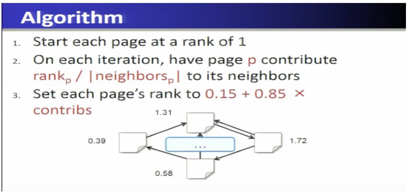

### Core ideas

**Creating RDDs.** `sc.parallelize([1,2,3])` turns a local, in-driver collection into a distributed RDD — mostly used for small test data. `sc.textFile("file.txt")` (or a wildcard `"directory/*.txt"`, or an `hdfs://...` path) reads a text file, one RDD element per line. `sc.hadoopFile(keyClass, valClass, inputFmt, conf)` reuses *any* existing Hadoop `InputFormat`, which is the hook that lets Spark read whatever HDFS-supported formats already exist. `SLIDE`

**Basic transformations.** `nums.map(lambda x: x*x)` passes every element through a function (`{1,2,3} → {1,4,9}`). `nums.filter(lambda x: x % 2 == 0)` keeps only elements passing a predicate. `nums.flatMap(lambda x: range(0,x))` maps each element to **zero or more** outputs and flattens the result into one RDD (this is the "one-to-many map" that WordCount needs to turn one line into many words). `EXAM`

**Basic actions.** `collect()` pulls the entire RDD back to the driver as a local list (only safe for small results). `take(k)` returns the first k elements. `count()` returns the element count. `reduce(f)` merges all elements pairwise via an associative function (`reduce(_+_) → sum`). `saveAsTextFile(path)` writes the RDD to storage (e.g. HDFS). `EXAM`

**Key-value pair RDDs.** A pair RDD holds `(key, value)` tuples — in Python a plain tuple `pair[0]`/`pair[1]`, in Scala `pair._1`/`pair._2`. Three operations matter most: `reduceByKey(f)` groups by key and combines each key's values with `f` (`[("cat",1),("dog",1),("cat",2)].reduceByKey(+) → {(cat,3),(dog,1)}`) — and it **automatically applies a combiner on the map side**, i.e. it partially sums values *before* shuffling them across the network, the same optimization idea as a MapReduce combiner. `groupByKey()` collects all of a key's values into a list without combining them (`{(cat, Seq(1,2)), (dog, Seq(1))}`) — more data movement than reduceByKey when you only needed an aggregate. `sortByKey()` sorts the pairs by key. `EXAM` `PROF`

**WordCount, fully worked.** `lines = sc.textFile("hamlet.txt")`; then `counts = lines.flatMap(lambda line: line.split(" ")).map(lambda word: (word,1)).reduceByKey(lambda x,y: x+y)`. Read the pipeline left to right: `flatMap` turns each *line* into many *words* (one-to-many, hence flatMap not map); `map` turns each word into a `(word, 1)` pair; `reduceByKey` sums the 1's for matching words. This is the same shape as the Hadoop MapReduce WordCount from Week 2 — Spark just expresses map/shuffle/reduce as three chained RDD calls instead of two separate Java classes. `EXAM`

**Closures ship their captured variables automatically.** If a `map`/`filter` closure references a variable from outside itself (e.g. a threshold captured from the driver), Spark automatically ships that variable to the workers along with the closure — you do not need to pass it manually as an extra argument. `SLIDE`

**Job execution — who does what.** A **SparkContext** (created inside the driver program, e.g. automatically when you launch a Spark shell) is the entry point to all Spark functionality. Execution of an RDD chain is compiled into a **DAG** (directed acyclic graph — a graph of operations with no cycles, meaning data always flows forward through the pipeline, never back to an earlier step) of tasks. The **task scheduler** supports general task graphs (not just map-then-reduce), **pipelines** functions together when possible (chains several transformations into one pass over the data instead of materializing an RDD after every single step), and is **cache-aware** and **partition-aware** — it deliberately reuses cached data and keeps computation local to a partition to avoid unnecessary shuffles (network transfer of data to regroup it by key). `EXAM` `PROF`

**Creating a SparkContext by hand.** When not using the shell, code explicitly builds a SparkContext with arguments: a **Master URL** (e.g. `local` for a single machine, or a cluster URL), an **application name**, the **Spark home** install path on the cluster, and a list of **jar files** the job needs. `SLIDE`

**PageRank, worked on the slide's tiny graph.** The algorithm: (1) every page starts at rank 1; (2) each iteration, page `p` sends `rank_p / |neighbors_p|` (its rank split evenly among its outgoing links) to each neighbor; (3) each page's new rank becomes `0.15 + 0.85 × (sum of contributions received)`. On the slide's 4-node graph: a page with two outgoing links splits its rank 1 into 0.5 + 0.5 to each neighbor; a page with only one outgoing link sends its entire rank to that one neighbor. A page receiving 0.5 total becomes `0.15 + 0.85×0.5 = 0.575`; a page receiving the full incoming rank of 1 becomes `0.15 + 0.85×1 = 1` (unchanged); a page receiving contributions summing to 2 becomes `0.15 + 0.85×2 = 1.85`. Iteration repeats until the ranks stop changing (**convergence**). `EXAM` `SLIDE`

**PageRank in Spark code.** `links` is an RDD of `(url, neighbors)` pairs; `ranks` is an RDD of `(url, rank)` pairs. Each iteration: `contribs = links.join(ranks).flatMap { case (url,(links,rank)) => links.map(dest => (dest, rank/links.size)) }` — join brings each page's neighbor list and current rank together, then flatMap fans out that page's rank-share to every neighbor as a separate `(dest, share)` pair. Then `ranks = contribs.reduceByKey(_+_).mapValues(0.15 + 0.85*_)` — sum all incoming shares per destination page, then apply the damping formula. This loop runs for a fixed number of `ITERATIONS`. Because `links` and `ranks` are cached RDDs reused every iteration, PageRank is exactly the kind of *iterative* workload where Spark's in-memory model beats MapReduce (and the slide reports large speedups at even 16 machines); the same pattern (fast on iterative workloads) also applies to k-means and logistic regression. `EXAM` `PROF`

### How it fits together

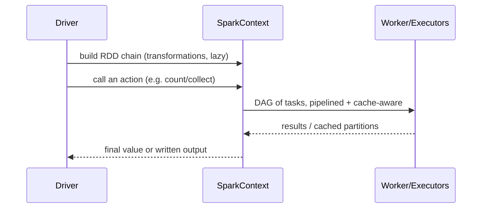

Nothing reaches the workers until an action forces the DAG scheduler to hand out tasks; cached RDDs from a previous action are reused instead of recomputed.

### Worked example

Trace the PageRank code for one iteration on a page `X` with two outgoing links to `Y` and `Z`, `rank(X) = 1`: `links.join(ranks)` pairs `X`'s neighbor list `[Y,Z]` with its rank `1`; `flatMap` emits `(Y, 0.5)` and `(Z, 0.5)`. If `Y` also receives `0.5` from another page, `reduceByKey(_+_)` sums to `1.0` for `Y`; `mapValues(0.15 + 0.85*_)` turns that into `Y`'s new rank `0.15 + 0.85×1.0 = 1.0`.

### Near-twins / traps

- **`map` vs `flatMap` in WordCount.** `map` on a line would produce one output per line (e.g. a list-of-words *object*); `flatMap` is required because you want one output *per word*, flattened into a single RDD of words — that's why WordCount uses `flatMap(line.split(" "))` then `map(word -> (word,1))`.
- **`reduceByKey` vs `groupByKey`.** Both group by key, but `reduceByKey` combines values on the map side before shuffling (less network traffic) while `groupByKey` ships every raw value across the network into one list per key. If the exam asks "which is more efficient for summing," it's `reduceByKey`.
- **DAG vs a simple two-stage MapReduce job.** MapReduce is always exactly map → shuffle → reduce. Spark's DAG scheduler supports **general** task graphs — arbitrarily many chained transformations across multiple stages, not a fixed two-step shape.

### Tiny recap card

- `flatMap` (one→many) → `map` (word→(word,1)) → `reduceByKey` (sum) is Spark WordCount.
- `reduceByKey` combines on the map side (fewer bytes shuffled) — `groupByKey` does not.
- PageRank per iteration: `join` ranks with neighbor lists, `flatMap` the rank-share to each neighbor, `reduceByKey` to total incoming share, `mapValues` to apply `0.15 + 0.85×contribs`.

### Checkpoint

1. Why does Spark's WordCount use `flatMap` on the lines instead of `map`?  
   a) `flatMap` is faster on strings  
   b) Each line produces many words, and `flatMap` flattens those many outputs into one RDD of words, which plain `map` would not do  
   c) `flatMap` is required before any `reduceByKey`  
   d) There is no difference; the slide could have used `map` instead

2. Which key-value operation reduces network traffic by combining values on the map side before shuffling?  
   a) `groupByKey()`  
   b) `sortByKey()`  
   c) `reduceByKey()`  
   d) `collect()`

3. In the PageRank formula `0.15 + 0.85 × contribs`, what does the `0.85` weight represent in this lecture's framing?  
   a) The fraction of a page's rank distributed to neighbors as `contribs`  
   b) An arbitrary constant with no stated meaning beyond the formula given  
   c) The number of iterations to run  
   d) The number of neighbors a page must have

4. A Spark job builds a chain of five transformations and never calls an action. How many tasks run on the worker nodes?  
   a) Five, one per transformation  
   b) Zero — nothing executes without an action  
   c) One, because Spark always pipelines everything into a single task  
   d) It depends on the number of partitions

5. What is a SparkContext?  
   a) A worker node that executes tasks  
   b) The entry point to Spark functionality, created inside the driver program  
   c) A cached RDD partition  
   d) The DAG scheduler's internal log file

6. Two pages both link only to page Z, each with rank 1 and each having exactly one outgoing link. What is Z's new rank after one iteration (assuming no other incoming links)?  
   a) 0.15 + 0.85 × 1 = 1.0  
   b) 0.15 + 0.85 × 2 = 1.85  
   c) 2.0  
   d) 0.85

#### Answer key

1. **b** — each line must become many word-outputs; `flatMap` is the one-to-many transformation that flattens the result, which is exactly what WordCount needs before `map(word → (word,1))`.
2. **c** — `reduceByKey` performs a map-side combine (like a MapReduce combiner) before shuffling; `groupByKey` ships every raw value.
3. **a** — the algorithm sends `rank_p / |neighbors_p|` (called `contribs` once summed at the receiver) to neighbors, and the new rank is `0.15 + 0.85 × contribs`.
4. **b** — transformations are lazy; without an action nothing is scheduled to the workers.
5. **b** — the SparkContext, created in the driver, is the entry point to all Spark functionality (e.g. for creating RDDs).
6. **b** — each page sends its full rank (1, since each has only one outgoing link) to Z, so Z receives 1+1=2 total contribs, giving 0.15 + 0.85×2 = 1.85.

#### Optional, after you check

- Say out loud, in one breath, the three-step WordCount pipeline and what each step does.
- Explain why PageRank is a good showcase for Spark's speed advantage over MapReduce, using the word "iterative" and the word "cache."

---

## Lecture 10: Introduction to Spark

### Hook

Lecture 9 handed you Spark's toolbox. This lecture answers the "why did anyone need this" question properly: what exactly goes wrong with MapReduce that made Berkeley's AMPLab build a whole new system in 2012, and what does Spark's execution engine (driver, executors, cluster manager, DAG) look like once you zoom into the machinery. Treat this as the "under the hood" companion to Lecture 9's "how to drive it."

### Slide picture

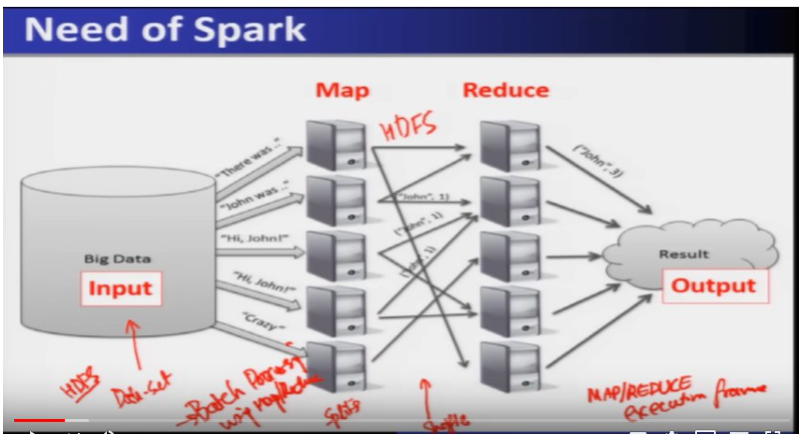

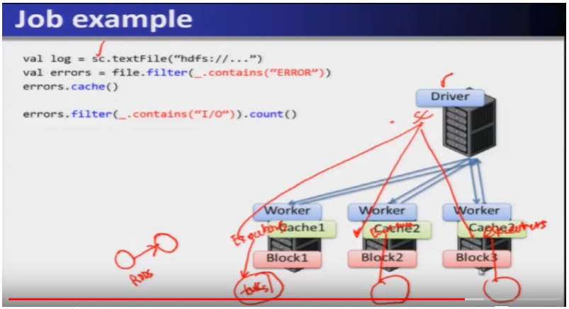

### Core ideas

**Why MapReduce alone isn't good enough.** MapReduce simplifies batch processing on large commodity clusters: a dataset sits in HDFS, gets split, a map function runs on each split, the intermediate output goes through **shuffle** and is written back into HDFS, and only then does the reduce function read it and produce output. That HDFS write between map and reduce is deliberate — it is what gives MapReduce its **fault tolerance**: if a node dies mid-job, the intermediate data survives on disk. But that same safety net is the problem: writing every intermediate result to disk is **expensive** and slow, which cripples MapReduce for **interactive** applications (a human waiting on an answer) and **iterative** applications (an algorithm that reruns the same computation many times, like PageRank or k-means) — every iteration pays the full disk round-trip again. MapReduce also **lacks efficient data sharing** across the map and reduce phases (or across iterations), because the only channel for sharing is that slow disk write/read through HDFS. `EXAM` `PROF`

**Specialized frameworks tried to patch this — and only patched one corner each.** Because MapReduce couldn't do graph processing efficiently, Pregel introduced **BSP (Bulk Synchronous Processing)**: nodes gather data from neighbors, compute, and scatter results, but all three steps (communicate, compute, communicate) must finish together before anyone moves to the next round — a synchronization barrier called a **lockstep**. Separately, "Iterative MapReduce" frameworks patched the iterative-application problem. Each solved its own niche; none solved data sharing in general. `SLIDE`

**Spark's answer: the RDD, again, but now with the "why."** Spark's fix is a new abstract data type, the RDD — immutable, built through **coarse-grained transformations** (map, join, etc. applied uniformly, not fine-grained edits to single records), partitioned across cluster nodes, and **cacheable in memory** for reuse. Because the RDD lives in memory instead of being written back to HDFS after every step, Spark gets efficient data sharing across map/reduce phases *and* across iterations — solving exactly the two problems MapReduce couldn't. `EXAM`

**How lineage actually works, mechanically.** Spark logs every **coarse-grained operation** applied to a partitioned dataset — reading a file into an RDD, then mapping it, then reducing it, and so on — into what's called the **lineage**: a log/graph of the transformations that built each RDD. If a partition is lost (node crash), Spark traces back through this lineage log to find which earlier RDD and which transformation produced the lost partition, and simply **recomputes** that one partition by replaying the transformation. Crucially: **if there is no failure, this costs nothing extra** — lineage is metadata, not a copy of the data, so it doesn't slow down the happy path the way writing every result to HDFS would. `EXAM` `PROF`

**Control operations: partitioning and persistence.** Beyond transformations and actions, Spark gives the programmer two more knobs. **Partitioning** lets you control how an RDD's data is split across the cluster's nodes. **Persistence** lets you choose whether an RDD is kept (cached) for reuse — by default an RDD is **not** persisted; you opt in when you know you'll reuse it (exactly like the `errors.cache()` call in Lecture 9's log-mining example). `EXAM`

**Spark execution components — the full org chart.** A **Driver Program** is where your code starts; running a Spark shell creates a **SparkContext** inside it. The SparkContext talks to a **Cluster Manager** (Spark's own standalone manager, or YARN/Mesos as alternatives), which in turn manages **Worker Nodes**. Each worker runs one or more **Executors**; each executor runs **Tasks** and holds a **Cache**. So the chain is: Driver (SparkContext) → Cluster Manager → Worker Nodes → Executors → Tasks + Cache. `EXAM` `SLIDE`

**Execution mechanics: broadcast, shuffle, and the DAG.** The driver **broadcasts** commands/functions out to the executors; executors run them and return results to the driver; the driver may then send further operations, some of which require a **shuffle** (regrouping data by key across the network — the same idea as MapReduce's shuffle). All of this — transformations and actions together — is scheduled as a **DAG (directed acyclic graph)**: on the slide's diagram, transformations are drawn as plain (gray) circles and actions as dotted circles, chained from one RDD to the next. The **DAG scheduler** splits this graph into **stages** of tasks and submits each stage once it's ready; the **task scheduler** then launches the actual tasks via the cluster manager and **retries failed or straggling tasks** (a straggler is a task running unusually slowly compared to its peers). `EXAM` `SLIDE`

**APIs and languages.** You can write Spark applications in Java, Scala, or Python; the **interactive interpreter** (shell) exists only for Scala and Python, not Java. **Standalone applications** can be written in any of the three. On raw **performance**, Java and Scala run faster than Python, thanks to **static typing** (types are checked and fixed at compile time, so the runtime doesn't pay the cost of figuring out types dynamically). `EXAM`

**Where this is heading.** Spark Core, once you have RDDs and this execution engine, is a foundation other libraries build on — the slide previews Spark MLlib (machine learning), Spark Streaming (real-time), and Spark GraphX (graph computation), each covered properly in Lecture 11. `SLIDE`

### How it fits together

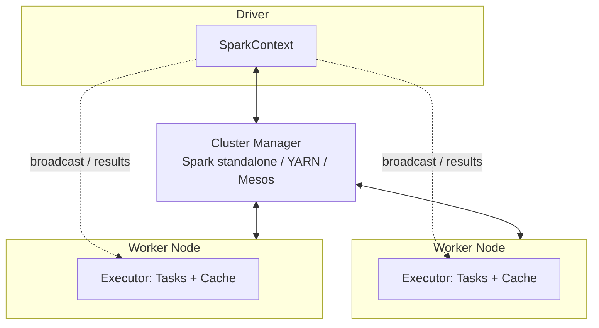

The Driver's SparkContext never runs tasks itself — it delegates through the Cluster Manager to Executors on Worker Nodes, which is the same skeleton for every Spark deployment mode (local, standalone, YARN, Mesos).

### Worked example

Trace what happens when the log-mining job from Lecture 9 (`errors.filter(...).count()`) actually runs: the Driver's SparkContext turns the RDD chain into a DAG; since there's no shuffle-requiring operation before `count()`, the DAG scheduler needs only **one stage**; the task scheduler sends that stage's tasks to the Executors on each Worker Node holding a relevant partition; each Executor runs its Task, caching the `errors` RDD locally as instructed; results are returned to the Driver, which sums them into the final count.

### Near-twins / traps

- **Why MapReduce writes to HDFS between map and reduce.** It is *not* a leftover design accident — it's the deliberate fault-tolerance mechanism. The trade-off (safety for speed) is exactly what Spark's lineage approach avoids.
- **Lineage cost vs replication cost.** Lineage adds *zero* overhead when nothing fails (it's just a log Spark already needed to build the DAG). HDFS-style replication pays a storage/write cost on *every* job, failure or not. This is the crux of "why Spark is faster."
- **Cluster Manager vs Executor.** The Cluster Manager allocates and tracks worker resources across the whole cluster; it does not itself run your map/filter code — that happens inside Executors' Tasks.

### Tiny recap card

- MapReduce's HDFS write between map/reduce = fault tolerance, at the cost of speed for iterative/interactive jobs.
- Lineage = log of coarse-grained transformations; free when nothing fails, replays only the lost partition on failure.
- Chain: Driver (SparkContext) → Cluster Manager → Worker Nodes → Executors → Tasks + Cache; whole job is scheduled as a DAG split into stages.

### Checkpoint

1. Why does MapReduce write intermediate (map-phase) output to HDFS before running reduce?  
   a) It's required by the Java compiler  
   b) To make the shuffle faster  
   c) To achieve fault tolerance — if a node fails, the intermediate data still exists on disk  
   d) Because reduce cannot read directly from memory

2. What is the main cost of Spark's lineage-based fault tolerance when no failure occurs?  
   a) The same disk-write cost as MapReduce  
   b) None — lineage is just a log, so the happy path pays no extra cost  
   c) Double the memory usage  
   d) A mandatory checkpoint to HDFS every stage

3. Order the Spark execution chain correctly:  
   a) Executor → Cluster Manager → Driver → Worker Node  
   b) Driver (SparkContext) → Cluster Manager → Worker Node → Executor  
   c) Worker Node → Driver → Executor → Cluster Manager  
   d) Cluster Manager → Executor → Driver → SparkContext

4. What does the DAG scheduler do that a plain two-phase MapReduce scheduler does not?  
   a) It only ever creates exactly two stages, map and reduce  
   b) It splits a general graph of transformations into stages and submits each stage once ready, supporting arbitrary task graphs, not just map-then-reduce  
   c) It replaces the need for a Driver program  
   d) It eliminates the need for actions

5. By default, is a newly created RDD persisted (cached) in memory?  
   a) Yes, all RDDs are cached automatically  
   b) No — persistence is opt-in; you call something like `.cache()` when you plan to reuse it  
   c) Only RDDs created via `sc.parallelize` are cached by default  
   d) Only RDDs larger than 1 GB are cached by default

6. Which language(s) support Spark's interactive shell/interpreter?  
   a) Java only  
   b) Scala and Python only  
   c) Java, Scala, and Python equally  
   d) Only Python

#### Answer key

1. **c** — the HDFS write is what lets MapReduce recover from node failure without losing intermediate results; it is the deliberate trade-off that costs performance.
2. **b** — lineage is metadata (a log), not a data copy, so it adds no cost unless a failure actually triggers recomputation.
3. **b** — Driver creates the SparkContext, which talks to the Cluster Manager, which manages Worker Nodes, each running Executors.
4. **b** — Spark's DAG scheduler handles general (not fixed two-stage) task graphs, splitting them into stages at shuffle boundaries.
5. **b** — persistence/caching is a control operation the programmer opts into; RDDs are not cached by default.
6. **b** — the interactive interpreter is available for Scala and Python; Java only supports standalone applications.

#### Optional, after you check

- Explain, without saying "fast," why lineage-based recovery scales better than HDFS-style replication for an iterative job with 50 iterations.
- Walk through the Driver → Cluster Manager → Worker → Executor chain out loud as if explaining it to someone who has only used a single laptop.

---

## Lecture 11: Spark Built-in Libraries

### Hook

Spark Core alone is "just" a fast, general-purpose RDD engine. The reason it eats into the market share of one-off specialized big data tools (dedicated ML frameworks, dedicated graph engines, dedicated stream processors) is that four solid libraries ship on top of the same Core, sharing the same RDDs and cluster — so a team doesn't need four different clusters for four different jobs. This lecture is a tour of those four: what each is for, and — heavily testable — MLlib's algorithm list by category.

### Slide picture

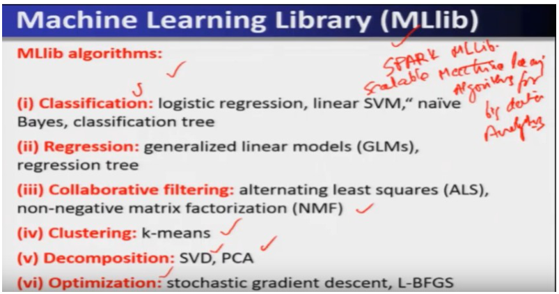

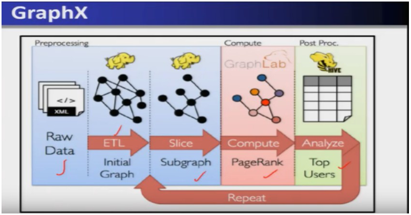

### Core ideas

**Why a "standard library" matters here.** Big data applications keep re-implementing the same common algorithms (a classifier, a join, a graph traversal) from scratch, which wastes effort and produces inconsistent quality. Spark's generality (the same RDD abstraction) plus its multi-language support (Python, Scala, Java, R) make it a natural place to offer these algorithms *once*, as shared libraries everyone on Spark can call. That is exactly the layering on the diagram: Python/Scala/Java/R sit on top of three library layers (SQL, ML, graph) which all sit on **Spark Core**. `EXAM`

**Spark SQL.** Lets you load and query **structured data** using SQL-like commands, with API links into Hive and JSON — so a key-value store or a JSON dump can be queried with familiar SQL syntax instead of hand-written map/filter chains. `EXAM`

**Spark Streaming.** Handles large-scale streaming applications by processing data in **micro-batches** — a micro-batch is a short, fixed-size chunk of the incoming stream (say, the last half-second of data) treated as a small RDD and run through the normal Spark engine, rather than processing one event at a time. Because it's built on the same Core, Spark Streaming can **unify** batch, interactive, and streaming computation in a single system instead of requiring three separate tools. `EXAM`

**Spark MLlib.** A collection of scalable machine learning algorithms for big data analytics, organized into six families (this exact list is exam gold — the slide states it verbatim):
- **Classification:** logistic regression, linear SVM, Naive Bayes, decision trees.
- **Regression:** generalized linear models (GLM), regression trees.
- **Collaborative filtering:** alternating least squares (ALS), non-negative matrix factorization (NMF).
- **Clustering:** parallel k-means.
- **Decomposition:** SVD (singular value decomposition), PCA (principal component analysis).
- **Optimization:** stochastic gradient descent, L-BFGS.
`EXAM` `SLIDE`

**Spark GraphX.** A general-purpose graph processing library that builds its graphs from **RDDs of vertices and edges** — so a graph in GraphX is really just two RDDs (one of nodes, one of edges) with graph-shaped operations layered on top, which is why GraphX can reuse Spark's fault tolerance and in-memory speed for free. The processing pipeline on the slide: raw data → **ETL** (extract, transform, load — cleaning/reshaping raw input into a usable form) builds the **initial graph** → **slice** into a **subgraph** (a filtered portion of the graph relevant to the task) → **compute** (run a graph algorithm, e.g. PageRank) → **analyze** the results (e.g. find "top users"), and the whole cycle can **repeat**. `EXAM` `SLIDE`

**GraphX's algorithm coverage.** Beyond PageRank (and personalized PageRank), GraphX supports: shortest path, graph coloring, collaborative filtering, structured prediction, semi-supervised machine learning, community detection (triangle counting, k-core decomposition, k-truss), and graph analytics/classification via neural networks. `SLIDE`

**Community scale (light context).** Spark is described as the most active open-source community in Big Data at the time of recording — 200+ developers, 50+ contributing companies — and had, by then, **surpassed Hadoop MapReduce** in number of contributions. This is trivia-flavored but has shown up as a "which is true about Spark's community" style distractor before. `PROF`

### How it fits together

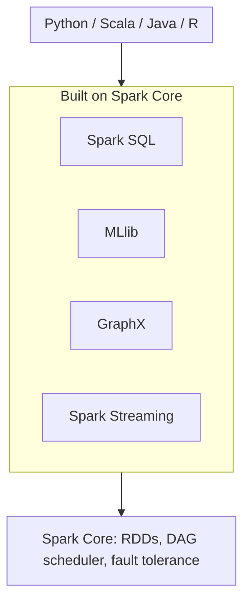

Every library reuses the same RDD engine and fault-tolerance mechanism from Lectures 9–10 — that reuse is the entire reason these four libraries can interoperate in one job.

### Worked example

A single pipeline could: load raw click logs with **Spark SQL** (structured query over JSON logs) → feed the cleaned data as micro-batches through **Spark Streaming** for near-real-time aggregation → periodically retrain a classifier with **MLlib**'s logistic regression on the aggregated features → build a **GraphX** graph of user-to-user interactions and run PageRank to rank influential users. All four steps run on the same RDDs and the same cluster, because all four libraries sit on Spark Core.

### Near-twins / traps

- **MLlib's clustering entry is "parallel k-means," not a generic "clustering" bucket with many algorithms** — the slide lists exactly one clustering algorithm (k-means), unlike classification, which lists four.
- **Spark Streaming ≠ true one-event-at-a-time processing.** It works in **micro-batches** — a short buffered chunk, run through the same batch engine — not a per-event streaming model.
- **GraphX's graph is not a special data structure outside RDDs.** It's literally built from RDDs of vertices and edges, which is why it inherits Spark's fault tolerance for free instead of needing its own.

### Tiny recap card

- Four libraries on Spark Core: SQL (structured queries), Streaming (micro-batch real-time), MLlib (6 algorithm families), GraphX (graphs from vertex/edge RDDs).
- MLlib families: classification, regression, collaborative filtering, clustering, decomposition, optimization.
- GraphX pipeline: raw data → ETL → initial graph → subgraph → compute → analyze → repeat.

### Checkpoint

1. Which Spark library would you use to run SQL-like queries against JSON-formatted data?  
   a) MLlib  
   b) Spark Streaming  
   c) Spark SQL  
   d) GraphX

2. What does "micro-batch" mean in the context of Spark Streaming?  
   a) A single event processed the instant it arrives  
   b) A short, fixed-size chunk of the stream processed as a small RDD through the normal batch engine  
   c) A batch job that runs once a day  
   d) A compressed version of the input stream

3. Which of these is NOT one of MLlib's six algorithm families as listed on the slide?  
   a) Classification  
   b) Decomposition  
   c) Natural language processing  
   d) Optimization

4. GraphX builds its graphs from:  
   a) A dedicated graph database external to Spark  
   b) RDDs of vertices and edges  
   c) HDFS block metadata  
   d) SQL tables only

5. In the GraphX pipeline (raw data → ETL → initial graph → subgraph → compute → analyze), what does the "compute" stage typically run?  
   a) A SQL join  
   b) A graph algorithm, e.g. PageRank  
   c) A file format conversion  
   d) A cache eviction

6. True or False: Each of Spark's four built-in libraries requires its own separate cluster because they use incompatible internal data structures.  
   a) True  
   b) False

#### Answer key

1. **c** — Spark SQL is the library for loading/querying structured data with SQL-like syntax, including links to Hive and JSON.
2. **b** — micro-batching buffers a short slice of the stream and runs it as a small RDD through Spark's normal engine, rather than truly per-event processing.
3. **c** — the slide's six families are classification, regression, collaborative filtering, clustering, decomposition, and optimization; NLP is not one of them.
4. **b** — GraphX graphs are built from RDDs of vertices and edges, inheriting Spark's fault tolerance.
5. **b** — the compute stage runs a graph algorithm such as PageRank on the (sub)graph produced by earlier stages.
6. **b** (False) — all four libraries are built on the same Spark Core and share RDDs and a cluster; that shared foundation is the whole point of the "standard library" pitch.

#### Optional, after you check

- List MLlib's six algorithm families from memory, then check against the slide.
- Explain in one sentence why GraphX gets fault tolerance "for free."

---

## Lecture 12: Design of Key-Value Stores

### Hook

Flipkart needs to look up an item by its item ID. EaseMyTrip needs to look up a flight by its flight number. Twitter needs to look up a tweet by its tweet ID. None of these companies need a `JOIN` across ten normalized tables — they need blazing-fast reads and writes on a simple "give me this ID, get me its data" pattern, at a scale (millions of clients, terabytes of data) that a single MySQL box cannot serve. This lecture builds the case for **key-value stores** from that mismatch, then opens up the internal design of the most widely used one, **Apache Cassandra**.

### Slide picture

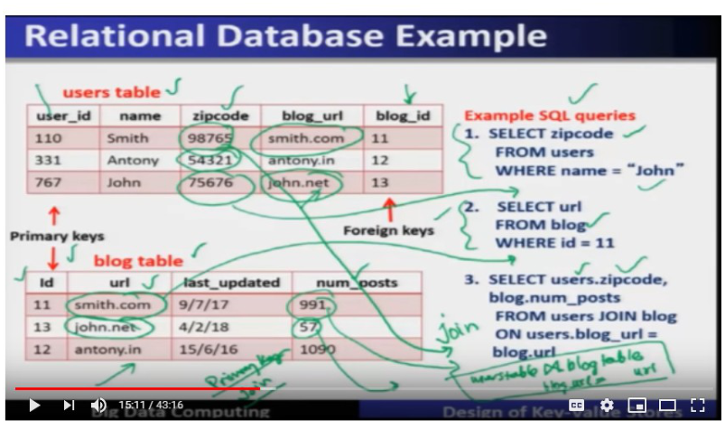

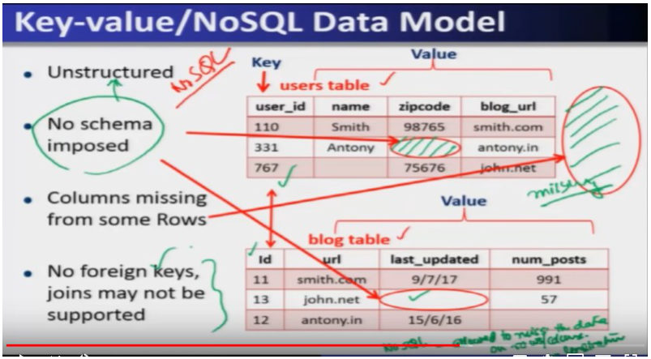

### Core ideas

**The key-value abstraction, in plain business terms.** For any business, the **key** is the important, unique entity you look things up by, and the **value** is everything you know about it. Flipkart: key = item, value = quantity, reviews, etc. EaseMyTrip: key = flight number, value = seat availability, etc. Twitter: key = tweet ID, value = timestamp and text. A bank: key = account number, value = balance and transaction history. Every one of these businesses needs the same basic operation — given a key, fetch (or update) its value — at a scale far beyond what fits on one machine. `EXAM`

**Why a hash table isn't enough.** Conceptually, a key-value store is just a **dictionary data structure**: `insert`, `lookup`, `delete` by key, which hash tables and binary trees already implement perfectly — on a *single* computer. The instant the data is too large for one machine's memory/disk, that single-machine dictionary breaks down. The fix borrows an idea from **peer-to-peer (P2P) systems**: a **distributed hash table (DHT)**, where the dictionary itself is spread across many machines in a cluster or data center. Cassandra's entire ring design (below) is a direct reuse of this P2P DHT idea. `EXAM` `PROF`

**RDBMS, reviewed with a concrete example (so the "mismatch" below makes sense).** A relational database (e.g. MySQL) organizes data into **schema**-based **tables**; every row has a **primary key**, unique within its table. On the slide, a `users` table has `user_id` as primary key plus `name`, `zipcode`, `blog_url`, `blog_id`; a `blog` table has `id` as primary key plus `url`, `last_updated`, `num_posts`. The `users.blog_id` column, which refers to `blog.id`, is a **foreign key** — a column in one table that points at another table's primary key, and is exactly what makes a **join** possible (e.g. "get each user's zip code and their blog's post count" requires joining `users` and `blog` on `users.blog_url = blog.url`). Queries are written in **SQL** (Structured Query Language). `EXAM` `SLIDE`

**Today's workload doesn't match that model — four concrete mismatches.** (1) **Data**: today's data is huge in volume *and* **unstructured** — it does not fit a predefined schema, and is too large for tables on one machine. (2) **Read/write pattern**: massive numbers of **random reads and writes** arrive from millions of clients simultaneously, not the occasional query an RDBMS was designed for. (3) **Write-heavy**: unlike classic RDBMS workloads, today's systems see disproportionately many **write** operations. (4) **Foreign keys and joins are rarely used** in this style of workload — the app almost never needs to relate two tables the way a bank statement report might. `EXAM` `PROF`

**What the new design needs to deliver.** Given that mismatch, four requirements drive the design: **lightning-fast writes** (to keep up with the write-heavy load); **fault tolerance** (no single point of failure — losing one node must not lose data or availability); **low cost of ownership** (cheap hardware, few system administrators); and **incremental scalability** — the ability to keep adding capacity as data grows, called **scale out**. `EXAM`

**Scale out vs scale up.** **Scale out**: keep adding more commodity (off-the-shelf, unremarkable) machines to grow capacity, and later phase in a few newer/faster machines while phasing out old ones — cheap because you're not throwing away existing hardware. **Scale up**: replace existing machines with fewer, more powerful (and much costlier) ones. Scale out is the strategy behind essentially every modern data-center/cloud system, because it avoids that costly wholesale replacement. `EXAM`

**NoSQL, defined properly.** "NoSQL" stands for **Not only SQL** — meaning "beyond the limitations of SQL," not "no SQL is allowed." The core API two operations are `put(key, value)` (write) and `get(key)` (read); specific systems add extras (e.g. Cassandra's own query language, **CQL**). Vocabulary differs by system for the same concept — what RDBMS calls a "table" is called a **Column Family** in Cassandra, a **Table** in HBase, and a **Collection** in MongoDB. `EXAM`

**Unstructured data, made concrete.** Because there is no fixed schema, a NoSQL "table" (Column Family) can have rows with missing columns, or entire columns missing from some rows, with no error — this would be illegal in an RDBMS table but is normal and expected here (a missing entry is a **null value**, not corruption). There are also **no foreign keys and no joins** in this model — consistent with the workload mismatch discussed above. `EXAM`

**Column-oriented storage — why NoSQL stores data sideways.** An RDBMS stores each **row together** on disk — natural for "give me everything about user X." NoSQL systems instead often store a **column** (or group of columns) **together**, called **column-oriented storage**. The payoff: a query like "get all blog IDs updated in the last month" only needs to scan the `last_updated` column (and the corresponding ID column) — it never has to touch every other column of every row, which a row-oriented layout would force. This makes range queries *within* one column fast, at the cost of making "give me the whole row" queries relatively more expensive. `EXAM` `SLIDE`

**Apache Cassandra — where it came from and who uses it.** Google's research (BigTable-style thinking) inspired Facebook to build **Cassandra** in-house; it was later open-sourced under the Apache project, hence "Apache Cassandra." It is a **distributed key-value store** meant to run across a **data center** (or across multiple data centers), not on a single node. Production users cited on the slide include IBM, Adobe, HP, eBay, Ericsson, Twitter (storing tweets), PBS Kids, and Netflix (tracking video playback position). `EXAM` `SLIDE`

**Cassandra's core design problem: key-to-server mapping.** Given a cluster of many servers, the first design question is: for a given key, *which server(s)* actually store it? Cassandra answers this with a **ring-based distributed hash table**. Picture the servers arranged around a **ring** of size `2^m` positions (the slide's example uses `m = 7`, giving `2^7 = 128` positions). A component called the **partitioner** decides, for any key, which ring position (and therefore which server) it belongs to — typically the key is hashed onto the ring, and the server at the **successor** position (the next server going clockwise) becomes responsible for it. In the slide's walkthrough, key `K13` maps to a position whose successor server is `N16`; additional copies of that key ("replicas") are placed at further servers around the ring (e.g. `N32`, `N45`). A **coordinator** node (the one the client talks to) uses the partitioner to figure out where a key's read/write should actually go. `EXAM` `SLIDE`

**Cassandra's ring is a DHT — minus the routing.** This is a direct reuse of P2P distributed hash tables, but Cassandra deliberately drops the multi-hop **finger table** routing that classic P2P DHTs use to find a key in `O(log n)` hops — Cassandra's ring has no such routing layer. `EXAM` `PROF`

**A worthwhile trap: "primary" vs "backup" replicas.** The slide's diagram labels one replica the **"primary replica for key K13"** and the others **"backup replicas for key K13."** But the *spoken* explanation on this same slide explicitly says the copies are simply called **replicas**, and that Cassandra does **not** distinguish a primary replica from secondary ones — "all the copies are same." Both framings appear in this course's material, so read exam wording carefully: if a question quotes the slide's literal labels, "primary/backup" is the expected answer; if a question asks about Cassandra's actual replica *model*, the correct answer is that replicas are equal, with no primary/secondary distinction. `EXAM` `PROF`

**Where this leaves off.** This lecture stops right after introducing the ring and the partitioner — the deeper mechanics of how Cassandra places data across multiple data centers, and how it resolves consistency between replicas, build directly on this ring model later in the course.

### How it fits together

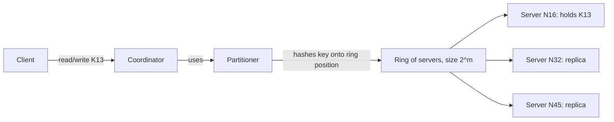

The partitioner is the single piece of logic that turns "here is a key" into "here are the servers responsible for it" — everything else in Cassandra's design builds on top of this ring mapping.

### Worked example

Trace a write of key `K13` with `m = 7` (128 ring positions): the client sends the write to a **coordinator** node; the coordinator's **partitioner** hashes `K13` onto the ring and finds its position; the **successor** server at that position (say `N16`) is where the primary/first copy lands; walking further round the ring, the next two distinct servers (say `N32` and `N45`) receive additional replica copies. A later read for `K13` follows the same partitioner logic to find the same set of servers.

### Near-twins / traps

- **Cassandra's ring vs a classic P2P DHT.** Same ring idea, but Cassandra has **no finger table and no multi-hop routing** — a coordinator finds the right server directly via the partitioner, not through a chain of hops.
- **"Primary replica" wording.** The slide's own diagram labels use "primary" and "backup" replicas, but the professor explicitly says in speech that Cassandra treats all replicas as equal, with no primary/secondary distinction — know both wordings.
- **NoSQL "unstructured" ≠ broken data.** Missing columns/rows are a normal, expected consequence of having no schema — not a data quality bug.
- **Column-oriented storage vs row-oriented (RDBMS).** RDBMS stores a row together (fast for "everything about one entity"); NoSQL commonly stores a column together (fast for range queries scanning one attribute across many entities).

### Tiny recap card

- Key-value abstraction = key (unique entity ID) → value (its attributes); needs a distributed hash table once data exceeds one machine.
- RDBMS needs schema + primary/foreign keys + joins; today's write-heavy, unstructured, join-free workload doesn't fit that, hence NoSQL (`get`/`put`, no schema, no joins).
- Cassandra: ring-based DHT (no finger table/routing) + partitioner maps key → server(s); replicas placed at successive ring positions.

### Checkpoint

1. In the key-value abstraction, what does "value" mean for a Twitter-style key-value store keyed by tweet ID?  
   a) The tweet ID itself, repeated  
   b) The attributes associated with that tweet — timestamp and text  
   c) A hash of the tweet ID  
   d) The username only

2. Why can't a plain in-memory hash table or binary tree serve as a big-data key-value store?  
   a) Hash tables cannot support `insert`/`lookup`/`delete`  
   b) They only run on a single machine, and big data exceeds what one machine can hold  
   c) Binary trees are always slower than hash tables  
   d) They require SQL, which NoSQL forbids

3. Which of the following is a foreign key in the RDBMS example (`users` table with `user_id`, `name`, `zipcode`, `blog_url`, `blog_id`; `blog` table with `id`, `url`, `last_updated`, `num_posts`)?  
   a) `users.user_id`  
   b) `users.blog_id`, referring to `blog.id`  
   c) `blog.num_posts`  
   d) `blog.last_updated`

4. Which is NOT one of the four mismatches between today's workload and classic RDBMS design, as stated in this lecture?  
   a) Large, unstructured data volume  
   b) Massive random reads and writes from many clients  
   c) Workloads are read-heavy, not write-heavy  
   d) Foreign keys and joins are rarely needed

5. "Scale out" means:  
   a) Replacing existing servers with fewer, more powerful ones  
   b) Adding more commodity machines to grow capacity  
   c) Reducing the number of servers to cut cost  
   d) Moving data to a single, larger data center

6. What does Cassandra's ring-based design borrow from, and what does it deliberately leave out?  
   a) Borrows from RDBMS joins; leaves out primary keys  
   b) Borrows from P2P distributed hash tables; leaves out finger tables / multi-hop routing  
   c) Borrows from HDFS block placement; leaves out replication  
   d) Borrows from MapReduce shuffle; leaves out the reduce phase

7. Why does column-oriented storage make a query like "all blog IDs updated in the last month" fast?  
   a) It compresses the entire table before every query  
   b) It only needs to scan the relevant column(s) instead of every row's full set of columns  
   c) It builds a B-tree index automatically on every column  
   d) It caches the entire table in RAM by default

8. According to the lecture's spoken explanation (not just the diagram labels), how does Cassandra treat its replica copies of a key?  
   a) One is designated primary and authoritative; others are read-only backups  
   b) All replicas are equal — there is no primary/secondary distinction  
   c) Replicas are ranked by which data center created them  
   d) Only the coordinator node's copy counts as valid

#### Answer key

1. **b** — the value holds the attributes of the entity named by the key; for a tweet ID key, that's the tweet's timestamp and text.
2. **b** — dictionary data structures like hash tables work great, but only within one machine's memory/storage; big data needs the same abstraction spread across a cluster.
3. **b** — `users.blog_id` refers to `blog.id`, the other table's primary key, making it a foreign key and enabling the join.
4. **c** — the lecture states today's workloads are **write-heavy**, not read-heavy; that's one of the four cited mismatches.
5. **b** — scale out grows capacity by adding more (cheap, commodity) machines rather than replacing existing ones with pricier hardware.
6. **b** — Cassandra reuses the ring idea from P2P distributed hash tables but skips the finger-table-based multi-hop routing those systems use.
7. **b** — column-oriented storage groups a column together on disk/across nodes, so a query touching one attribute doesn't have to read every other column of every row.
8. **b** — the professor explicitly states in speech that Cassandra's replicas are all equal, with no primary/secondary distinction, even though the diagram's own labels say "primary" and "backup."

#### Optional, after you check

- Explain, in 30 seconds, why a bank's account-lookup workload could plausibly use a key-value store instead of a full RDBMS.
- Say out loud the four RDBMS-vs-today's-workload mismatches without looking at the notes.

---

## Week wrap

### How the lectures connect

This week has two acts. Lectures 9–11 build **Spark**: Lecture 9 hands you the working vocabulary (RDD, transformation, action, lineage) through Scala syntax and worked examples (log mining, WordCount, PageRank); Lecture 10 goes back and explains *why* that vocabulary exists — MapReduce's disk-bound fault tolerance was too slow for interactive and iterative work, so Spark's RDDs trade "replicate everything" for "remember how to rebuild it" — and fills in the execution machinery (Driver, SparkContext, Cluster Manager, Executors, DAG scheduler). Lecture 11 then tours the four libraries (SQL, Streaming, MLlib, GraphX) that all reuse this same RDD engine, which is the entire reason Spark can be one system instead of four. Lecture 12 pivots to a second theme that will run through the rest of the course: once your *data*, not just your *computation*, is too big and too unstructured for a single schema-bound machine, you need a **key-value / NoSQL store** — and Cassandra's ring-based partitioner is the first piece of that design, continuing in the lectures ahead.

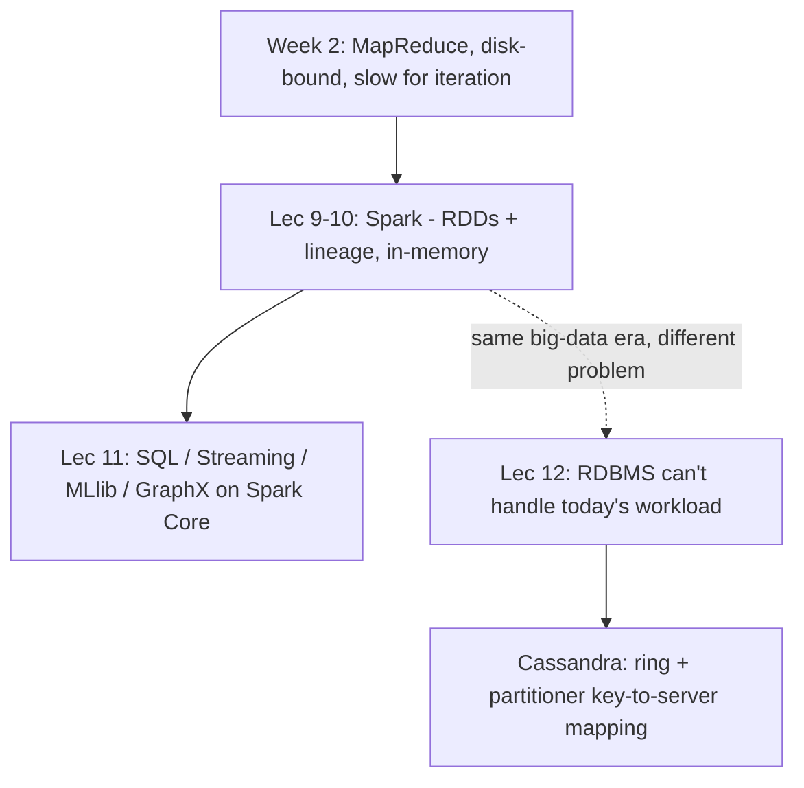

### Assignment-shaped mixed quiz

1. What is the primary reason Spark keeps RDDs in memory instead of writing intermediate results to HDFS the way MapReduce does?  
   a) HDFS cannot store intermediate data  
   b) To avoid the disk write/read cost that makes MapReduce slow for interactive and iterative applications  
   c) Because Spark cannot use HDFS at all  
   d) In-memory storage is a legal requirement for Scala programs

2. Which pair correctly matches an RDD operation to its category?  
   a) `count()` — transformation  
   b) `map()` — action  
   c) `reduceByKey()` — transformation  
   d) `collect()` — transformation

3. In the log-mining worked example, caching the filtered `errors` RDD speeds up:  
   a) The very first query only  
   b) Any subsequent query that reuses that cached RDD, since it skips re-reading from disk  
   c) Only queries run by a different driver  
   d) Nothing — caching has no performance effect in Spark

4. What does an RDD's "lineage" actually store?  
   a) A full backup copy of every partition  
   b) A log of the coarse-grained transformations used to build the RDD, replayed on failure  
   c) The IP addresses of all executors that touched the RDD  
   d) A checksum of the final output

5. Rank the Spark execution chain from top to bottom: Driver → ? → Worker Node → ?  
   a) SparkContext → Executor; Cluster Manager → Task  
   b) Cluster Manager → Executor  
   c) Task → Cluster Manager  
   d) Executor → SparkContext

6. Which MLlib family includes logistic regression, linear SVM, Naive Bayes, and decision trees?  
   a) Regression  
   b) Classification  
   c) Clustering  
   d) Optimization

7. Spark Streaming processes data using:  
   a) Strictly one event at a time, with no batching  
   b) Micro-batches — short buffered chunks run through the normal batch engine  
   c) A separate, incompatible engine from Spark Core  
   d) Only nightly batch jobs

8. What specifically makes today's big-data workloads a poor fit for classic RDBMS, according to this week's lecture?  
   a) Large unstructured volume, massive random read/write from many clients, write-heavy operations, and rare use of foreign keys/joins  
   b) RDBMS cannot store numbers  
   c) RDBMS requires a data center  
   d) RDBMS is always slower than any NoSQL system regardless of workload

9. In Cassandra, the component that decides which server(s) a given key maps to on the ring is called the:  
   a) Coordinator  
   b) Partitioner  
   c) Executor  
   d) DAG scheduler

10. What does Cassandra's ring design deliberately omit compared to a classic P2P distributed hash table?  
    a) Replication  
    b) Finger tables and multi-hop routing  
    c) Hashing of keys  
    d) A ring topology

11. Column-oriented storage in NoSQL systems is chiefly optimized for:  
    a) Fetching an entire row's data as fast as possible  
    b) Range queries scanning one column (or a few) without touching every other column  
    c) Enforcing a fixed schema across all rows  
    d) Running SQL joins efficiently

12. True or False: Because GraphX, MLlib, Spark SQL, and Spark Streaming all sit on Spark Core, a job can combine them (e.g. SQL to load data, then MLlib to train a model) within the same cluster and the same RDDs.  
    a) True  
    b) False

#### Answer key

1. **b** — avoiding the disk round-trip on every step is exactly what makes Spark fast for interactive/iterative work that MapReduce struggled with.
2. **c** — `reduceByKey` builds a new RDD lazily, so it's a transformation; `count`, `collect` are actions that trigger execution.
3. **b** — caching benefits any later query that reuses the same cached RDD, not just the query that created it.
4. **b** — lineage is a log of transformations, not a data copy; it's replayed to recompute lost partitions.
5. **a** — Driver has the SparkContext, which talks to the Cluster Manager, which manages Worker Nodes running Executors that run Tasks.
6. **b** — classification is the family listing logistic regression, linear SVM, Naive Bayes, and decision trees.
7. **b** — Spark Streaming buffers short chunks (micro-batches) and processes them through Spark's normal batch engine.
8. **a** — the four mismatches given in the lecture: unstructured volume, massive random read/write, write-heavy, and rare foreign keys/joins.
9. **b** — the partitioner is the component responsible for key-to-server mapping on the ring.
10. **b** — Cassandra reuses only the ring idea from P2P DHTs, dropping finger-table-based multi-hop routing.
11. **b** — column-oriented storage groups a column together so range queries over that column skip unrelated columns.
12. **a** (True) — all four libraries build on the same Spark Core RDDs, which is the stated reason they can interoperate in one job on one cluster.

### Last 5-minute drill

| Term | 6-word answer |
| --- | --- |
| RDD | Immutable, partitioned, in-memory, rebuilt via lineage |
| Lineage | Log of transformations, replayed on failure |
| Transformation | Lazy; builds new RDD, doesn't run |
| Action | Triggers execution; count, collect, save |
| DAG scheduler | Splits transformation graph into task stages |
| SparkContext | Driver's entry point to Spark functionality |
| reduceByKey | Groups by key, combines on map side |
| MLlib | Six families: classify, regress, filter, cluster, decompose, optimize |
| GraphX | Graph algorithms built from vertex/edge RDDs |
| Column-oriented storage | Stores a column together for range scans |
| Scale out | Add more commodity machines, not bigger ones |
| Partitioner | Maps a key to its ring position/server |
| Cassandra ring | DHT-style ring, no finger table routing |
