# Week 4 — Storage platforms (Cassandra internals, CAP, Zookeeper, CQL)

> Goal: finish this week without the video or the raw PDF.
> Time budget: about 90–110 minutes (this week runs a bit long because Zookeeper is a big lecture).

## One-page cheat sheet

**If you remember only 7 things this week**

1. Cassandra replication picks a partitioner (random, uniform load) or a network-topology strategy (N replicas per data center, placed clockwise on the ring onto *different racks*).
2. Cassandra writes are "always writable": commit log → Memtable (cache) → later flushed to an immutable SSTable on disk; a down replica gets caught up later via **hinted handoff**.
3. **CAP theorem**: pick at most 2 of Consistency, Availability, Partition-tolerance. Cassandra chooses **A+P** with eventual (weak) consistency; RDBMS chooses **C+A** (no partitions to survive); HBase/BigTable choose **C+P**.
4. Cassandra tunes consistency per query with R (read replicas to wait for) and W (write replicas to wait for): `R+W > N` and `W > N/2` gives strong-ish consistency; smaller R/W trade consistency for speed.
5. **Zookeeper** is a centralized coordination service (leader election, group membership, dynamic config, locks) — an ensemble of servers, one elected **leader** takes all writes, any server answers reads, majority (`2f+1` for `f` failures) must agree.
6. Zookeeper's data model is a Unix-like tree of **znodes**: persistent (survive until deleted) or ephemeral (die with the client's session) or sequential (auto-numbered) — ephemeral znodes are how Zookeeper implements "who is alive right now."
7. **CQL** looks like SQL (keyspace = database, column family = table, row = tuple) but is really key→columns under the hood: the primary key becomes the **row key** used for partitioning, and Cassandra is fast at finding rows and scanning columns — it never scans rows.

**Near-twins (left is not right)**

| This | Is not | Because |
| --- | --- | --- |
| Random partitioner | Byte-ordered partitioner | Random spreads keys evenly (no hotspots); byte-ordered supports range queries but clusters writes on a few nodes |
| Write-back (Cassandra default) | Write-through | Write-back acks after the in-memory Memtable is updated (fast, flushed to disk later); write-through waits for the disk write itself |
| Eventual consistency (Cassandra) | Strong/sequential consistency (RDBMS, HBase) | Eventual only guarantees replicas converge *after writes stop*; strong models guarantee every read sees the latest write immediately |
| Persistent znode | Ephemeral znode | Persistent survives until an explicit delete; ephemeral is deleted automatically when its creating session ends — that's what makes it usable as a "server is alive" flag |
| CQL `PRIMARY KEY` | An RDBMS primary key with joins | CQL has no joins/foreign keys — the primary key is only the Cassandra row (+ clustering) key used to shard data across the ring |

**Numbers / defaults this week**

- Network topology strategy: 2 replicas/DC × 3 DCs = 6 replicas; 3 replicas/DC × 3 DCs = 9 replicas.
- Bloom filter false-positive rate in the slide's example: ~0.02% (never false negatives).
- Quorum conditions: `W + R > N` and `W > N/2`.
- MySQL (>50 GB data): ~300 ms write / ~350 ms read avg. Cassandra: ~0.12 ms write / ~15 ms read avg.
- Zookeeper: benchmarked over 10,000 ops/sec for write-heavy workloads; reads:writes ratio it's tuned for is ~10:1; needs `2f+1` servers to tolerate `f` failures; leader election takes on the order of 200 ms.

**Diagrams** (reused from the lecture sections below)

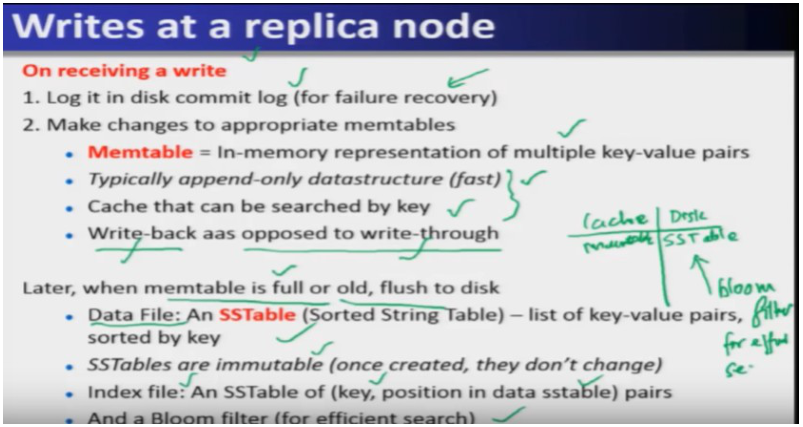
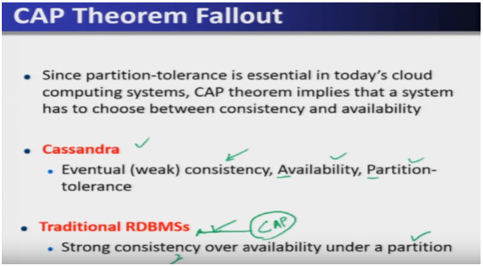
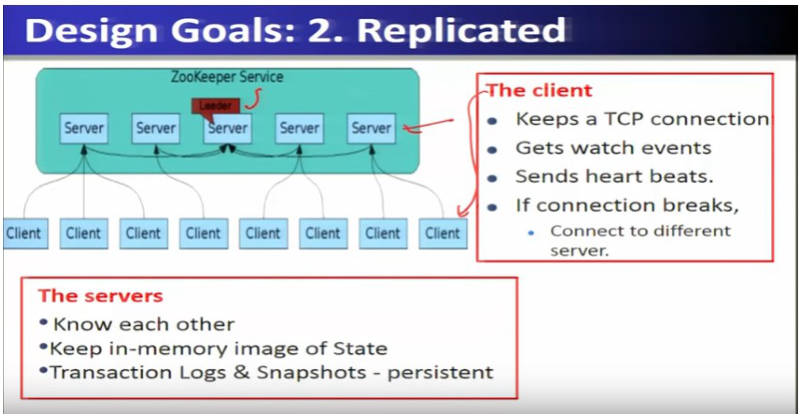

## This week's map

| Lec | Title | Why it is on the exam |
| --- | --- | --- |
| 13 | Data Placement Strategies | Partitioners, snitches, the full Cassandra write/read path, bloom filter, gossip membership — the mechanics questions live here |
| 14 | CAP Theorem | The single most quoted theorem in the course; which systems pick which two letters |
| 15 | Consistency Solutions | The spectrum between eventual and strong consistency (CRDTs, causal, red-blue) |
| 16 | Design of Zookeeper | Coordination service concepts, znodes, leader election, sessions, watches, real applications (YMB, Katta) |
| 17 | CQL | How SQL-shaped commands map onto Cassandra's row-key/column-value storage |

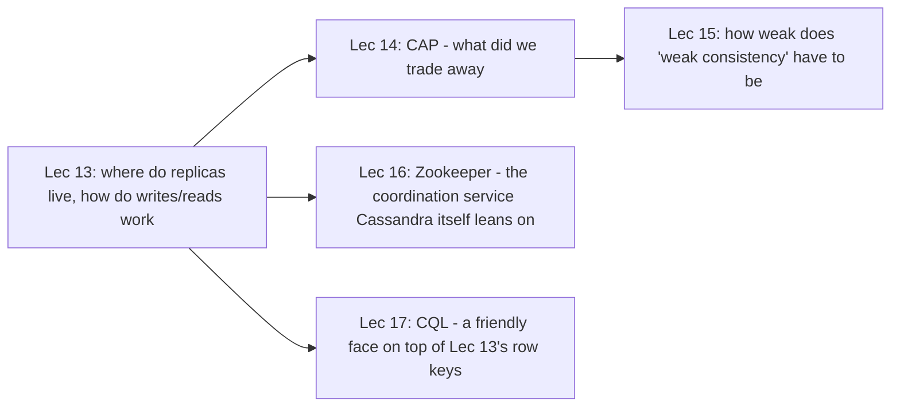

One story: Lecture 13 builds the storage engine, Lecture 14 explains the theoretical price it paid, Lecture 15 shows the menu of prices you could pay instead, Lecture 16 is the separate coordination service that keeps any of this cluster machinery honest, and Lecture 17 is the query language that hides all of Lecture 13's row-key plumbing behind SQL-like syntax.

---

## Lecture 13: Data Placement Strategies

### Hook (4–6 sentences)

Imagine you're handed a Cassandra cluster and told "store this data, replicate it, and don't lose it even if a node or a whole data center goes down." Before you can write a single byte you have to answer two boring but critical questions: which physical server does a given key's data live on, and which server do we ask when a node fails partway through? This lecture is the plumbing underneath Cassandra: how keys get spread across the ring, how a write reaches every replica reliably, how a read serves you fast without touching a disk it doesn't have to, and how nodes even know which of their peers are still alive. None of this shows up as one flashy diagram — it's a chain of small, deliberate engineering decisions, each one picked to keep writes "lightning fast."

### Slide picture

### Core ideas

**Placing replicas.** Cassandra's replication strategy is either **Simple Strategy** or **Network Topology Strategy**. Simple strategy hands the job of picking which node gets which key to a *partitioner*. A **Random Partitioner** hashes each key and scatters keys uniformly across all servers — nobody gets more than their share, so no single node becomes a bottleneck. A **Byte-Ordered Partitioner** instead assigns contiguous key ranges to servers (handy if you want a range query like "all Twitter users starting with A–B"), but because writes to nearby keys pile onto the same few servers it creates **hotspots** — a few overloaded nodes needing constant rebalancing. That's why random partitioning is the recommended default. `EXAM`: random partitioner = uniform load, no range queries; byte-ordered = supports ranges, risks hotspots.

Once you're running across *multiple data centers*, Simple Strategy isn't enough — you need the **Network Topology Strategy**, which places a fixed number of replicas per data center (e.g. 2 replicas/DC × 3 DCs = 6 total replicas). Within one data center, the first replica goes wherever the partitioner says, then Cassandra walks clockwise around that DC's ring placing further replicas *on different racks* — so a single rack failure (a switch dying, say) can't take out every copy of your data. `EXAM`: replicas are deliberately spread across racks for rack-failure tolerance.

**Knowing where the racks and data centers actually are.** All of that replica placement needs Cassandra to map a server's IP address to its rack and data center — that mapping is done by a **Snitch**, configured in `cassandra.yaml`. A **Simple Snitch** is topology-unaware: it just guesses randomly, with no notion of racks. A **Rack Inferring Snitch** reads the *octets* of the IP address itself as coded topology info (e.g. `101.102.103.104` = `x.<DC octet>.<rack octet>.<node octet>` — two IPs sharing the second octet are in the same data center). A **Property File Snitch** reads an explicit config file instead of guessing from IPs. An **EC2 Snitch** is built for AWS: the *EC2 region* stands in for the data center and the *Availability Zone* stands in for the rack. `EXAM`: snitches map IP → rack/DC; four named types are Simple, RackInferring, PropertyFile, EC2.

**Writing data — why it's "lightning fast."** A client sends a write to one **coordinator** node (any node can play this role, chosen per-key, per-client, or per-query). The coordinator uses the partitioner to forward the write to every replica responsible for that key; once **X** of the `N` replicas reply, the coordinator acks the client. Cassandra is deliberately **"always writable"**: if a replica is down, the coordinator just writes to the other replicas and buffers the down replica's copy locally, replaying it once that replica comes back — this buffering-and-replay trick is called **hinted handoff**. If *every* replica for a key is down, the coordinator buffers the write itself for up to a few hours, hoping a replica recovers. Per-data-center coordinators are themselves elected using Zookeeper running the Paxos consensus protocol (foreshadowing Lecture 16). `EXAM`/`PROF`: hinted handoff is what makes "always writable" true even when replicas are down.

At the replica itself, on receiving a write: (1) log it to the on-disk **commit log** first, purely so a crash doesn't lose the update; (2) update the **Memtable**, an in-memory, append-only, cache-like structure of key-value pairs. This is a **write-back** design (ack as soon as memory is updated, persist to disk later) rather than **write-through** (wait for the disk write before acking) — write-back is what makes Cassandra's writes so fast. When a Memtable gets full/old, it's flushed to disk as an **SSTable** ("Sorted String Table") — an immutable, key-sorted list of key-value pairs, paired with an index file (key → position) so lookups don't need to scan the whole file. To make SSTable lookups even cheaper, Cassandra fronts them with a **Bloom filter**.

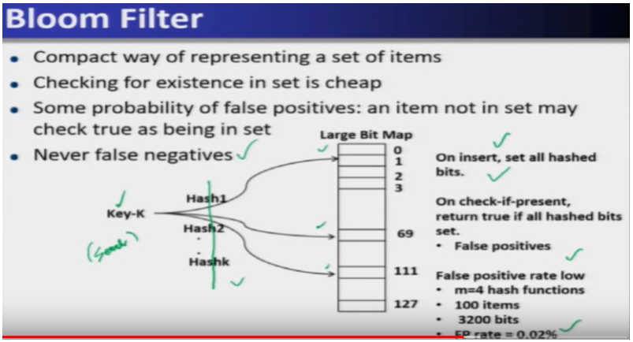

A Bloom filter is a compact way to ask "is this key possibly in this SSTable?" without touching the disk. Inserting a key runs it through *k* different hash functions, each setting one bit in a shared bit array; checking a key runs the same hashes and answers "yes" only if *all* those bits are set. It can lie in one direction only: it might say "present" when the key isn't there (a **false positive** — the slide's example measured this at ~0.02%, i.e. very rare) but it never says "absent" for a key that's actually there (**no false negatives**). `EXAM`: Bloom filter — no false negatives, rare false positives, used to pick the right SSTable fast.

Because updates pile up across many SSTables over time, Cassandra periodically runs **compaction**: merging multiple SSTables (and applying pending deletes) into fewer, updated ones, run locally on each server. **Deletes** don't remove data immediately — they write a **tombstone** marker, and the actual removal happens only when compaction later encounters that tombstone. `EXAM`/`SLIDE`: delete → tombstone now, real removal happens during compaction.

**Reading data.** Reads resemble writes: the coordinator contacts X replicas (often the ones that have answered fastest recently), returns the value with the latest timestamp among their replies, and in the background checks the *remaining* replicas for consistency, triggering a **read repair** if they disagree — a quiet mechanism that nudges stale replicas back toward eventual consistency. Because a row can be split across multiple SSTables, reads sometimes have to touch more than one SSTable, which is why reads are slower than writes in Cassandra — though still much faster than a traditional RDBMS.

**Knowing who's alive: gossip and membership.** Since any server can be a coordinator, every server needs an up-to-date list of who else is currently in the cluster — and that list must self-update as nodes join, leave, or fail. Cassandra maintains this with a **gossip protocol**: nodes periodically exchange heartbeat counters with each other, and on receiving a peer's gossip message a node updates its local membership table with whichever heartbeat is more recent. If a node's last-known heartbeat is older than some timeout, it's marked failed. Layered on top is a **suspicion mechanism** (the "accrual failure detector"): instead of a fixed timeout, it computes a suspicion value **Phi** that adapts to the network's actual behavior, with a practical detection time around 10–15 seconds. `EXAM`/`PROF`: Cassandra membership uses gossip, not a central membership server (that's Zookeeper's job for other systems — the contrast is worth noticing).

### How it fits together

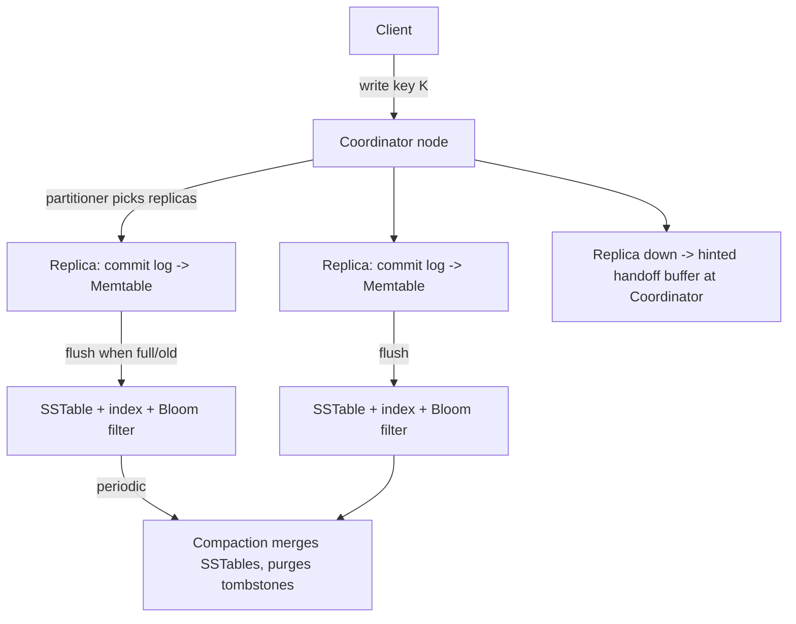

Caption: a write only needs the Memtable to ack the client (write-back); durability comes from the commit log, and disk cost is deferred to a later flush + compaction.

### Worked example

Trace a write to key `K` with `N=3` replicas, one of which (`R3`) happens to be down:
1. Client sends `write(K, v)` to Coordinator.
2. Coordinator uses the partitioner to find `R1, R2, R3` for `K`.
3. Coordinator writes to `R1` and `R2` normally (commit log → Memtable); for `R3` it keeps a hint locally.
4. `R1`/`R2` reply; once **X** replies are back, Coordinator acks the client — the write already "succeeded" even though `R3` never saw it yet.
5. When `R3` comes back up, the Coordinator replays its buffered hint to `R3` (hinted handoff), and `R3` catches up.

### Near-twins / traps

- **Random partitioner is not Byte-ordered partitioner** — random avoids hotspots; byte-ordered supports range scans but concentrates load.
- **Write-back is not write-through** — Cassandra acks after the Memtable update (write-back), not after the disk write (write-through); that's the whole reason writes are ~0.12 ms.
- **A Bloom filter "present" is not certain** — it can false-positive (rare, ~0.02% here); a Bloom filter "absent" answer is always correct (no false negatives).
- **Tombstone is not deletion** — the row still physically exists until compaction sweeps it away.

### Tiny recap card

- Replication: Simple Strategy (partitioner-driven) or Network Topology Strategy (N replicas/DC, different racks); Snitches map IP → rack/DC.
- Writes: commit log (durability) → Memtable (fast ack) → SSTable (immutable, flushed later) → Bloom filter (fast existence check) → Compaction (merge + purge tombstones).
- Membership: gossip heartbeats + accrual (Phi) suspicion, not a central directory.

### Checkpoint

1. A cluster uses the Byte-Ordered Partitioner instead of the Random Partitioner. What is the most likely consequence?
   a) Faster writes across all nodes
   b) Hotspots on the nodes holding popular key ranges
   c) Loss of the ability to do range queries
   d) Automatic rack-failure tolerance

2. True or False: Cassandra acknowledges a write to the client only after the value has been persisted to disk in the SSTable.

3. A replica is temporarily down when a write arrives. What does the coordinator do?
   a) Fails the write and returns an error
   b) Buffers the write and replays it via hinted handoff when the replica returns
   c) Waits indefinitely for the replica to come back before acking
   d) Redirects all future reads to a different data center

4. Which statement about Bloom filters used in Cassandra is correct?
   a) They can produce false negatives but never false positives
   b) They can produce false positives but never false negatives
   c) They guarantee the key's exact position in the SSTable
   d) They replace the need for an index file entirely

5. A DELETE is issued for a row in Cassandra. What happens immediately?
   a) The row is removed from all SSTables
   b) A tombstone is written; physical removal happens later during compaction
   c) The row is moved to a separate "deleted" keyspace
   d) The commit log is rolled back

6. Two data centers, each with 2 replicas per key configured under the Network Topology Strategy. How many total replicas exist for a given key?
   a) 2
   b) 3
   c) 4
   d) 6

7. Which mechanism does Cassandra use to let every node know which other nodes are currently alive?
   a) A centralized Zookeeper-style membership server
   b) Gossip protocol with heartbeat counters
   c) Polling the NameNode every second
   d) DNS round-robin

#### Answer key

1. **b** — byte-ordered partitioning clusters writes onto whichever server owns a popular range, creating hotspots; that's exactly why random partitioning is recommended instead.
2. **False** — Cassandra is write-back: it acks once the Memtable (in-memory) is updated; the SSTable flush to disk happens later.
3. **b** — this is hinted handoff, the mechanism that keeps Cassandra "always writable" even with a replica down.
4. **b** — Bloom filters never miss a key that's actually present (no false negatives) but can occasionally say "present" for a key that isn't there (false positive).
5. **b** — delete writes a tombstone; the row is actually purged only when compaction later encounters that tombstone.
6. **d** — 2 replicas/DC × 2 DCs = 4... but the slide's own worked example used 3 DCs × 2 replicas/DC = 6, so watch the DC count in the stem; here 2 DCs × 2 replicas = 4. (If your version of this question says 3 DCs, the answer is 6.)
7. **b** — gossip-based membership, not a centralized directory (Zookeeper handles that role for other systems, not Cassandra's own membership).

#### Optional, after you check

- Explain hinted handoff in 30 seconds, including what happens if *all* replicas for a key are down.
- What breaks if Cassandra used write-through instead of write-back?

---

## Lecture 14: CAP Theorem

### Hook (4–6 sentences)

Every distributed storage system eventually gets asked the same uncomfortable question: what happens when the network between two of your data centers goes dark for ten minutes? Do you keep answering queries with possibly-stale data, or do you refuse to answer at all until you're sure you're right? The CAP theorem is the formal answer to why you cannot dodge this question — you can have at most two of three properties, and the choice you make defines the personality of your database. This lecture takes Cassandra's design choices from Lecture 13 (always writable, eventual consistency, gossip-based membership) and shows they weren't arbitrary — they're what you get when you pick Availability and Partition-tolerance over strict Consistency.

### Slide picture

### Core ideas

**The three letters.** Proposed by Eric Brewer (and later formally proved by Gilbert and Lynch), the CAP theorem says a distributed system can guarantee **at most two** of: **Consistency** (every read returns the most recent write — all nodes see the same data at any instant), **Availability** (every request gets a response, and quickly — the system never just "hangs" or refuses), and **Partition tolerance** (the system keeps working even when the network between some nodes is cut, e.g. by a router outage, a severed undersea cable, or a DNS failure). `EXAM`: C = latest value always, A = always responds quickly, P = survives a network split.

**Why availability is not a nice-to-have.** The slide makes availability concrete with a business number: at companies like Amazon or Google, an extra 500 ms of read/write latency has been shown to cost roughly a 20% drop in revenue — every added millisecond of latency can translate into millions of dollars a year, because users mentally "leave" once more than about a second passes between their click and the response. That's why availability shows up explicitly in service-level agreements. `PROF`: this is the transcript's concrete justification for why availability is treated as a first-class design goal, not an afterthought.

**Why partition tolerance isn't optional either.** Partitions happen for mundane reasons — a router outage between data centers, a severed cable, a broken switch inside one rack. Since real clusters run across multiple racks and data centers, some partition is basically inevitable eventually, so partition tolerance is treated as a *requirement*, not a trade-off you can skip. That's the theorem's real bite: because P is non-negotiable in practice, **you are actually choosing between C and A**, not freely picking any two of three.

**Who picks what.** Cassandra chooses **Availability + Partition tolerance**, accepting **eventual (weak) consistency** — this is the "AP" system. Traditional single-machine RDBMS effectively gets **Consistency + Availability** "for free," because with no replication there's no partition to survive in the first place. Systems like **HBase, Hypertable, BigTable, Spanner** instead choose **Consistency + Partition tolerance**, sacrificing some availability — a "CP" system. Amazon's Dynamo and Voldemort sit with Cassandra in the AP camp. `EXAM`: Cassandra = AP; RDBMS (unreplicated) = CA; HBase/BigTable/Spanner = CP.

**What "eventual consistency" actually means in practice.** If writes to a key stop, all its replicas will *eventually* converge to the same value — but while writes keep flowing, there's a "moving wave" of updated values lagging behind whatever the client most recently sent, and a read can return a stale value during that lag. The system always tries to keep converging; it converges quickly when writes are infrequent, but can keep returning slightly-stale reads under a constant stream of back-to-back writes. This is formalized as the **BASE** properties (contrasted with RDBMS's **ACID**): **B**asically **A**vailable, **S**oft state (values live transiently in caches like the Memtable), **E**ventual consistency (not immediate, but it gets there).

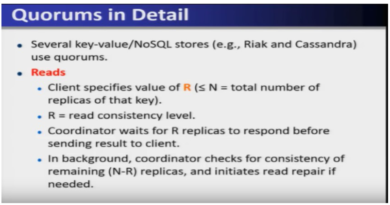

**Tuning consistency per query.** Cassandra lets the client pick a consistency level *per operation*: **ANY** (any server, possibly not even a replica, may ack — fastest, weakest), **ALL** (every replica must be updated — strongest, slowest), **ONE** (at least one replica — faster than ALL but can't tolerate all replicas failing), and **QUORUM** (a majority of replicas — a deliberate middle ground). A **quorum** is "more than half": with 5 replicas the quorum is 3, and the key mathematical property is that *any two quorums must overlap in at least one replica* — so if client A writes via one quorum and client B reads via another quorum, at least one server in B's read-quorum has A's latest write. That overlap guarantee is what makes quorum reads/writes "faster than ALL but still strongly consistent."

More precisely: the client picks **R** (read consistency level) and **W** (write consistency level), each ≤ N (total replicas). The coordinator waits for R replicas to answer a read (and checks the remaining N−R in the background, triggering read repair if they disagree) or waits for W replicas to ack a write. Two necessary conditions make the quorum overlap guarantee hold: **W + R > N** and **W > N/2**. Common tuning choices: `(W=1, R=1)` — fewest writes/reads needed, weakest guarantee; `(W=N, R=1)` — great for read-heavy workloads (reads are cheap since any one replica suffices); `(W=N/2+1, R=N/2+1)` — balanced, good for write-heavy workloads; `(W=1, R=N)` — good when mostly one client writes per key. **LOCAL_QUORUM** only waits for a quorum within the coordinator's own data center (faster); **EACH_QUORUM** requires a quorum in *every* data center (supports hierarchical replies, globally consistent but still relatively fast compared to ALL). `EXAM`: `W+R>N` and `W>N/2` are the two quorum conditions to memorize.

### How it fits together

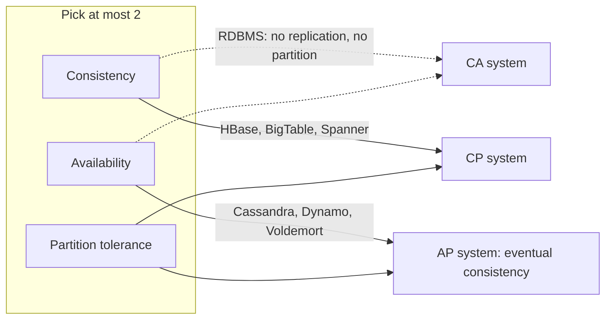

Caption: Cassandra deliberately sits in the AP corner; the price for its "lightning fast" writes/reads from Lecture 13 is that a read can occasionally return a stale value.

### Worked example

Five replicas (`N=5`). Client A writes with `W=3` (a write-quorum of {R1,R2,R3}); Client B then reads with `R=3` from a different quorum, say {R3,R4,R5}. Why must B's read see A's write? Because any two quorums of size ≥3 out of 5 must share at least one server — here it's R3 — so R3 already has A's update and will report it back to B's coordinator with the latest timestamp. Check the arithmetic: `W+R = 3+3 = 6 > N=5` ✓, and `W=3 > N/2=2.5` ✓ — both quorum conditions hold.

### Near-twins / traps

- **Cassandra's AP is not RDBMS's CA** — RDBMS gets consistency "for free" only because it isn't distributed/partitioned; it isn't proof that RDBMS "solved" CAP.
- **QUORUM is not ALL** — QUORUM is strongly consistent *and* faster than ALL, because it only needs a majority, not every replica, thanks to the quorum-overlap property.
- **Eventual consistency is not "inconsistent forever"** — it converges once writes stop; the staleness window only exists while writes are actively flowing.
- **LOCAL_QUORUM is not QUORUM** — LOCAL_QUORUM only needs a majority in one DC (faster, weaker across DCs); plain/EACH_QUORUM coordinates across all DCs.

### Tiny recap card

- CAP: pick 2 of Consistency, Availability, Partition-tolerance; P is basically mandatory in practice, so the real choice is C vs A.
- Cassandra = AP (eventual/BASE); RDBMS = CA; HBase/BigTable/Spanner = CP.
- Quorum: `W+R>N` and `W>N/2` guarantee any two quorums overlap → still-consistent reads, faster than ALL.

### Checkpoint

1. Which two guarantees does Cassandra prioritize, according to the CAP theorem?
   a) Consistency and Availability
   b) Consistency and Partition tolerance
   c) Availability and Partition tolerance
   d) All three simultaneously, without trade-off

2. True or False: A single-machine (non-replicated) RDBMS satisfies all three of Consistency, Availability, and Partition tolerance simultaneously, in the full distributed-systems sense.

3. With N=5 replicas, what is the minimum quorum size?
   a) 2
   b) 3
   c) 4
   d) 5

4. Which consistency level in Cassandra is the slowest but gives the strongest guarantee?
   a) ANY
   b) ONE
   c) QUORUM
   d) ALL

5. A system chooses Consistency and Partition tolerance (CP) at the expense of Availability. Which systems does the lecture name as examples?
   a) Cassandra and Dynamo
   b) HBase, Hypertable, BigTable, Spanner
   c) MySQL and PostgreSQL
   d) Voldemort and Riak

6. Two quorums of size 3 each, drawn from N=5 replicas. What must be true of them?
   a) They can never share a replica
   b) They must share at least one replica
   c) They must be identical
   d) They must each include the coordinator

7. Which condition, together with `W > N/2`, is required for Cassandra's quorum consistency guarantee?
   a) `W + R < N`
   b) `W + R > N`
   c) `R > N`
   d) `W = R`

#### Answer key

1. **c** — Cassandra is an AP system; it sacrifices strict consistency for eventual consistency instead.
2. **False** — CAP is a statement about distributed systems; an unreplicated single-node RDBMS never faces a network partition at all, so it isn't really "satisfying" P, it's sidestepping the question.
3. **b** — majority of 5 is more than 2.5, so the minimum quorum is 3.
4. **d** — ALL requires every replica to ack, giving strong consistency at the cost of being the slowest option.
5. **b** — the lecture explicitly names HBase, Hypertable, BigTable, and Spanner as CP-leaning systems.
6. **b** — the quorum-overlap property (any two quorums intersect) is exactly why quorum reads/writes stay consistent.
7. **b** — `W + R > N` together with `W > N/2` are the two necessary quorum conditions given in the lecture.

#### Optional, after you check

- Explain in 30 seconds why "partition tolerance" effectively turns CAP into just a C-vs-A choice.
- What breaks if a Cassandra cluster used `R=1, W=1` for a banking application?

---

## Lecture 15: Consistency Solutions

### Hook (4–6 sentences)

Lecture 14 left off with a blunt choice: eventual consistency (fast, but occasionally stale) or strong consistency (correct, but slow). Real systems rarely want either extreme — a shopping cart can tolerate a little staleness, but a bank balance can't; a social-media "like" counter can be sloppy, but a distributed lock absolutely cannot. This lecture fills in the space between the two extremes with a menu of "newer consistency models," each trading a bit of speed for a bit more correctness guarantee, so an application can pick exactly as much consistency as it actually needs — no more, no less.

### Slide picture

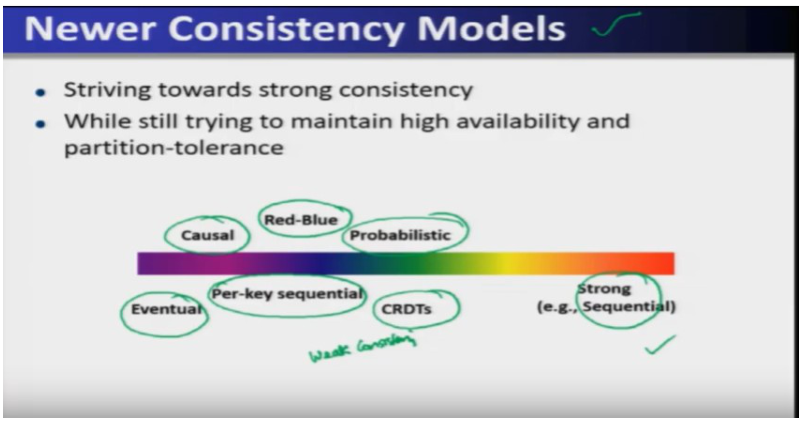

### Core ideas

**Why a spectrum, not just two extremes.** Eventual consistency (Cassandra's default, inherited from Amazon's Dynamo and LinkedIn's Voldemort) gives the fastest reads/writes because replicas are only guaranteed to converge *after* writes stop — good enough when applications can tolerate momentarily stale reads. Strong consistency sits at the opposite end, guaranteeing every read sees the latest write, at the cost of slower operations. Between them sit several **newer consistency models** that still aim toward strong consistency while trying to preserve most of the availability and partition tolerance of the weak end: **per-key sequential**, **CRDTs**, **red-blue**, **causal**, and **probabilistic** consistency.

**Per-key sequential consistency.** All operations *on the same key* have one agreed global order (even if different keys aren't coordinated with each other). Because it only needs to order operations per-key rather than across the whole system, it's faster than full strong consistency while still being meaningfully stronger than plain eventual consistency.

**CRDTs (Commutative Replicated Data Types).** A CRDT is a data structure specifically designed so that concurrent, commutative writes give the same result no matter what order they're applied in — the example given is a counter where the only operation is "+1": since addition is commutative, it genuinely doesn't matter whether replica A's +1 or replica B's +1 "happened first," the servers never need to argue about ordering at all. `EXAM`: CRDTs work because their operations commute — order doesn't matter, so there's nothing to reconcile.

**Red-blue consistency.** Not every operation can be made commutative, so red-blue consistency splits a client's transaction into two kinds: **blue** operations, which are commutative and can run in any order across data centers, and **red** operations, which must run in the same order everywhere. By isolating only the non-commutative part into "red" and leaving everything else free to reorder as "blue," this scheme is faster than requiring full strong consistency while still guaranteeing correctness for the operations that truly need ordering.

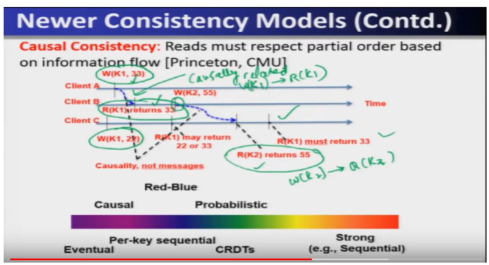

**Causal consistency.** This model says reads must respect a **partial order based on information flow** — even when no message was explicitly exchanged between the two operations. If client B reads a value that client A wrote, then any further write by B that was informed by that read is *causally* dependent on A's write, and any later reader (client C) must see writes in an order that respects that causal chain — e.g., if A writes `K1=33` and B later reads `K1` (getting 33) and then writes `K2=55`, client C reading `K1` afterward must get 33 (not an older, stale value like 22), because C's read of K1 is causally "downstream" of B having already observed 33. `EXAM`/`SLIDE`: causal consistency preserves *cause-and-effect* order between related operations, without needing full global ordering of unrelated ones.

**Picking a model.** The practical rule of thumb given is: use the *lowest* (weakest, leftmost-on-the-spectrum) consistency model that is still "correct" for your application — because moving left always buys you faster availability, and there's no reason to pay for stronger consistency than your application actually requires.

**Strong consistency models, briefly.** **Linearizability** is the strongest model: every client's operation appears to take effect instantaneously and is visible to everyone immediately, as if there were only one copy of the data — genuinely hard to achieve in a distributed system. **Sequential consistency** (Lamport) is slightly weaker: the result of any execution must look *as if* all processors' operations ran in *some* single sequential order, and each processor's own operations appear in that order in the sequence it issued them — it doesn't require real-time instantaneity, just a consistent overall ordering after the fact. Systems needing full ACID transactions on top of NoSQL-style scale are sometimes called **NewSQL** (e.g. Google Spanner, Microsoft's research systems) — they add ACID guarantees to the availability/scale properties NoSQL stores already have.

### How it fits together

Caption: moving right always costs speed/availability and buys a stronger guarantee — pick the leftmost model your application can actually tolerate.

### Worked example

Client A writes `K1=33`. Client B later reads `K1` and gets `33`, then writes `K2=55` (this write is *causally* dependent on B having seen A's write). Client C then reads `K1` — under causal consistency it must return `33`, not any older value, because C's read is causally reachable from A's write even though A and C never directly exchanged a message. If C then reads `K2`, it must return `55` for the same reason.

### Near-twins / traps

- **Causal consistency is not** full strong/sequential consistency — it only orders operations that are causally *related*; unrelated operations on different keys/clients can still be seen in different orders by different clients.
- **CRDTs are not** a general-purpose consistency fix — they only work because their specific operations (e.g., +1) are commutative; not every operation can be redesigned this way.
- **Eventual consistency is not** the same as per-key sequential consistency — eventual only promises convergence *after writes stop*; per-key sequential promises a real agreed order for operations on that key, continuously.

### Tiny recap card

- Spectrum (weak→strong): Eventual → Per-key sequential/CRDTs → Causal/Red-Blue/Probabilistic → Strong (Sequential/Linearizable).
- CRDTs win by using commutative operations; Red-Blue wins by isolating the non-commutative part into "red."
- Rule of thumb: use the weakest model that's still correct for your application.

### Checkpoint

1. Which consistency model relies on operations being commutative so that order never matters?
   a) Causal consistency
   b) CRDTs
   c) Linearizability
   d) Red-Blue consistency

2. True or False: Causal consistency requires that all clients see every operation in the exact same global order, regardless of any causal relationship.

3. In red-blue consistency, which operations must execute in the same order across all data centers?
   a) Blue operations
   b) Red operations
   c) Both, always
   d) Neither — order never matters

4. Which is the strongest consistency model discussed, where every operation appears instantaneous to all clients?
   a) Eventual consistency
   b) Per-key sequential consistency
   c) Linearizability
   d) Probabilistic consistency

5. Client A writes K=5. Client B reads K (sees 5) and then writes K=10 based on that read. Under causal consistency, what must a later reader, Client C, observe for K?
   a) Either 5 or 10, at random
   b) Only ever 5
   c) 10, since it is causally downstream of the read of 5
   d) An error, since causality cannot be tracked

6. What is the general rule of thumb for choosing a consistency model for an application?
   a) Always choose the strongest available model
   b) Always choose eventual consistency regardless of application needs
   c) Choose the weakest model that is still "correct" for the application, for best availability
   d) Choose randomly since all models perform equally

7. NewSQL systems are best described as:
   a) NoSQL stores that dropped all consistency guarantees
   b) Systems adding ACID transaction guarantees on top of NoSQL-style scale
   c) A rebranding of traditional RDBMS with no new features
   d) Systems that only support key-value operations

#### Answer key

1. **b** — CRDTs are designed around commutative operations (like +1), so concurrent writes always converge to the same result regardless of order.
2. **False** — causal consistency only enforces ordering for operations that are causally related; it does not require a single total order for everything.
3. **b** — red operations are the ones that must be executed in the same order everywhere; blue operations can commute freely.
4. **c** — linearizability is the strongest model described, making every operation look instantaneous and globally visible.
5. **c** — B's write of K=10 is causally dependent on having read K=5, so any later reader must see the write that came causally after, i.e. 10.
6. **c** — the lecture's explicit guidance is to use the lowest/weakest consistency model that is still correct, since that gives the fastest availability.
7. **b** — NewSQL systems add ACID transaction guarantees while still trying to keep NoSQL's scale/availability properties.

#### Optional, after you check

- Explain in 30 seconds why red-blue consistency can be faster than strong/sequential consistency without losing correctness.
- What breaks if an application built for linearizability were switched to plain eventual consistency without any code changes?

---

## Lecture 16: Design of Zookeeper

### Part A — Why coordination, and Zookeeper's design goals

### Hook (4–6 sentences)

Picture hundreds of servers running pieces of one big application, with nodes joining and crashing constantly, and no traffic light at the intersection telling them who goes first. Two processes racing to update the same value can silently corrupt data; two processes each waiting on the other can freeze forever. Rather than have every distributed application in Hadoop's world reinvent solutions to these problems from scratch, the ecosystem built one shared, general-purpose **coordination service** — Zookeeper — and this lecture is a tour of why it exists, what it guarantees, and how it's built.

### Slide picture

### Core ideas

**The two failure modes coordination prevents.** A **race condition** is what happens when two processes compete to update the same shared variable without coordinating: the slide's example has two people simultaneously depositing ₹1 into a bank account holding ₹17 — each reads 17, adds 1, and writes back 18, so the final balance is 18 instead of the correct 19; one increment silently vanished. A **deadlock** is what happens when a set of processes are each waiting (directly or indirectly) on one another for a resource, and none can proceed — a circular wait with no way out. A coordination service's whole job is to let many machines and processes share resources and state *without* falling into either of these traps. `EXAM`: race condition = concurrent writes corrupt data; deadlock = circular waiting, nobody progresses.

**What "coordination" looks like concretely.** The lecture gives several recognizable shapes this problem takes: **group membership** (which set of nodes currently belong to a group — e.g. which servers are alive), **leader election** (choosing one primary among a primary + backups, so a fault-tolerant master/backup system can survive the master crashing), **dynamic configuration** (services joining/leaving need a shared, live config that everyone agrees on), **status monitoring** (tracking the health of processes/services across a cluster), **queuing** (one process produces, another consumes), **barriers** (all processes must reach a point before any proceeds), and **critical sections** (only one process may be "inside" at a time). Zookeeper is built to serve all of these as one general primitive rather than as separate bespoke systems.

**What Zookeeper actually is.** Zookeeper is a **highly reliable distributed coordination kernel** used for distributed locking, configuration management, leader election, and work queues — in short, "a central store of key-value pairs the distributed system coordinates through," itself running replicated across many machines so it can handle load and survive failures. It exposes a simple set of primitives and a data model shaped like a Unix directory tree, so applications get synchronization, locking, and shared configuration through an easy-to-program interface, without each application implementing its own race-condition-free, deadlock-free protocol from scratch.

**Design goal 1 — Simplicity.** Zookeeper presents a shared, hierarchical namespace that looks like a standard Unix filesystem; its nodes are called **znodes**, and their data is kept **in memory** for high throughput and low latency. It's also highly available (no single point of failure) and strictly orders access (providing real synchronization guarantees), all while staying simple to program against.

**Design goal 2 — Replication.** Zookeeper itself runs on an **ensemble** of servers (e.g. 5 in the slide's example) — every server keeps an in-memory copy of the same state, and one is elected **leader** at startup and thereafter. **All writes must go through the leader**, while **any server (leader or follower) can service reads** — meaning reads scale out across the ensemble but writes are always funneled through one place for ordering. A write's response is only sent once a **majority** of the ensemble has persisted the change, and the ensemble needs **2f+1** machines to tolerate **f** failures.

**Design goal 3 — Ordering.** Every update is timestamped with a number reflecting the transaction's global order, which is exactly what lets Zookeeper implement higher-level abstractions like synchronization primitives on top of a simple key-value store.

**Design goal 4 — Speed.** Zookeeper performs best when reads dominate writes, at roughly a 10:1 ratio — at Yahoo!, where it was created, it was benchmarked at over 10,000 write-dominant operations per second across hundreds/thousands of clients.

**The data model.** Think of Zookeeper's storage as a highly-available filesystem with a twist: nodes are called **znodes**, data is stored JSON-style, and reads/writes on a znode are **atomic** (fully done or fully failed — never a half-written state); crucially, a znode has **no append operation** — you only ever fully update its data. Znodes nest into a tree (e.g. `/zoo/duck` is a child of `/zoo`, which is a child of the root `/`).

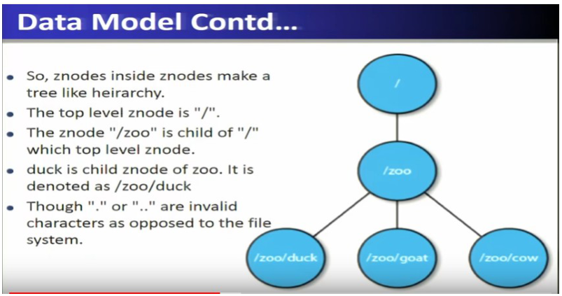

Znodes come in types: **Persistent** znodes (the default) remain until explicitly deleted; **Ephemeral** znodes are automatically deleted the moment the client session that created them disconnects — tied to that session, though visible to other clients, and an ephemeral znode can never have children (not even ephemeral ones). **Sequential** znodes get an automatically-appended, monotonically increasing sequence number, so repeatedly creating "the same" node name actually produces a growing series of uniquely numbered nodes. `EXAM`/`SLIDE`: ephemeral = dies with its session; persistent = lives until deleted; sequential = auto-numbered.

Zookeeper can run **standalone** (one machine — testing only, no real availability) or **replicated** (an ensemble of machines, production mode, tolerates failure as long as a majority stays up).

### How it fits together

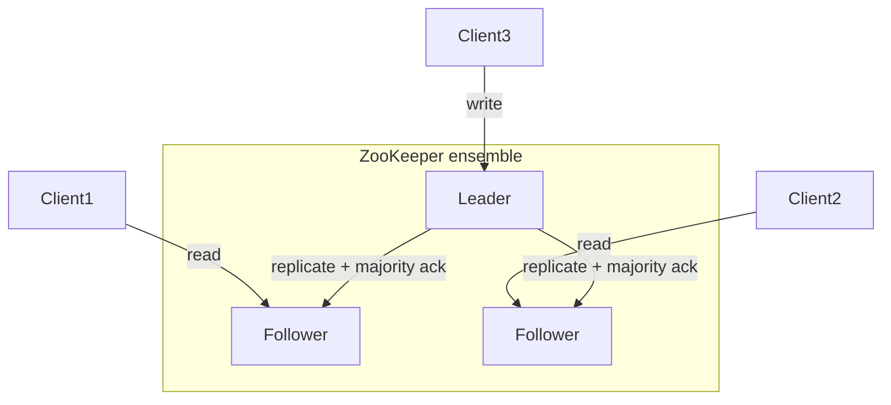

Caption: reads can hit any ensemble member, but every write is funneled through the single elected leader and only acked once a majority has persisted it.

### Worked example

A client creates znode `/servers/duck` (ephemeral) and `/servers/cow` (ephemeral) when servers "duck" and "cow" start up. Another client runs `ls /servers` and sees both. If "duck" crashes (its session dies), Zookeeper automatically deletes `/servers/duck` — the very next `ls /servers` shows only `cow`, with zero extra bookkeeping code written by the application. This is exactly the ephemeral-znode trick used for liveness tracking.

### Near-twins / traps

- **Persistent znode is not ephemeral** — persistent survives session death; ephemeral disappears the moment its creating session ends, which is what makes it useful as a live "who's alive" flag.
- **Reads and writes are not symmetric** in the replicated design — any server answers reads, but only the leader accepts writes (then replicates to followers, needing a majority ack).
- **Zookeeper's own znode storage is not append-friendly** — an update always replaces the whole znode's data; there's no partial/append write.

### Checkpoint

1. Two processes concurrently read and increment the same shared counter without coordination, and one increment is silently lost. This is:
   a) A deadlock
   b) A race condition
   c) A partition
   d) A tombstone

2. True or False: In a Zookeeper ensemble, both reads and writes can be serviced by any follower without involving the leader.

3. Which znode type is automatically deleted when the creating client's session ends?
   a) Persistent
   b) Sequential
   c) Ephemeral
   d) Root

4. How many machines are needed in a Zookeeper ensemble to tolerate `f` failures?
   a) `f`
   b) `f+1`
   c) `2f`
   d) `2f+1`

5. What read:write ratio is Zookeeper's design tuned to perform best under?
   a) 1:1
   b) 1:10 (write-heavy)
   c) 10:1 (read-heavy)
   d) 100:1

6. Which statement correctly describes Zookeeper's znode data updates?
   a) Znodes support an append operation for adding data incrementally
   b) Znode reads/writes are atomic; there is no append, only full updates
   c) Znode data can be partially written if the client disconnects mid-write
   d) Znode updates are asynchronous and never acknowledged

7. Standalone mode in Zookeeper is best used for:
   a) Production clusters requiring high availability
   b) Testing only, since it has no fault tolerance
   c) Multi-datacenter deployments
   d) Achieving strict majority-based consensus

#### Answer key

1. **b** — this is the textbook race condition example from the lecture (two deposits, one lost increment).
2. **False** — reads can go to any server, but writes must always go through the elected leader.
3. **c** — ephemeral znodes are deleted automatically when their creating session disconnects; persistent znodes are not.
4. **d** — the lecture states an ensemble needs `2f+1` machines to tolerate `f` failures (majority rule).
5. **c** — Zookeeper is optimized for read-dominant workloads at roughly a 10:1 read:write ratio.
6. **b** — znode operations are atomic (fully done or not at all) and there is no append — only full-value updates.
7. **b** — standalone mode runs on a single machine and is explicitly called out as testing-only, with no high availability.

#### Optional, after you check

- Explain in 30 seconds why ephemeral znodes are the natural building block for "which servers are alive right now."
- What breaks if a Zookeeper ensemble had only 2 machines and one failed?

---

### Part B — Leader election, sessions, and why majority matters

### Hook (3–4 sentences)

Design goal 2 said "one leader, elected at startup" — but startup isn't the only time you need an election: leaders crash mid-operation too. This part digs into exactly how Zookeeper elects (and re-elects) a leader without flooding the network with messages, why it insists on a strict majority even when that means occasionally refusing to elect anyone, and how it tracks which ephemeral znodes should vanish when a client's session dies.

### Core ideas

**Phase 1 — Leader election.** Zookeeper's ensemble elects a leader using a Paxos-like protocol called **Zab** (**Z**ookeeper **A**tomic **B**roadcast). Each server is assigned a sequence number/ID; the server whose file shows the highest ID becomes leader (e.g., among IDs N6, N12, N3, N32, N5, the server with ID 32 — the highest — wins). Naively, one option is for *every* node to directly monitor the current leader and start a fresh election the instant it detects a failure — but if many nodes react simultaneously, this floods the network with election messages. Zookeeper instead has **each process monitor only the next-higher-ID process** (32 watches 80, 80 watches 3, 3 watches 5, 5 watches 6, 6 watches 12, 12 watches 32 — a ring of "who watches whom"). If a process detects that the specific peer it's watching has failed *and* that peer happened to be the leader, *that watching process* becomes the new leader directly — no ensemble-wide election storm needed; otherwise it just waits out a timeout and re-checks. Handling id-conflicts and leader failure *during* an election itself is done via a two-phase-commit-style protocol: a candidate sends a "new leader" proposal to everyone, each process acks at most one candidate (the highest ID it has seen), the candidate waits for a majority of acks, then sends a commit — at which point every process updates its local leader variable, preserving safety throughout.

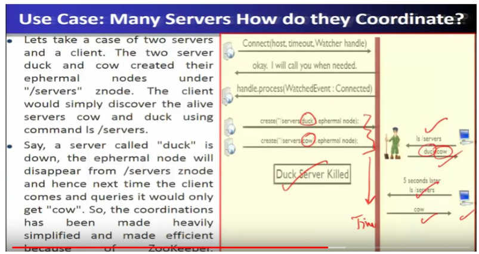

**Why the majority rule matters — the split-brain problem.** Suppose 6 servers split evenly across 2 data centers (3 each), and the network between the two data centers is severed. If Zookeeper *didn't* require a majority, each isolated half could independently elect its own leader — producing **two leaders at once**, a direct violation of "there is exactly one leader." Requiring a strict majority prevents this: with 3 nodes and 1 failure, the surviving 2 are a majority (2 of 3), so an election can safely proceed and either survivor may become leader; but with 3 nodes and 2 failures, the lone survivor is *not* a majority (1 of 3), so **no leader is elected at all** — the system deliberately refuses to make progress rather than risk correctness. `EXAM`/`PROF`: majority requirement exists specifically to prevent split-brain (two simultaneous leaders) during a network partition.

**Sessions.** A client holds a list of ensemble servers and tries each until one accepts it; the server that accepts creates a **session** with a caller-chosen timeout. If the server doesn't hear from the client within that timeout, it may expire the session — and on expiry, **all of that session's ephemeral znodes are deleted**. To keep a session alive across brief silences, the client library automatically sends periodic heartbeat "pings," and if a connection breaks, the client library transparently reconnects to a different ensemble server while keeping the same session alive — failover the application code never has to think about. The client also gets **watch events** reflecting connection state (e.g., Connected, Disconnected, Expired).

**Zookeeper's core guarantees.** **Sequential consistency**: updates from any one client are applied in the order that client issued them. **Atomicity**: an update either fully succeeds or has no effect — never partially applied. **Single system image**: a client always sees one consistent view of the system (a newly (re)joining server won't accept client connections until it's caught up). **Durability**: once an update succeeds, it persists and is never silently undone. **Timeliness**: rather than let a client see arbitrarily stale data, the server would rather shut down/refuse than lie about freshness.

### How it fits together

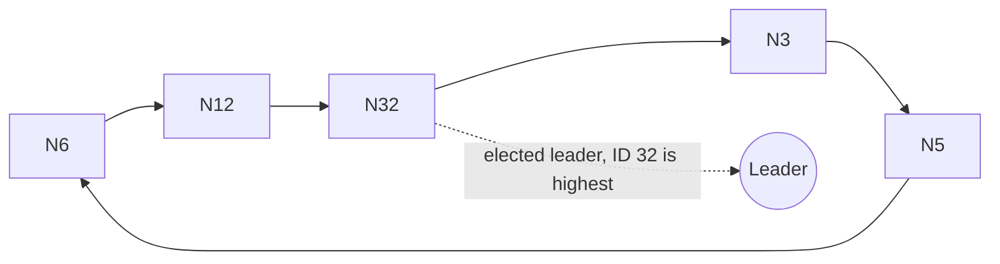

Caption: each server watches only the next-higher-ID server in a ring, so a leader failure is detected and handled by exactly one neighbor — no election-message flood.

### Worked example

Ensemble of 3 nodes A (leader), B, C.
- **A dies**: survivors B, C = 2 of 3 = majority survives → election proceeds, one of B/C becomes the new leader. System keeps working.
- **A and B die**: survivor C = 1 of 3 = not a majority → no election happens, C stays a follower with no leader. System refuses to elect anyone rather than risk being wrong.

### Near-twins / traps

- **"Every node watches the leader directly" is not** what Zookeeper actually does — it's the naive, message-flooding alternative; Zookeeper instead has each node watch only the next-higher-ID node.
- **A majority surviving is not the same as "more than zero" surviving** — 1 out of 3 nodes is not a majority, and Zookeeper will refuse to elect a leader in that case, on purpose.
- **Session expiry is not just "client got disconnected briefly"** — it specifically triggers deletion of that session's ephemeral znodes; a brief disconnect handled by heartbeats/failover does not.

### Tiny recap card

- Zab (Paxos-like) elects the highest-ID server as leader; each server watches only its next-higher-ID neighbor.
- Majority (2f+1 for f failures) prevents split-brain — without it, a network partition could elect two leaders.
- Session expiry deletes that session's ephemeral znodes; the client library auto-heartbeats and auto-reconnects to mask brief network hiccups.

### Checkpoint

1. In Zookeeper's leader election, which server becomes leader?
   a) The one with the lowest ID
   b) The one with the highest ID
   c) Whichever server responds fastest
   d) The one running the oldest software version

2. True or False: In Zookeeper's failure-detection scheme, every server directly monitors the current leader at all times.

3. A 5-node ensemble loses 2 nodes. Can a leader still be elected?
   a) No, because 3 of 5 is not enough
   b) Yes, because 3 of 5 is a majority
   c) No, Zookeeper never re-elects after losing any node
   d) Only if the lost nodes were followers, never if one was the leader

4. What happens when a client's Zookeeper session expires?
   a) Nothing, sessions never expire
   b) Only persistent znodes created by that session are deleted
   c) All ephemeral znodes created by that session are deleted
   d) The entire ensemble restarts

5. Why does Zookeeper require a strict majority for leader election rather than "any surviving node"?
   a) To reduce network traffic only
   b) To prevent two isolated partitions from each electing their own leader (split-brain)
   c) Because a minority can never run the Zab protocol at all
   d) It's arbitrary and has no correctness reason

6. If a client's connection to its Zookeeper server breaks, but the session hasn't expired, what happens?
   a) The application must manually reconnect and recreate all znodes
   b) The client library automatically reconnects to a different server, preserving the session
   c) All watches are silently dropped and never fire again
   d) The client must restart from scratch with a new session

7. Which protocol does Zookeeper use for leader election and atomic broadcast?
   a) Raft
   b) Zab (a Paxos-like protocol)
   c) Gossip
   d) Two-phase locking

#### Answer key

1. **b** — the server with the highest sequence/ID number is elected leader.
2. **False** — to avoid a flood of election messages, each server monitors only the next-higher-ID server, not the leader directly.
3. **b** — 3 out of 5 surviving nodes is a majority, so leader election can proceed normally.
4. **c** — session expiry specifically deletes all ephemeral znodes tied to that session; persistent znodes are unaffected.
5. **b** — majority is required precisely to prevent split-brain: without it, two network-partitioned halves could each elect their own leader.
6. **b** — the client library handles reconnection and failover transparently as long as the session itself hasn't expired.
7. **b** — Zab, Zookeeper Atomic Broadcast, is the Paxos-like protocol used.

#### Optional, after you check

- Explain in 30 seconds why "each node watches only the next-higher-ID node" avoids a message flood compared to "every node watches the leader."
- What breaks if session timeouts were set far too short for a slow network?

---

### Part C — Watches, ACLs, and real Zookeeper applications

### Hook (3–4 sentences)

A coordination service is only useful if applications can actually *react* to change without constantly polling, and if it can restrict who's allowed to touch what. This last part covers Zookeeper's notification mechanism (watches), its access-control model, and then three real production use cases — Yahoo's crawler fetching service, the non-Yahoo "Katta" distributed indexer, and Yahoo's own pub/sub message broker — which together show group membership, leader election, and configuration management all being reused as the same three Zookeeper primitives.

### Core ideas

**Watches.** Clients register **watches** to get notified when a znode changes — created, deleted, or has its data updated (via `exists`, `getData`, or `getChildren` calls). A crucial detail: **watches fire only once** — after a watch triggers, the client must re-register it to get notified of the *next* change; watches are not a permanent subscription. Only write-type operations (create, delete, setData) trigger watches — ACL (permission) operations do not. `EXAM`/`PROF`: a watch is a one-shot notification, not a standing subscription — this is a classic trap.

**Access Control Lists (ACLs).** An ACL entry combines an authentication *scheme* with an *identity* under that scheme and a set of permissions. Schemes include **digest** (username/password), **sasl** (client authenticated via Kerberos-style tickets, gets a session), and **ip** (client authenticated by its source IP address).

**Use cases Zookeeper is built for — and when *not* to use it.** Good fits: building a reliable configuration service, and distributed locking (ensuring only one process holds a lock at a time). Not a good fit: storing very large data (znodes are meant to be small, in-memory-sized) or, ironically, applications needing *extremely* strong consistency beyond what Zookeeper's guarantees provide.

**Case study — Yahoo's fetching service (web crawler).** A master process commands many page-fetching processes: the master hands out configuration and the fetchers write back status/health. Using Zookeeper here buys three things: recovering automatically from a master crash (leader election), guaranteeing availability despite failures, and decoupling clients from specific servers (a client can just read current server status from Zookeeper and route around unhealthy ones). Mainly, this system leans on Zookeeper for **configuration metadata** plus **leader election** for the master.

**Case study — Katta (a non-Yahoo distributed indexer).** Katta splits indexing work into shards; a master assigns shards to slaves and tracks progress. Since slaves (and even the master) can fail, Katta uses Zookeeper for three distinct services at once: **group membership** (tracking which slave/master servers are currently up), **leader election** (handling master failover), and **configuration management** (tracking and propagating shard-to-slave assignments to clients).

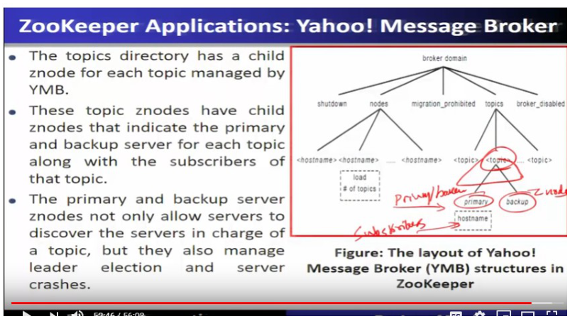

**Case study — Yahoo Message Broker (YMB), a distributed pub/sub system.** YMB manages thousands of topics that clients publish to and subscribe from; topics are distributed across servers for scalability, and each topic is replicated via a **primary/backup scheme** (replicated to two machines) for reliable delivery. Because YMB's servers use a shared-nothing architecture, coordination is essential, and Zookeeper provides it in three ways: **configuration metadata** (managing how topics are distributed), **failure detection + group membership** (dealing with machine failures), and general **control operations**. Concretely, each YMB server creates an **ephemeral znode** under a `nodes` znode carrying its load/status — reusing the exact ephemeral-node liveness trick from Part A — while each topic gets its own child znode whose children indicate the primary server, backup server, and subscribers for that topic; this znode layout lets servers both discover who currently owns a topic *and* handles leader election/crash recovery for that topic automatically.

**Conclusion (from the lecture's own wrap).** Zookeeper takes a "wait-free" approach to coordinating distributed processes — clients don't block waiting on locks held by a possibly-dead process, they get notified via watches instead — achieving hundreds-of-thousands of read-dominant operations per second by serving fast reads and watches from local replicas.

### How it fits together

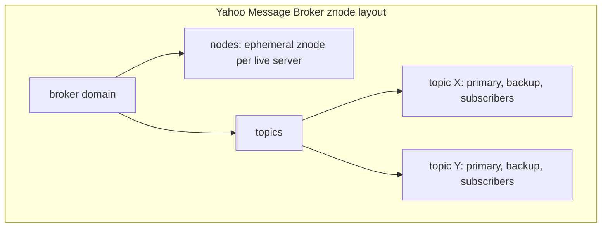

Caption: YMB reuses the same ephemeral-znode-for-liveness trick (Part A) at two levels — once for "which servers are alive" and again inside each topic for "who is primary/backup right now."

### Worked example

A client calls `exists("/config", watch=true)` on a config znode. Another process updates `/config`. The client's watch fires exactly once, notifying it of the change — but if `/config` changes *again* right after, the client gets nothing more unless it explicitly re-registers the watch after handling the first notification. This "fire once, re-arm manually" behavior is the single most-tested trap about watches.

### Near-twins / traps

- **A watch firing once is not a standing subscription** — you must re-register after each trigger to keep getting notified.
- **ACL operations do not trigger watches** — only create/delete/setData (writes) do; permission changes are silent to watchers.
- **Zookeeper is not a bulk data store** — it's explicitly *not* meant for storing very large data; that's a "when not to use it" case.
- **Katta's three Zookeeper uses are distinct** — group membership, leader election, and configuration management are three separate services Zookeeper provides simultaneously, not one blended feature.

### Checkpoint

1. A client registers a watch on a znode. The znode changes twice in quick succession. How many notifications does the client receive without re-registering?
   a) Zero
   b) One
   c) Two
   d) Unlimited, until the client disconnects

2. True or False: ACL (permission) changes on a znode trigger watches the same way data updates do.

3. Which Zookeeper feature is used by Yahoo's fetching service primarily to recover from a master crash?
   a) ACLs
   b) Leader election
   c) Sequential znodes
   d) The Bloom filter

4. Katta uses Zookeeper for which combination of services?
   a) Only leader election
   b) Group membership, leader election, and configuration management
   c) Only configuration management
   d) Only ACL-based authentication

5. In the Yahoo Message Broker's znode layout, what is used to detect that a server is no longer alive?
   a) A persistent znode with a manual delete
   b) An ephemeral znode under "nodes" that disappears when the session ends
   c) A polling script external to Zookeeper
   d) A sequential znode counter

6. Which of these is explicitly named as a case where you should NOT use Zookeeper?
   a) Distributed locking
   b) Reliable configuration service
   c) Storing very large data
   d) Leader election

7. What authentication scheme authenticates a Zookeeper client using its source IP address?
   a) digest
   b) sasl
   c) ip
   d) kerberos

#### Answer key

1. **b** — watches are one-shot: the client is notified once and must re-register to catch the next change.
2. **False** — only write-type operations (create, delete, setData) trigger watches; ACL operations do not.
3. **b** — leader election is what lets the fetching service automatically recover from a master crash.
4. **b** — Katta uses all three: group membership (tracking slaves/master), leader election (master failover), and configuration management (shard assignments).
5. **b** — YMB reuses the ephemeral-znode-for-liveness pattern: the znode vanishes automatically when the server's session ends.
6. **c** — the lecture explicitly says Zookeeper should not be used to store very large data.
7. **c** — the `ip` scheme authenticates a client based on its source IP address.

#### Optional, after you check

- Explain in 30 seconds why "watches fire once" is a deliberate design choice rather than a limitation.
- What breaks if an application assumed watches were a persistent subscription and never re-registered them?

---

## Lecture 17: CQL (Cassandra Query Language)

### Hook (4–6 sentences)

Lecture 13 showed Cassandra storing data as row keys mapping to columns, with no joins and no fixed schema — powerful, but painful to actually use if every application has to hand-craft that structure. CQL is Cassandra's answer: a query language that reads almost exactly like SQL (`CREATE TABLE`, `INSERT`, `SELECT`), so anyone who already knows SQL can be productive on day one — while underneath, every CQL command still gets translated into the same row-key/column-value storage from Lecture 13. This lecture is about seeing through that friendly SQL-shaped surface to the internal mapping, so you're never surprised when composite keys or collections behave differently than they would in a real relational database.

### Slide picture

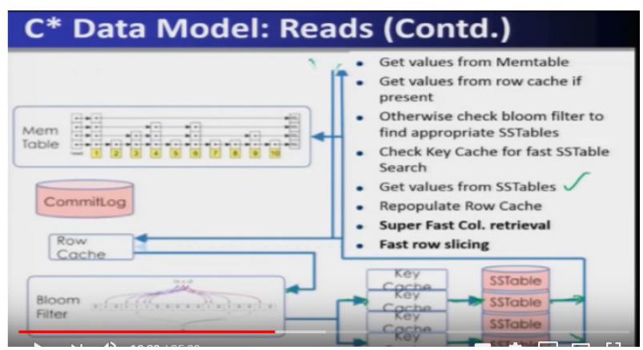

### Core ideas

**Why CQL exists — Cassandra's "awesomeness" and its rough edges.** Cassandra (recapping Lecture 13) is a distributed columnar store with no single point of failure, tunable consistency, and blazing writes and fast reads that scale essentially without limit. But raw Cassandra has real usability pain: **no joins**, **no fixed schema**, and effectively one giant table that can have millions of columns with no normalization — meaning you'd otherwise have to read internal implementation details just to understand what's stored. **CQL "saves the day"**: it packages Cassandra's own best practices behind an SQL-like interface, so the *interface* looks familiar even though the *internals* are nothing like a relational database.

**Cassandra's data model vocabulary, mapped to RDBMS terms.** A **keyspace** ≈ an entire RDBMS *database*. A **column family** ≈ an RDBMS *table*. Each column family has **rows**, and each row has any number of **columns** — a row can have millions of columns, and different rows in the *same* column family don't need to have the same set of columns. Every column entry actually carries a name, a value (or a tombstone), a **comparator** (defines how column names sort), and optionally a **time-to-live** (TTL, after which the data auto-deletes). Every row has a **row key**, which is exactly what the **partitioner** (Lecture 13) uses to decide which node stores that row. `EXAM`: keyspace=database, column family=table, but there is still no such thing as a join.

**The write/read paths, recapped from the CQL side.** Writes barely do anything expensive: go to the Memtable, log to the commit log — no locking required, and the operation is CPU-bound rather than I/O-bound, so adding more CPUs scales writes almost linearly. Reads are a short pipeline: check the **Memtable** first, then the **row cache**; if absent, consult the **Bloom filter** to identify the right SSTable, then the **key cache** to speed up that SSTable's lookup, fetch from the **SSTable**, and repopulate the row cache for next time. Because a row can be split across multiple SSTables, a read sometimes needs to consult more than one. The lecture's own one-line summary is worth memorizing verbatim: **"Cassandra finds rows fast, Cassandra scans columns fast, Cassandra does *not* scan rows."**

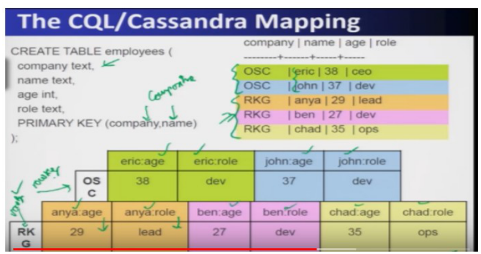

**The core mapping — how a CQL table becomes row keys and columns.** Take `CREATE TABLE employees(name text PRIMARY KEY, age int, role text)`, populated with rows for "John" and "Eric": internally, the primary key value ("John", "Eric") *becomes the row key*, and every other attribute (age, role) becomes that row's column values — this is why Cassandra "finds rows fast," since rows are partitioned directly by that row key. Extend the primary key to a **composite key**, e.g. `PRIMARY KEY (company, name)`: now rows sharing the same `company` value collapse onto the *same row key* (e.g. all "OSC" employees share row key `OSC`), and the *remaining* key part (`name`) gets folded into each column's name instead (columns literally named like `eric:age`, `eric:role`, `john:age`, `john:role`) — so a single physical row key can hold many people's data side by side, addressed by prefixed column names. This is the single most important internal-mapping fact of the lecture: **composite primary keys turn extra key components into column-name prefixes, not extra row keys.** `EXAM`/`SLIDE`: composite key `(company, name)` → row key = company, columns prefixed by name.

**Collections: set, list, map.** CQL also supports collection types layered on the same underlying row-key/column-value structure — but **collection fields cannot be part of the primary key** (only ordinary scalar attributes can). A **set** holds unique elements with no fixed order; a **list** holds possibly-repeating elements in order; a **map** is a list of key-value pairs. Internally: for a **set**, given primary key `(x,y)`, each individual set member becomes its own column (e.g. `myset:member1`, `myset:member2`) with no separate column value needed — membership *is* the column's existence. For a **list**, elements get positional column names (e.g. `mylist:0:0`, `mylist:0:1`) holding the actual list values. For a **map**, each key from the map becomes part of the column name and the map's value becomes that column's value (e.g. column `mymap:M` holding value `3`). `EXAM`: sets/lists/maps cannot be primary keys; they get flattened into columns using member/position/key as part of the column name.

**Everyday CQL commands.** CQL supports `CREATE KEYSPACE` (with a replication factor and a partitioner strategy — e.g. simple strategy, replication factor like `2:1`), `CREATE TABLE`, `INSERT`/`UPDATE`/`DELETE`, and `SELECT` (including selecting from Cassandra's own system schema tables to introspect column families) — all deliberately styled to look like familiar SQL. There are official drivers in **Java** and **C**, with community drivers for Perl, Python, and others, each offering both synchronous and asynchronous APIs.

**Conclusion, from the lecture's own wrap.** CQL is a *reintroduction* of schema on top of a schema-less store, creates one common data-modeling language for talking about Cassandra tables, packages Cassandra's best practices as its interface, and lets you use the underlying data structures directly. The CQL wire protocol is **binary** (so it's efficient and interoperable across languages), and it's asynchronous, fast, and supports prepared statements.

### How it fits together

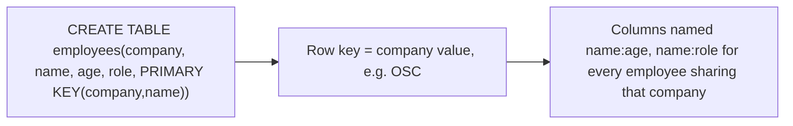

Caption: a composite primary key does not create multiple row keys — the leading key part becomes the row key, and the rest becomes a prefix baked into every column name.

### Worked example

Table: `CREATE TABLE employees(company text, name text, age int, role text, PRIMARY KEY(company, name))`, populated with 2 rows for company `OSC` (Eric, John) and 3 rows for company `RKG` (Anya, Ben, Chad).
- Row key `OSC` ends up holding columns: `eric:age=38`, `eric:role=ceo` (say), `john:age=37`, `john:role=dev`.
- Row key `RKG` ends up holding columns: `anya:age=29`, `anya:role=lead`, `ben:age=27`, `ben:role=dev`, `chad:age=35`, `chad:role=ops`.
- So 5 CQL "rows" (in the SQL sense) compress into just **2** physical Cassandra rows (row keys), because the composite key's first component (`company`) is what actually determines the row key.

### Near-twins / traps

- **A CQL composite primary key is not** like a composite key in an RDBMS (which still identifies one row per combination) — in Cassandra, only the *first* key component becomes the row key; the rest becomes a column-name prefix, so multiple "logical rows" can live inside one physical row key.
- **CQL collections (set/list/map) cannot be primary keys** — only plain scalar attributes can be; this is a direct rule, not just a style preference.
- **"Cassandra finds rows fast" is not the same as "Cassandra finds arbitrary predicates fast"** — the speed comes specifically from partitioning on the row key; it does not mean scanning arbitrary WHERE-clause predicates across rows is fast (Cassandra explicitly does *not* scan rows).

### Tiny recap card

- Keyspace=database, column family=table, but there are no joins, no fixed schema per row.
- Row key comes from the (first component of the) primary key; the rest of a composite key becomes part of the column name.
- Sets/lists/maps flatten into columns using member/position/key in the column name; they cannot be primary keys.

### Checkpoint

1. In Cassandra's data model, a "keyspace" corresponds most closely to which RDBMS concept?
   a) A table
   b) A row
   c) An entire database
   d) An index

2. True or False: A CQL collection type (set, list, or map) can be used as part of a table's PRIMARY KEY.

3. Given `PRIMARY KEY (company, name)`, what actually becomes the Cassandra row key?
   a) A concatenation of company and name, treated as one unit that never repeats
   b) `company` alone — `name` instead becomes part of each column's name
   c) `name` alone — `company` is discarded
   d) A randomly generated UUID unrelated to either field

4. Which one-line rule from the lecture best summarizes Cassandra's read performance characteristics?
   a) Cassandra scans rows fast but finds columns slowly
   b) Cassandra finds rows fast, scans columns fast, and does not scan rows
   c) Cassandra never uses caching for reads
   d) Cassandra requires a join for every read

5. In the read path, what is consulted first to find the correct SSTable once the Memtable and row cache miss?
   a) The commit log
   b) The Bloom filter
   c) The ACL
   d) The gossip protocol

6. Why do CQL writes scale almost linearly with added CPUs, according to the lecture?
   a) Because writes require heavy disk I/O that CPUs parallelize
   b) Because writes are essentially lock-free and CPU-bound rather than I/O-bound
   c) Because CQL writes always go through Zookeeper for coordination
   d) Because writes require a full table scan

7. Five CQL rows share the same `company` value under a composite key `(company, name)`. How many physical Cassandra rows (row keys) result?
   a) Five, one per CQL row
   b) One, since they all share the same row key
   c) Zero, because composite keys are invalid
   d) It depends only on the number of columns, not the key

#### Answer key

1. **c** — a keyspace is Cassandra's equivalent of an entire database in the RDBMS world.
2. **False** — collection types (set, list, map) cannot be part of the primary key; only scalar attributes can.
3. **b** — with a composite primary key, only the first component becomes the row key; the remaining component(s) are folded into column names instead.
4. **b** — this is the lecture's own explicit summary line: rows are found fast, columns are scanned fast, but rows themselves are never scanned.
5. **b** — the Bloom filter is checked next, specifically to identify which SSTable is likely to hold the key, before the key cache and the SSTable itself.
6. **b** — writes don't require locking or disk I/O to acknowledge (write-back to the Memtable), so they're CPU-bound and scale with added CPU capacity.
7. **b** — all five collapse onto one physical row key (the shared `company` value), with `name` folded into each column's name instead.

#### Optional, after you check

- Explain in 30 seconds why a composite primary key in CQL does not behave like a composite key in a relational database.
- What breaks if you tried to make a `list` column part of a table's `PRIMARY KEY`?

---

## Week wrap

### How the lectures connect

Lecture 13 built Cassandra's storage engine bottom-up: partitioners and snitches decide *where* replicas live, the write path (commit log → Memtable → SSTable, with hinted handoff for down replicas) explains *why* writes are so fast, and gossip explains how nodes track who's alive without any central directory. Lecture 14 then named the theoretical price of all those speed-focused choices: CAP says you can't have Consistency, Availability, and Partition-tolerance all at once, and Cassandra deliberately chose Availability + Partition-tolerance, accepting eventual consistency — tunable per-query via R/W quorum settings. Lecture 15 zoomed into the space between "eventual" and "strong," showing that real applications usually want something in between (per-key sequential, CRDTs, causal, red-blue), and the rule of thumb is to pick the weakest model that's still correct for your use case. Lecture 16 stepped sideways into Zookeeper — a separate, general-purpose coordination service that Cassandra itself leans on (electing per-DC coordinators via Zab/Paxos) and that other Hadoop-ecosystem systems (Katta, Yahoo Message Broker) reuse for group membership, leader election, and configuration management, all built out of the same simple ephemeral-znode primitive. Lecture 17 closed the loop by showing how CQL, Cassandra's SQL-shaped query language, is just a friendly face bolted onto Lecture 13's row-key/column-value storage — composite keys still ultimately collapse to one row key plus column-name prefixes, not real relational rows.

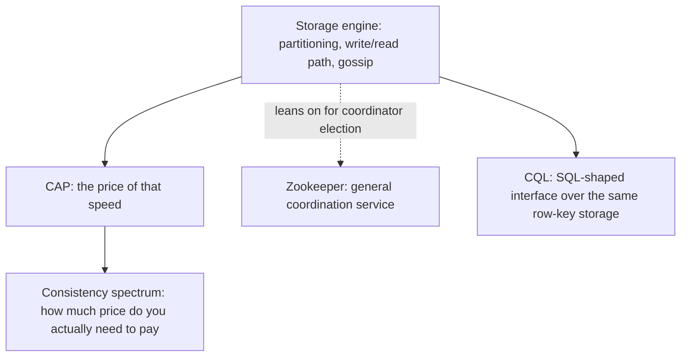

### Assignment-shaped mixed quiz

1. Which Cassandra partitioner is recommended by default, and why?
   a) Byte-ordered, for range queries
   b) Random, for uniform load and no hotspots
   c) Byte-ordered, for uniform load
   d) Neither — Cassandra requires manual placement

2. True or False: Under Cassandra's Network Topology Strategy, replicas within one data center are deliberately placed on different racks.

3. What mechanism lets a Cassandra write succeed even when the target replica is temporarily down?
   a) Read repair
   b) Hinted handoff
   c) Compaction
   d) Gossip

4. Which CAP combination does Cassandra choose?
   a) Consistency + Availability
   b) Consistency + Partition tolerance
   c) Availability + Partition tolerance
   d) All three

5. With N=7 replicas, what is the minimum valid quorum size satisfying `W > N/2`?
   a) 3
   b) 4
   c) 5
   d) 7

6. Which consistency model guarantees operations that are causally related are seen in the correct order by all clients, without requiring a full global order for unrelated operations?
   a) Strong/linearizable consistency
   b) Causal consistency
   c) Eventual consistency
   d) ALL consistency level

7. In Zookeeper, which znode type is deleted automatically when its creating session ends?
   a) Persistent
   b) Sequential
   c) Ephemeral
   d) Root

8. Why does Zookeeper require a majority (`2f+1` for `f` failures) rather than "any surviving server" for leader election?
   a) To reduce memory usage
   b) To prevent split-brain (two leaders) during a network partition
   c) Because Zab cannot run with fewer servers
   d) It is an arbitrary historical choice

9. True or False: A Zookeeper watch, once registered, continues to notify the client on every subsequent change to that znode without needing to be re-registered.

10. In CQL, given `PRIMARY KEY (company, name)`, what becomes the Cassandra row key?
    a) `name`
    b) `company`
    c) A hash of both fields combined
    d) Neither — CQL disallows composite keys

11. Which of the following can NOT be part of a CQL table's primary key?
    a) A text column
    b) An int column
    c) A collection type (set, list, or map)
    d) A composite of two scalar columns

12. Which real Zookeeper application example used ephemeral znodes both for tracking live servers AND for tracking per-topic primary/backup/subscriber assignments?
    a) Yahoo's fetching service
    b) Katta
    c) Yahoo Message Broker (YMB)
    d) HBase

#### Answer key

1. **b** — random partitioning distributes keys uniformly, avoiding the hotspots that byte-ordered partitioning can create.
2. **True** — replicas within a data center are placed on different racks specifically for rack-failure tolerance.
3. **b** — hinted handoff lets the coordinator buffer a write locally and replay it once a down replica recovers.
4. **c** — Cassandra is an AP system, trading strict consistency for availability and partition tolerance.
5. **b** — majority of 7 is more than 3.5, so the minimum quorum is 4.
6. **b** — causal consistency preserves cause-and-effect ordering between related operations without requiring a total global order.
7. **c** — ephemeral znodes are tied to the session that created them and vanish when it ends.
8. **b** — majority rule specifically prevents two network-isolated halves from each electing their own leader.
9. **False** — Zookeeper watches are one-shot; they must be re-registered after each notification to keep receiving updates.
10. **b** — only the first component of a composite primary key becomes the row key; the rest becomes part of the column name.
11. **c** — collection types (set, list, map) are explicitly disallowed as primary key components in CQL.
12. **c** — Yahoo Message Broker uses ephemeral znodes both under "nodes" (server liveness) and inside each topic's primary/backup/subscriber structure.

### Last 5-minute drill

| Term | 6-word answer |
| --- | --- |
| Random partitioner | Hashes keys uniformly, avoids write hotspots |
| Network Topology Strategy | N replicas per DC, different racks |
| Snitch | Maps server IP to rack/datacenter |
| Hinted handoff | Buffers writes for a down replica |
| Memtable | In-memory cache, fast write-back target |
| SSTable | Immutable sorted on-disk key-value file |
| Bloom filter | Cheap probably-present check, no false negatives |
| Compaction | Merges SSTables, purges tombstoned deletes |
| Gossip protocol | Heartbeat-based, decentralized cluster membership tracking |
| CAP theorem | Pick two: Consistency, Availability, Partition-tolerance |
| Cassandra's CAP choice | Availability + Partition tolerance, eventual consistency |
| Quorum condition | `W+R>N` and `W>N/2` required |
| CRDT | Commutative operations need no write ordering |
| Causal consistency | Preserves cause-effect order, not global order |
| Zookeeper | Centralized coordination service, replicated ensemble |
| Znode | Zookeeper's tree node, holds small data |
| Ephemeral znode | Dies automatically when session disconnects |
| Zab | Paxos-like protocol electing Zookeeper's leader |
| Majority rule (2f+1) | Prevents split-brain during network partition |
| Watch | One-shot notification, must be re-registered |
| Keyspace | Cassandra's equivalent of an entire database |
| Column family | Cassandra's equivalent of a database table |
| Composite primary key (CQL) | First part = row key, rest = column prefix |
